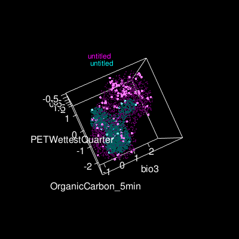

## The diversity of Ungulate abiotic niches

Project repository for the analysis of abiotic niches of Ungulates. Contains
source code (R) and data files. The overall layout is as follows:

- [script](script) - reusable scripts in Perl and R
- [data](data) - data, including occurrences, GIS layers and shape files
- [results](results) - analysis output (e.g. maxent output)
- [doc](doc) - (executable) documentation files, including RMarkdown

The source code that is being developed is intended to be portable such that
analysis workflows can be prototyped on laptops, while longer running analyses
can be executed in a cloud environment. In addition to the occurrences, other 
input data include GIS layers for bioclimatic variables, soil, topographic 
heterogeneity, and vegetation types. However, these are quite large files 
obtained from 3rd parties, and so we consider these immutable for this project. 
Hence, we may store some of these separately in a DropBox folder structure. 
From the combined input data types, we model niches (e.g. using maxent), the 
results of which we write to the results folder. These are then, subsequently, 
used for the following:

- to calculate niche overlap between pairs of species, such that we can then
  cluster species by ecological similarity. This is done in a variety of ways,
  including by computing projected niche overlap (Schoener's D) and by
  computing climatic 'trait' values (e.g. those from GIS pixels that 
  coincide with raw occurrences, or GIS pixels in projected suitable habitats)
  and distances in trait space between species (Gower's D).
- to identify the niche dimensions that determine Ungulate distribution, i.e
  which GIS layers are the most important.
  

