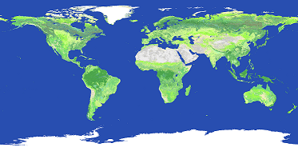
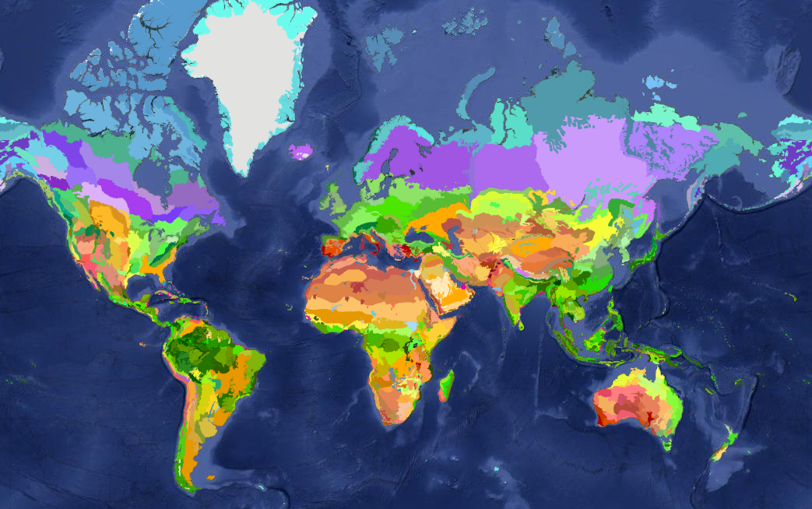
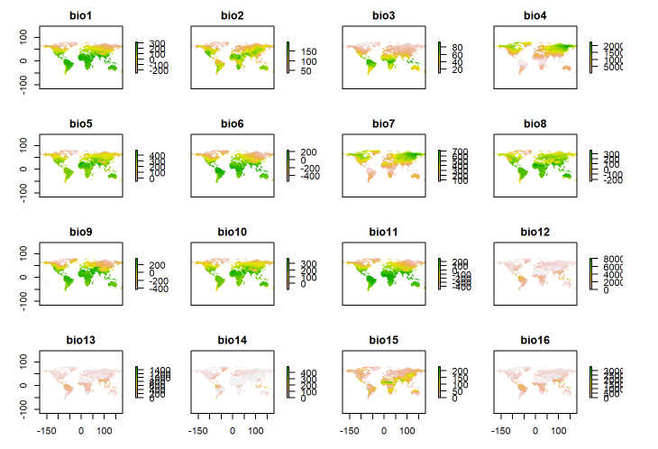
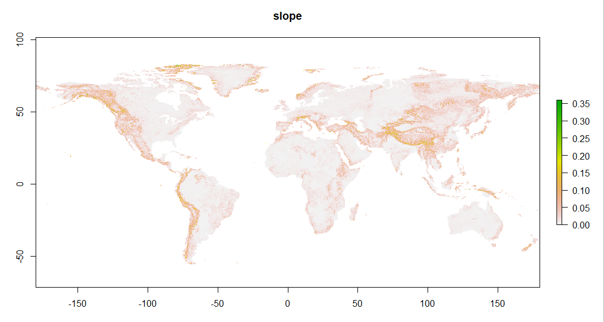
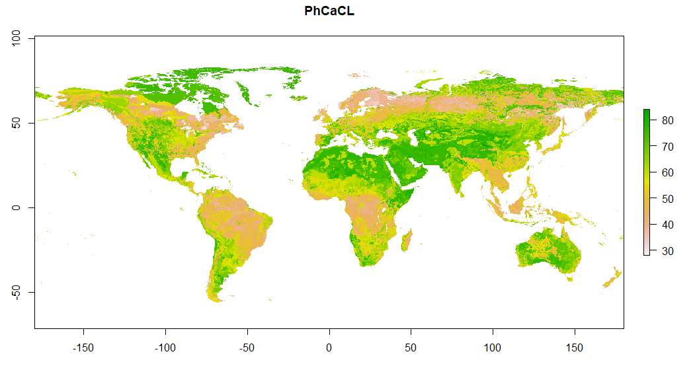

# GIS datasets 

## [Land Cover (GLCNMO) - Global version](https://globalmaps.github.io/glcnmo.html)

### Metadata

- Data source: MODIS data 2013 (Terra & Aqua)
- Coordinate system: WGS84
- Resolution: 15 arcseconds
- Data type: Byte (8bits, Little end ordering (Intel x86))

### Classes

1. Broadleaf Evergreen Forest	
2. Broadleaf Deciduous Forest	
3. Needleleaf Evergreen Forest	
4. Needleleaf Deciduous Forest	
5. Mixed Forest	
6. Tree Open	
7. Shrub	
8. Herbaceous	
9. Herbaceous with Sparse Tree/Shrub	
10. Sparse vegetation	
11. Cropland
12. Paddy field
13. Cropland / Other Vegetation Mosaic
14. Mangrove
15. Wetland
16. Bare area, consolidated (gravel,rock)
17. Bare area, unconsolidated (sand)
18. Urban
19. Snow / Ice
20. Water bodies

## [Ecoregions](https://ecoregions2017.appspot.com/)

### Metadata

Shape file: https://storage.googleapis.com/teow2016/Ecoregions2017.zip

### Classes

1. Boreal Forests/Taiga
2. Deserts & Xeric Shrublands
3. Flooded Grasslands & Savannas
4. Mangroves
5. Mediterranean Forests, Woodlands & Scrub
6. Montane Grasslands & Shrublands
7. Rock and Ice
8. Temperate Broadleaf & Mixed Forests
9. Temperate Conifer Forests
10. Temperate Grasslands, Savannas & Shrublands
11. Tropical & Subtropical Coniferous Forests
12. Tropical & Subtropical Dry Broadleaf Forests
13. Tropical & Subtropical Grasslands, Savannas & Shrublands
14. Tropical & Subtropical Moist Broadleaf Forests
15. Tundra

## Climate 
Both the [Bioclim](http://worldclim.org/version2) dataset and the [ENVIREM](https://deepblue.lib.umich.edu/data/concern/data_sets/gt54kn05f) dataset are used as climatic variables. 

### Datasets Bioclim 
1. BIO1 Annual Mean Temperature
2. BIO2 Mean Diurnal Range (Mean of monthly (max temp - min temp))
3. BIO3 Isothermality (BIO2/BIO7) (* 100)
4. BIO4 Temperature Seasonality (standard deviation *100)
5. BIO5 Max Temperature of Warmest Month
6. BIO6 Min Temperature of Coldest Month
7. BIO7 Temperature Annual Range (BIO5-BIO6)
8. BIO8 Mean Temperature of Wettest Quarter
9. BIO9 Mean Temperature of Driest Quarter
10. BIO10 Mean Temperature of Warmest Quarter
11. BIO11 Mean Temperature of Coldest Quarter
12. BIO12 Annual Precipitation
13. BIO13 Precipitation of Wettest Month
14. BIO14 Precipitation of Driest Month
15. BIO15 Precipitation Seasonality (Coefficient of Variation)
16. BIO16 Precipitation of Wettest Quarter
17. BIO17 Precipitation of Driest Quarter
18. BIO18 Precipitation of Warmest Quarter
19. BIO19 Precipitation of Coldest Quarter

### Datasets ENVIREM 

1. annualPET Annual potential evapotranspiration
2. aridityIndexThornthwaite Thornthwaite aridity index
3. climaticMoistureIndex Metric of relative wetness and aridity
4. continentality Average temp. of warmest and coldest month
5. embergerQ Emberger’s pluviothermic quotient
6. growingDegDays0 Sum of months with temperatures greater than 0 degrees
7. growingDegDays5 Sum of months with temperatures greater than 5 degrees
8. maxTempColdestMonth Maximum temp. of the coldest month
9. minTempWarmestMonth Minimum temp. of the warmest month
10. monthCountByTemp10 Sum of months with temperatures greater than 10 degrees
11. PETColdestQuarter Mean monthly PET of coldest quarter
12. PETDriestQuarter Mean monthly PET of driest quarter
13. PETseasonality Monthly variability in potential evapotranspiration
14. PETWarmestQuarter Mean monthly PET of warmest quarter
15. PETWettestQuarter Mean monthly PET of wettest quarter
16. thermInd Compensated thermicity index

## Topography
Median elevation variables were extracted from the [Harmonized World Soil Database ](http://www.fao.org/soils-portal/soil-survey/soil-maps-and-databases/harmonized-world-soil-database-v12/en/) and have a spatial resolution of 30 arcseconds. The topographic wetness index and the terrain roughness index are extracted from the [ENVIREM](https://deepblue.lib.umich.edu/data/concern/data_sets/gt54kn05f) dataset and have a spatial resolution of 30 arcseconds. 

### Datasets 
1. Slope
2. Aspect
3. Topographic wetness index
4. Terrain roughness index

## Soil 
The soil characteristics are extracted from the [Land-Atmosphere Interaction Research Group](http://globalchange.bnu.edu.cn/research/soilw) with a spatial
resolution of 5 arcminutes. 

1. Bulk density
2. Clay percentage
3. pH CaCL
4. Organic carbon 

