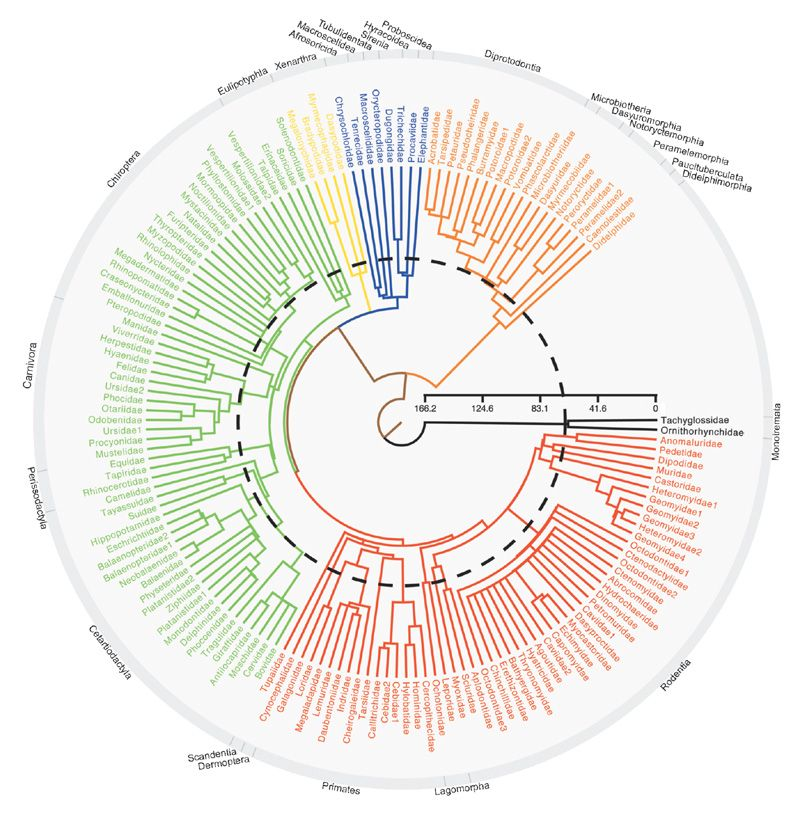

# phylogeny 
We used the phylogenetic tree of present day mammals by Bininda-Emonds et al. (2007). 

ref: Olaf RP Bininda-Emonds, Marcel Cardillo, Kate E Jones, Ross DE MacPhee, Robin MD Beck,  
Richard Grenyer, Samantha A Price, Rutger A Vos, John L Gittleman, and Andy Purvis. The 
delayed rise of present-day mammals. Nature 446(7135):507 2007
