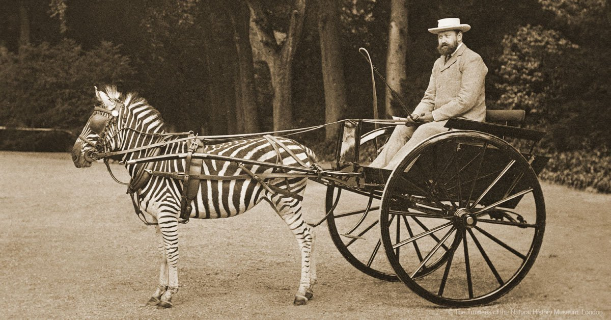

Available workflows
===================

1. [**maximum entropy**](html_files/1.maxent) - species distribution modeling using 
   dismo::maxent. The modeling is performed on the data sets in 
   `/data/filtered`. The performance of the models is assessed by comparing 
   their AUC with a distribution of AUC values obtained by modeling on randomly
   selected points within the buffered species area. The results of this 
   assessment are written to `/results/maxent/model_summaries/AUCvalues.csv`.
   The modeling results themselves are written to `/results/per_species/` and
   include a README.md file for each species that explains the source and 
   purpose of the different output files.
2. [**variable importance and model summaries**](html_files/2.varimp) - summarizes the
   importance the variables (i.e. GIS layers) have had in the maxent models 
   across all species. Produces output for each species and for each GIS
   layer, written to `/results/maxent/model_summaries/traits_contribution_maxent.csv` and `/results/maxent/model_summaries/mean_traits_contribution_maxent.csv`. The variable importance dataframes are used to summarize the models per species (AUC value, n occurrence points, variable importance in descending order), written to `/results/maxent/model_summaries/summary_df.csv`
3. [**outlying mean index**](3_omi.rmd) - computes 'trait' values for each
   species and for each GIS layer. The values are obtained either by taking the
   GIS pixel values directly under the raw occurrences or by taking values 
   averaged over the GIS pixels whose habitat suitability is higher than 
   that of the worst 10% of the raw occurrences. The normalized mean values under the raw occurences are saved as  `/results/OMI/normalized_raw_values.csv` and the normalized mean values derived from the suitable habitat areas are saved as `/results/OMI/normalized_MaxEnt_values.csv`. Subsequently the Gower's 
   distance between species is computed for these values, and the species are 
   then clustered using neighbor-joining and hierarchical clustering. The Gower's distance dataframes are saved as `/results/maxent/comparative/gower/raw_omi.csv` and `/results/maxent/comparative/gower/maxent_omi.csv` for the raw and habitat projections respectively. The neighbor-joining trees are saved as `/results/maxent/comparative/gower/raw_omi_nj.tree` and `/results/maxent/comparative/gower/maxent_omi_nj.tree`. The hierarchical clustering trees are saved as `/results/maxent/comparative/gower/raw_omi_hclust.tree` and `/results/maxent/comparative/gower/maxent_omi_hclust.tree`. As a last step the Mean pairwise patristic distance is calculated based on the neighbor-joining trees and are saved as `/results/maxent/clustering_nj_MaxEnt_occurences.pdf`, `/results/maxent/clustering_nj_raw_occurences.pdf`  and `/results/maxent/clustering_nj_schoener.pdf`. 
4. [**niche clusters**](4_niche_clusters.rmd) - takes a dendrogram (whether
   Schoener's D or Gower's D, and irrespective of clustering algorithm) and
   attempts to partition this optimally such that the dendrogram is subdivided
   in clusters that are specific to the domesticated species. Visualizes these
   clusterings. Identifies the niche traits with the greatest magnitude 
   difference between the cluster ingroup and outgroup.
5. [**phylogeny**](5_phylogeny.rmd) - tests whether evolutionary 
   relatedness, i.e. phylogeny, shapes the pattern of similarities and 
   differences in abiotic niche dimensions among the terrestrial Ungulates. The 
   general approach to test this is to perform a Mantel test that randomizes
   niche clustering a predefined number of times (e.g. 100) with respect to the
   phylogenetic clustering, and then assesses the distribution of correlation
   coefficients.
6. [**phyloglm**](6_phyloglm.rmd) - performs phylogenetic generalized linear
   modeling and model selection to identify which niche traits most predict
   domestication.
7. [**trait-dependent diversification**](7_trait-dependent_diversification.rmd)
   - assesses whether there is evidence for an adaptive radiation in relation
   to grazing, using a BiSSE analysis.
8. [**DPLACE**](8_dplace.rmd) - performs statistical tests to link societal
   data from DPLACE to Ungulate niches.

Manuscript
----------

Apart from the notes being collected here, we are also preparing an 
[overleaf manuscript](https://www.overleaf.com/project/5c7cfef8ac6a080f4fd4476a)
