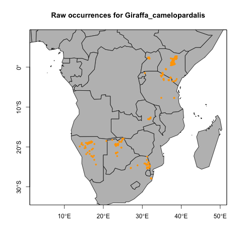
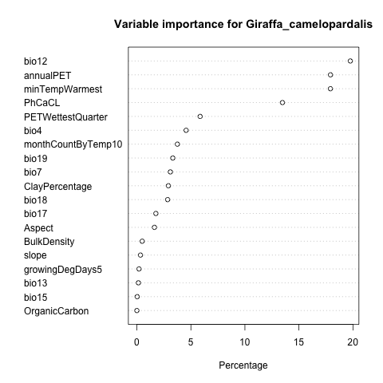
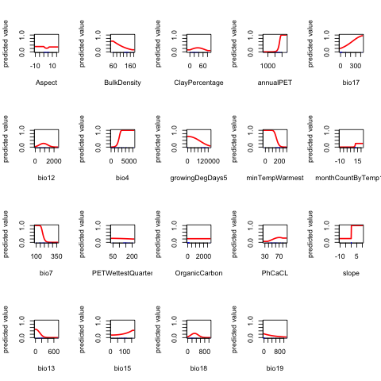
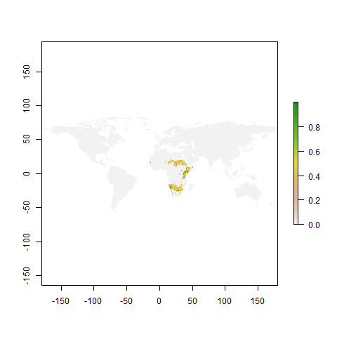
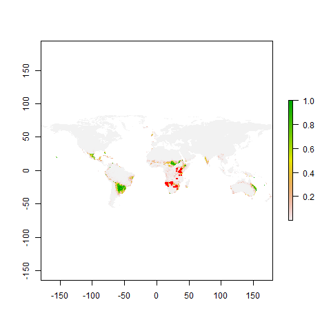

# Giraffa camelopardalis 

 

## Distribution of occurence points 
The following map shows the distribution of the filtered occurence points for Giraffa camelopardalis used in the Maxent model. 

    
## Variable importance 
The variable importance graph shows the relative importance of the abiotic raster layers in the  Maxent model for Giraffa camelopardalis. 

    
## Response curve 
The response curve graphs show the response of the Maxent model for Giraffa camelopardalis to different values in the abiotic raster layers. 

    
## prediction map 
The first map shows the predicted suitable areas on earth based on the niche preferences for Giraffa camelopardalis calculated in the Maxent model. The second map shows the suitable area map with the original occurence points.

    
