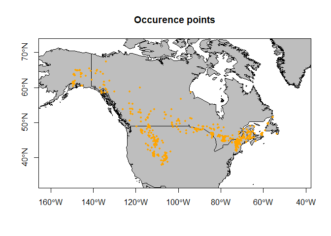

Niche Models
================
Elke Hendrix
February 13, 2019

\# Introduction
===============

The following R markdown file explains the steps needed to calculate niche overlap between 154 Ungulates. Here we explain two different approaches to calculate the niche per species (i) Maxent species distribution models and (ii) Outlying Mean Index (OMI) and how to calculate their overlap.

The following libraries need to be loaded:

``` r
library(raster)
library(maxent)
library(maps)
library(rJava) 
library(maptools)
library(jsonlite)
library(caret)
library(ENMeval)
library(repmis)
library(CoordinateCleaner)
library(dismo) 
library(virtualspecies)
library(sp)
library(rgeos)
library(ape)
```

To calculate niches and niche overlap environmental data and occurrence data per species are needed.

The environmental data used in this research are based on climatic variables, topography and soil characteristics. Climatic information about the present was subtracted from the widely used Bioclim dataset which includes 19 bioclimatic datasets. The datasets contain information such as precipitation in the driest quarter or maximum temperatures of the coldest month and are constructed based on monthly remote sensing data between 1950 and 2000 (Hijmans et al., 2005, Title et al ., 2018). The dataset can directly be downloaded with the getData() function from the raster package. It is also possible to adjust the spatial resolution res=2.5 to 30 seconds, 5 minutes and 10 minutes.

``` r
currentEnv1=getData("worldclim", var="bio", res=10)
```

The other environmental datasets that we used are the new ENVIREM variables that give additional climatic information to the Bioclim datasets. We used median elevation variables from the Harmonized World Soil Database (HWSD) which are based on NASA’s Shuttle Radar Topographic Mission to calculate worldwide slope and aspect. We used indirect height measures such as slope and aspect because the height variables are directly correlated with the temperature Bioclim datasets. To capture soil characteristics, we used organic carbon, pH CaCL, bulk density and clay percentage datasets obtained from the land-atmosphere interaction research group at Sun Yat-sen University.

The additional environmental datasets that we used for this research can be downloaded from our dropbox folder at a spatial resolution of 5 and 10 minutes.

``` r
soilproperties<-stack("C:/Users/elkeh/Dropbox/trait-geo-diverse-ungulates/Input_Datasets/Abiotic_Data/10_deg/Totalstack.tif")
currentEnv<- stack(soilproperties, currentEnv1)
```

The occurrence datasets are needed to extract useful environmental information per species. The line below downloads a list of the species of interest from the github (<https://github.com/naturalis/trait-geo-diverse-ungulates>) data folder, originally obtained via GBIF. The data contains the taxon name, taxon id and the longitude and latitude.

``` r
t<-read.table("https://github.com/naturalis/trait-geo-diverse-ungulates/raw/master/data/filtered/taxa.txt", header = FALSE, sep = "", dec = ".")
```

Below an example of how to plot these occurece datasets is given.

``` r
# here you select the file in the list that you want to plot
file<-paste("https://github.com/naturalis/trait-geo-diverse-ungulates/raw/master/data/filtered/", t[5,1], sep = "")
species_occurence<-read.csv(file)
colnames(species_occurence) <- c("taxon_id","taxon_name","decimal_latitude","decimal_longitude")
# plot a simple world map
data(wrld_simpl)
plot(wrld_simpl, axes=TRUE, xlim=c(min(species_occurence$decimal_longitude)-5,max(species_occurence$decimal_longitude)+5), ylim=c(min(species_occurence$decimal_latitude)-5,max(species_occurence$decimal_latitude)+5), fill=TRUE, col="grey", main= "Occurence points")
points(species_occurence$decimal_longitude, species_occurence$decimal_latitude, col="orange", pch=20, cex=0.75)
box()
```



\# Maxent: species distribution model
=====================================

\# Outlying Mean Index (OMI)
============================
