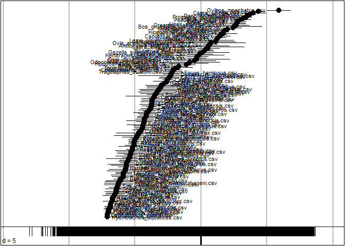
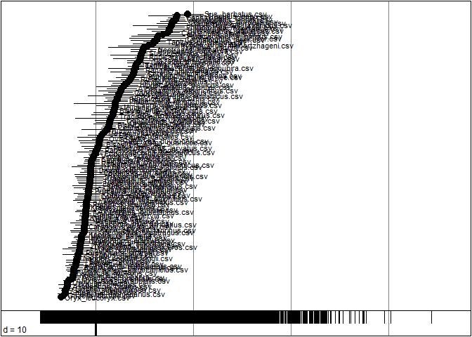

Niche Models
============

Introduction
------------

The following R markdown file explains the steps needed to calculate niche overlap between the extant Ungulates. 
Here we explain two different approaches to calculate the niche per species: 

1. Maxent species distribution models, and 
2. Outlying Mean Index (OMI) and how to calculate their overlap.

The following libraries and scripts need to be loaded:

```{r libraries}
library(raster, quietly = T)
library(knitr, quietly = T)
library(maxent, quietly = T)
library(maps, quietly = T)
library(rJava, quietly = T) 
library(maptools, quietly = T)
library(jsonlite, quietly = T)
library(caret, quietly = T)
library(ENMeval, quietly = T)
library(repmis, quietly = T)
library(CoordinateCleaner, quietly = T)
library(dismo, quietly = T) 
library(virtualspecies, quietly = T)
library(sp, quietly = T)
library(rgeos, quietly = T)
library(ape, quietly = T)
library(adehabitatMA, quietly = T)
library(ade4, quietly = T)
library(raster, quietly = T)
library(SDMTools, quietly = T)
library(factoextra, quietly = T)
library(ecospat, quietly = T)

# our local code. the goal is that this will eventually be properly portable code that lives
# inside the ./R folder of the repository
source("MaxEnt_function.R")
```

In addition, here we define the global variables that we will reuse throughout the code

```{r globals}
# this is the location of the root directory of the git repository in the local file system.
# normally you would be running the code from within rstudio, using a project that is initialized
# within that directory, so the working directory should automatically be set.
REPO_HOME <- paste(getwd(),'/../',sep='')
```

To calculate niches and niche overlap environmental data and occurrence data per species are needed.

The environmental data used in this research are based on climatic variables, topography and soil 
characteristics. Climatic information about the present was extracted from the widely used Bioclim 
dataset, which includes 19 bioclimatic layers. The datasets contain information such as precipitation 
in the driest quarter or maximum temperatures of the coldest month and are constructed based on 
monthly remote sensing data between 1950 and 2000 (Hijmans et al., 2005, Title et al., 2018). The 
dataset can directly be downloaded with the getData() function from the raster package. It is also 
possible to adjust the spatial resolution res=2.5 to 30 seconds, 5 minutes and 10 minutes.

```{r getdata}
# This function from the raster package loads bioclimatic layers. It first attempts to do this
# from files in data/GIS/wc10, but if these are not found it will attempt to download them
# and cache them locally. Since the files are small enough to commit to github we will normally
# have these files already. This could change if we move to a resolution that is finer than 10
# arcminutes, as the layer files will then grow above 10MB.
currentEnv1 = raster::getData(
  "worldclim", 
  var="bio", 
  res=10, 
  path=paste(REPO_HOME, '/data/GIS', sep=''), 
  download=T
)
```

The other environmental datasets that we used are the new ENVIREM variables that give additional 
climatic information to the Bioclim datasets. We used median elevation variables from the Harmonized 
World Soil Database (HWSD), which are based on NASA’s Shuttle Radar Topographic Mission to calculate 
worldwide slope and aspect. We used indirect height measures such as slope and aspect because the 
height variables are directly correlated with the temperature Bioclim datasets. To capture soil 
characteristics, we used organic carbon, pH CaCL, bulk density and clay percentage datasets obtained 
from the land-atmosphere interaction research group at Sun Yat-sen University.

The additional environmental datasets that we used for this research can be downloaded from our 
dropbox folder at a spatial resolution of 5 and 10 minutes.

```{r add_layers}
# The location of the TIFF file with the stacked layers described directly above
totalstack.tif <- paste(REPO_HOME, '/data/GIS/Totalstack.tif', sep = '')

# This file is too large to keep under git, so this download is likely to happen at least once
if (!file.exists(totalstack.tif)) {

  # With the ?dl=1 argument the file is downloaded directly and stored as the temporary file
  download.file("https://www.dropbox.com/s/nlfe349hykg9pfs/Totalstack.tif?dl=1", totalstack.tif, quiet = T)
}

# load the file contents, assign layer names, add to environment
soilproperties <- stack(totalstack.tif)
names(soilproperties) <- c(
  "Aspect_10deg",
  "BulkDensity_10min",
  "ClayPercentage_10min",
  "current_10arcmin_annualPET",
  "current_10arcmin_aridityIndexThornthwaite",
  "current_10arcmin_climaticMoistureIndex",
  "current_10arcmin_continentality",
  "current_10arcmin_embergerQ",
  "current_10arcmin_growingDegDays0",
  "current_10arcmin_growingDegDays5",
  "current_10arcmin_maxTempColdest",
  "current_10arcmin_minTempWarmest",
  "current_10arcmin_monthCountByTemp10",
  "current_10arcmin_PETColdestQuarter",
  "current_10arcmin_PETDriestQuarter",
  "current_10arcmin_PETseasonality",
  "current_10arcmin_PETWarmestQuarter",
  "current_10arcmin_PETWettestQuarter",
  "current_10arcmin_thermicityIndex",
  "OrganicCarbon_10min",
  "PhCaCL_10min",
  "slope_10deg"
)
currentEnv <- stack(soilproperties, currentEnv1)
```

The occurrence datasets are needed to extract useful environmental information per species. The 
segment below reads a list of the species of interest from the `/data/filtered/taxa.txt` file. From 
this list we construct paths to input and output files per species. This way, we can work incrementally,
and cache intermediate results, such as maps of raw occurrence data, maxent models, model predictions,
and global projections.

```{r load_taxa}
# read listing
taxa <- scan(paste(REPO_HOME, "/data/filtered/taxa.txt", sep = ""), sep = "\n", what = character())

# make output directories, if needed
for ( i in 1:length(taxa) ) {
  taxon.dir.name <- sprintf('%s/results/per_species/%s/', REPO_HOME, taxa[i])
  if(!dir.exists(taxon.dir.name)) {
    dir.create(taxon.dir.name, recursive = T)
  }
}
rm(i,taxon.dir.name)
```

Below, the raw occurrence data are plotted on a map, which goes to `/results/per_species/<taxon>/occurrences.png`:

```{r plot_points}
data(wrld_simpl)
for ( i in 1:length(taxa) ) {

  # construct the name of the occurrences file for the current taxon
  taxon <- taxa[i]
  occ.map.file <- sprintf('%s/results/per_species/%s/occurrences.png', REPO_HOME, taxon)
  
  # generate the map
  if(!file.exists(occ.map.file)) {
  
    # create the path for the file whose occurrences you want to plot, then load occurrences as CSV
    csv.file <- sprintf('%s/data/filtered/%s.csv', REPO_HOME, taxon)
    occ <- read.csv(csv.file, header = T)
    lon <- occ$decimal_longitude
    lat <- occ$decimal_latitude

    # plot a simple world map
    png(file = occ.map.file)
    plot(
      wrld_simpl, 
      axes=TRUE, 
      xlim=c(min(lon)-5,max(lon)+5), 
      ylim=c(min(lat)-5,max(lat)+5), 
      col="grey", 
      main=sprintf('Raw occurrences for %s',taxon)
    )
    points(lon, lat, col="orange", pch=20, cex=0.75)
    box()
    dev.off()
  }
}
rm(i,occ.map.file,taxon,wrld_simpl)
```

Maxent: species distribution model
----------------------------------

For this research we used the Maximum Entropy (MaxEnt) machine learning algorithm version 3.3.3 to 
construct SDMs for all available species. Previous research has demonstrated that the MaxEnt technique 
performs well when using presence only data to estimate the relationships between environmental 
predictors and the occurrences of species (Elith et al., 2011, Philips et al., 2006, Tognelli et al., 2009, 
Conolly et al., 2012). The widely used machine learning algorithm is very efficient in the complex 
handling of response and predictor variable interactions and works well with little occurrence data 
points (Elith et al., 2011, Elith et al., 2006, Wisz et al., 2008).

Before the construction of the maxent model the environmental rasters are cropped to the extent 
of the occurrence points for a specific species + a buffer around the total extent. Buffers that 
are too small can result in underestimations of edge effects while buffers that are too large 
have the risk of losing track of favorable environmental conditions due to noise. In this research 
we base the extent of the buffer on the maximum distribution between two occurrence points, in 
this way we account for species with a wide distribution and species with a small distribution. 
The cropped environmental data are checked for collinearity, because only uncorrelated environmental 
raster layers can be used in the SDM (Dormann et al., 2013, Reas & Aguirre-Gutierrez, 2018). To 
remove correlated layers the removeCollinearity function in the virtualspecies version 1.4-4 R 
package was used (Leroy et al., 2016). Environmental variables with a Pearson’s R correlation 
coefficients above 0.7 were grouped and one variable within this group was randomly chosen, 
resulting in a raster stack with only uncorrelated environmental rasters.

Afterwards the occurrence dataset is split in k-fold partitions: a training dataset containing 
75% of the data and a test dataset containing 25% of the data. The maxent model is constructed 
using the maxent function from the dismo R package (Hijmans & Elith, 2013). The function extracts 
abiotic environmental data for the training occurrence locations and 1000 random sampled 
background locations, resulting in a model maxent object that can be used to predict which other 
locations are suitable.

To assess the model performance we used the area under the receiver operating curve (ROC), also 
known as the AUC, which is often used to estimate the ability of models (Fourcade et al., 2014). 
The AUC was interpreted as the probability that a randomly chosen “presence point”, the location 
of a species occurrence, has a higher predicted probability of occurrence than a randomly chosen 
absence point (Reas & Aguirre-Gutierrez, 2018). To compare a presence point to an absence point 
1000 absence points were randomly sampled within the study area. The test occurence datasets were 
used to evaluate the model performance with the evaluate function in the dismo R package 
(Hijmans & Elith, 2013). Only SDMs with an AUC value higher than 0.7 were used in the further steps, 
since these models are generally accepted as useful models (Swets et al., 2000).

The script below shows a loop that automatically loops through each species in the list and 
separates them into two groups: 

1. the models with a high accuracy and, 
2. the models with a low accuracy. 

The Maxent function used in this loop can be viewed and adapted in our Github repository in this [script](https://github.com/naturalis/trait-geo-diverse-ungulates/blob/master/script/MaxEnt_function.R).

```{r maxent1}

# first we created two empty lists, one list for models with a low accuracy (AUC below 0.7) and one 
# list for models with a high accuracy (AUC above 0.7)
list_species_model_low_accuracy <- list()
list_species_model_high_accuracy <- list()

# iterate over n species
for (i in 1:length(taxa)) {
  name <- taxa[i]
  valid.model.file <- sprintf('%s/results/per_species/%s/valid_maxent_model.rda', REPO_HOME, name)
  invalid.model.file <- sprintf('%s/results/per_species/%s/invalid_maxent_model.rda', REPO_HOME, name)
  
  # check if we have the model cached
  if(!file.exists(valid.model.file) && !file.exists(invalid.model.file)) {
    message(name)

    # set the extent for the training model with a buffer of 5 lon and lat
    csv.file <- sprintf('%s/data/filtered/%s.csv', REPO_HOME, name)
    species_occurence <- read.csv(csv.file, header = T)
    species_model <- Maxent_function(species_occurence, currentEnv)

    # validate the model with the test data
    # to construct an AUC model we need random points
    random <- randomPoints(species_model[[2]], 1000)
    Validation_species <- evaluate(p=species_model[[3]], a=random, x=species_model[[2]], model=species_model[[1]])

    # create two stacks one with the models with a low accuracy <0.7 and one with a high accuracy >0.7
    model <- species_model[[1]]
    if (Validation_species@auc > 0.7) {
      list_species_model_high_accuracy[[name]] <- model
      save(model, file = valid.model.file)
    } 
    else { 
      list_species_model_low_accuracy[[name]] <- model
      save(model, file = invalid.model.file)
    }
  } else if (file.exists(valid.model.file)) {
    
    # valid model was previously constructed, load it
    env <- new.env()
    nm <- load(valid.model.file, env)[[1]]
    list_species_model_high_accuracy[[name]] <- env[[nm]]
    
  } else if (file.exists(invalid.model.file)) {
    
    # invalid model was previously constructed, load it
    env <- new.env()
    nm <- load(invalid.model.file)[[1]]
    list_species_model_low_accuracy[[name]] <- env[[nm]]
  }
}
```


The models are now stacked in a list but can be viewed and examined as follows:

```{r plot_importance}
# Select the first model in the list
open_species_model <- list_species_model_high_accuracy[[1]]

# name of the dataset plotted
name <- paste("Variable importance for", names(list_species_model_high_accuracy[1]))

# plot the variable importance
plot(open_species_model, main = name)
```


```{r plot_envelopes}
# plot the response curve to see what the range of important values is per abiotic dataset
response(open_species_model)
```

The outcome of the species distribution models can be used to create a prediction of the areas 
that are suitable for the species. The script below shows a loop that creates prediction raster 
files for the models with a high prediction accuracy.

```{r plot_suitability}
# combine all prediction rasters, either by doing the projection or by reading from a file
prediction_rasters <- stack()
taxon.names <- names(list_species_model_high_accuracy)
for (i in 1:length(list_species_model_high_accuracy) ) {
  
  # file name: load if exists, create otherwise
  valid.model.prediction <- sprintf('%s/results/per_species/%s/valid_maxent_prediction.rda', REPO_HOME, taxon.names[i])
  if( file.exists(valid.model.prediction) ) {
    
    # load file
    message(sprintf("loading prediction for taxon %s from file %s", taxon.names[i], valid.model.prediction))
    env <- new.env()
    nm <- load(valid.model.prediction, envir = env)[[1]]
    prediction_rasters <- stack(prediction_rasters, env[[nm]])
  }
  else {
    message(sprintf("computing prediction for taxon %s, will write to file %s", taxon.names[i], valid.model.prediction))
    open_species_model <- list_species_model_high_accuracy[[i]]
    
    # select non correlated layers from model environment in the world environment
    noncorrelated <- names(open_species_model@presence)
    subsetworldEnv <- subset(currentEnv,noncorrelated)
  
    # make prediction of the whole earth based on the maxent SDM
    species.pred <- predict(open_species_model, subsetworldEnv)
    
    # save file, stack prediction contents
    save(species.pred, file = valid.model.prediction)
    prediction_rasters <- stack(prediction_rasters, species.pred)
  }
}

names(prediction_rasters) <- names(list_species_model_high_accuracy)
plot(prediction_rasters)
```

To assess whether the predicted suitable niche spaces differ per species we calculate their niche 
overlap. We use Schoener’s D to calculate niche overlap since it has been suggested to be the best 
suited index for maxent SDM outputs (Rödder & Engler, 2011). The index ranges from 0 which is no 
overlap to 1 which is a complete overlap and is based on the model prediction maps.

```{r calc_dist}
# calculate niche overlap
overlap <- calc.niche.overlap(prediction_rasters, stat="D", maxent.args )
```

Having calculated the Schoener's D distances, we can now use these to make a symmetrical distance
matrix, and perform a neighbor joining clustering to visualize the distances in niche space.

```{r cluster_dist}
# create a distance matrix
dmatrix <- as.dist(1-overlap)

# plot an unrooted dendrogram
tree <- nj(dmatrix)
plot(tree, type="unrooted", cex = 0.1, main = "Unrooted dendrogram of Schoener's D")
```

\# Outlying Mean Index (OMI)
============================

The second approach we used to characterize environmental niches per species is the Outlying Mean Index (OMI) proposed by Dolec et al. (2000). The OMI is a multivariate method that measures the distance of the niche per species to the mean environmental conditions of the study area. The difference in distance is used to estimate niche position and breadth (Doledec et al., 2000).

``` r
## transform the environmental raster datasets to spatialpixelsdataframes
rtoAsc<- as(currentEnv, "SpatialPixelsDataFrame")
proj4string(rtoAsc) <- CRS("+proj=longlat +datum=WGS84")

### make a spatialPointsDataFrame from all the seperate species 
## create empty spatialpointsdataframe 

spdf<-new("SpatialPointsDataFrame",                                                          
    coords = structure(numeric(0), .Dim = c(0L, 2L),                          
                       .Dimnames = list(NULL, c("decimal_longitude", "decimal_latitude"))),  
    bbox = structure(c(1, 1, 1, 1), .Dim = c(2L, 2L),                         
                     .Dimnames = list(c("decimal_longitude", "decimal_latitude"),
                                      c("min", "max"))),
    proj4string = new("CRS", projargs = "+proj=longlat +datum=WGS84")) 

for (i in 1:153){
    file<-paste("https://github.com/naturalis/trait-geo-diverse-ungulates/raw/master/data/filtered/", t[i,1], sep = "")
  species_occurence<-as.matrix(read.csv(file))
  name<- paste(t[i,1])
  length_df<- NROW(species_occurence)
  bindlonglat<- as.data.frame(cbind(species_occurence[, c("decimal_longitude", "decimal_latitude")]))
  points<- bindlonglat
  points$decimal_longitude<- as.numeric(as.character(points$decimal_longitude))
  points$decimal_latitude<- as.numeric(as.character(points$decimal_latitude))
  coordinates(points)<- ~ decimal_longitude + decimal_latitude
  spdf2<- SpatialPointsDataFrame(points, data.frame(species = rep(name, length_df)), proj4string = CRS)
  proj4string(spdf2) <- CRS("+proj=longlat +datum=WGS84")
  spdf<- rbind(spdf, spdf2)
}
```

The environmental spatialpixeldataframes and the spatialpointsdataframes are used to create a dataframe with all the environmental variability in our dataset (world). The occurence datasets are used to create a dataframe that shows which species visited which spatialpixel in the environmental dataframe.

``` r
cp <- count.points(spdf, rtoAsc)

dfavail <- slot(rtoAsc, "data")
dfavail <- tibble::rowid_to_column(dfavail, "ID")
dfavail<- na.omit(dfavail)

dfused <- slot(cp, "data")
dfused <- tibble::rowid_to_column(dfused, "ID")

dfused<- subset(dfused, dfused$ID %in% dfavail$ID )
dfused <- subset(dfused, select = -ID )
```

A PCA analysis is conducted to standardize all the environmental variables. This standardized dataframe is used a an input dataset for the niche function to calculate the OMI per species. The OMI is used to plot both niche breadth and niche position per species.

``` r
## pca to analyse the environmental data 
## standardizes the environmental variables 
## the OMI uses these standardized values 
dud<- dudi.pca(dfavail[2:42], scannf=FALSE)
#scatter(dud, npcs=2)

# The correlations between environmental variables and PCA axes:
dud$co
```

    ##                      Comp1        Comp2
    ## Totalstack.1   0.004169398 -0.010052677
    ## Totalstack.2  -0.426296227  0.289772534
    ## Totalstack.3  -0.377001775 -0.151827690
    ## Totalstack.4  -0.958538671  0.246420839
    ## Totalstack.5  -0.322570355  0.809150759
    ## Totalstack.6   0.257904521 -0.899885209
    ## Totalstack.7   0.882160583  0.227589920
    ## Totalstack.8  -0.514545152 -0.768869302
    ## Totalstack.9  -0.975224427  0.077216203
    ## Totalstack.10 -0.966753057  0.076405141
    ## Totalstack.11 -0.981141695  0.003585391
    ## Totalstack.12 -0.876316170  0.214312846
    ## Totalstack.13 -0.963634377  0.108379063
    ## Totalstack.14 -0.937809652 -0.004877828
    ## Totalstack.15 -0.836820674  0.195693884
    ## Totalstack.16  0.298704369  0.594562895
    ## Totalstack.17 -0.770642056  0.517095042
    ## Totalstack.18 -0.590574187  0.296391732
    ## Totalstack.19 -0.981871578  0.067286156
    ## Totalstack.20  0.314551985 -0.221732318
    ## Totalstack.21  0.026514295  0.538108494
    ## Totalstack.22  0.195584899 -0.177580515
    ## bio1          -0.984646388  0.079086442
    ## bio2          -0.432951019  0.647016089
    ## bio3          -0.894750669 -0.209481873
    ## bio4           0.886856991  0.222580355
    ## bio5          -0.850068819  0.382266432
    ## bio6          -0.970997262 -0.078799068
    ## bio7           0.813659524  0.361324476
    ## bio8          -0.800975126  0.126193391
    ## bio9          -0.930347183  0.059435159
    ## bio10         -0.896336959  0.285227697
    ## bio11         -0.980881545 -0.027181856
    ## bio12         -0.490594825 -0.829065964
    ## bio13         -0.550727238 -0.645564446
    ## bio14         -0.150984743 -0.775018289
    ## bio15         -0.345728481  0.455272467
    ## bio16         -0.544016026 -0.677424130
    ## bio17         -0.180935500 -0.793450988
    ## bio18         -0.284694130 -0.713591368
    ## bio19         -0.342690256 -0.675313740

``` r
## Calculate OMI based on the standardized environmental variables per occurece point
nic<- niche(dud, dfused, scannf=FALSE)

# OMI values 
niche.param(nic)
```

    ##                                  inertia        OMI          Tol
    ## Aepyceros_melampus.csv          28.93873  21.271711  0.322024732
    ## Alcelaphus_buselaphus.csv       43.44576  33.080980  2.141173325
    ## Alcelaphus_caama.csv            34.41469  29.413125  0.167905125
    ## Alces_alces.csv                 28.78079  19.395383  1.066131802
    ## Alces_americanus.csv            26.21566  12.434307  0.869830117
    ## Ammotragus_lervia.csv           13.88987  10.526878  0.144145092
    ## Antidorcas_marsupialis.csv      29.59901  23.109889  0.603436701
    ## Antilocapra_americana.csv       18.55710   8.398867  0.303596472
    ## Antilope_cervicapra.csv         41.99512  37.361425  0.221816154
    ## Axis_axis.csv                   50.73824  36.848124  0.842087600
    ## Axis_porcinus.csv               69.35335  61.857171  2.597678786
    ## Bison_bison.csv                 26.88514  20.395643  0.936398204
    ## Bison_bonasus.csv               14.82828   9.658841  0.162812522
    ## Blastocerus_dichotomus.csv      25.20372  23.072089  0.108138074
    ## Bos_frontalis_gaurus.csv        68.72244  42.251546  5.833629437
    ## Bos_grunniens_mutus.csv         38.89163  16.413859  1.195709407
    ## Bos_javanicus.csv               52.77814  43.681101  0.466390168
    ## Boselaphus_tragocamelus.csv     42.81443  38.609952  0.170425918
    ## Bubalus_bubalis_arnee.csv       82.75372  62.047333  5.237177046
    ## Budorcas_taxicolor.csv          23.79775  16.171345  2.037512597
    ## Camelus_dromedarius.csv         38.22989  26.375307  0.455841133
    ## Capra_ibex.csv                  52.71345  18.377962  9.217327362
    ## Capra_nubiana.csv               30.06497  27.039637  0.324424057
    ## Capra_pyrenaica.csv             12.75853   7.671015  0.283386073
    ## Capra_sibirica.csv              31.09279  22.796438  0.944454394
    ## Capreolus_capreolus.csv         25.65660  13.132119  1.743890470
    ## Capreolus_pygargus.csv          30.21309  14.566274  2.935262920
    ## Capricornis_crispus.csv         32.97522  27.069020  1.055342967
    ## Capricornis_swinhoei.csv       107.37388  96.145970  1.919176468
    ## Catagonus_wagneri.csv           27.76182  27.273272  0.063016804
    ## Cephalophus_dorsalis.csv       118.81656 115.044906  1.371383702
    ## Cephalophus_jentinki.csv       123.63991 121.221481  0.688462425
    ## Cephalophus_natalensis.csv      25.14623  20.576568  0.154616924
    ## Cephalophus_niger.csv          100.59803  88.814949  4.489967606
    ## Cephalophus_nigrifrons.csv      51.23974  40.452271  0.861754327
    ## Cephalophus_rufilatus.csv       53.77163  50.741091  0.138434312
    ## Cephalophus_silvicultor.csv    103.02267  87.533202  5.809425055
    ## Cephalophus_zebra.csv          123.70375 121.573690  0.550851741
    ## Ceratotherium_simum.csv         20.22134  15.926344  0.201671266
    ## Cervus_elaphus.csv              47.63049  24.289380  8.746714328
    ## Cervus_nippon.csv               29.51241  22.478965  1.479887126
    ## Connochaetes_gnou.csv           14.00056   9.502501  0.378371625
    ## Connochaetes_taurinus.csv       28.13886  19.746694  0.420104281
    ## Dama_dama.csv                   21.23661  14.090923  0.642738062
    ## Damaliscus_korrigum.csv         49.44214  41.699487  1.827714466
    ## Damaliscus_lunatus.csv          34.92181  25.123360  0.840900747
    ## Damaliscus_pygargus.csv         15.47217   8.162744  0.249016045
    ## Diceros_bicornis.csv            33.21767  22.309901  0.470934832
    ## Equus_asinus.csv                35.52179  17.722411  4.332259178
    ## Equus_burchellii.csv            29.61076  20.563452  0.547157348
    ## Equus_caballus.csv              29.31452   6.865680  3.443815798
    ## Equus_grevyi.csv                40.05366  35.006871  0.288400147
    ## Equus_hemionus.csv              26.79648  22.845747  1.549508555
    ## Equus_kiang.csv                 31.98207  26.173686  0.294485835
    ## Equus_przewalskii.csv           22.56222  18.272596  0.111574156
    ## Equus_zebra.csv                 20.88502  14.378635  0.715934609
    ## Eudorcas_rufifrons.csv          51.80233  50.005646  0.002093413
    ## Eudorcas_thomsonii.csv          33.44398  26.158296  0.513834646
    ## Gazella_bennettii.csv           43.83676  38.919486  0.033535388
    ## Gazella_dorcas.csv              31.56089  28.722352  0.170888582
    ## Gazella_gazella.csv             27.98361  24.790536  0.187637517
    ## Gazella_subgutturosa.csv        29.56384  15.106290  0.706172497
    ## Giraffa_camelopardalis.csv      41.73745  34.154870  1.504419108
    ## Hemitragus_jemlahicus.csv       48.20076  16.461752  5.543380033
    ## Hippocamelus_antisensis.csv     38.36668  23.881877  2.195348479
    ## Hippocamelus_bisulcus.csv       39.70594  30.086468  1.765442461
    ## Hippopotamus_amphibius.csv      28.74197  21.245591  0.342296148
    ## Hippotragus_equinus.csv         52.48563  48.156117  0.007813929
    ## Hippotragus_niger.csv           28.66794  23.210564  0.272738399
    ## Hyemoschus_aquaticus.csv       116.46019 110.679084  2.065118967
    ## Hylochoerus_meinertzhageni.csv  87.04756  69.725981  7.029818603
    ## Kobus_ellipsiprymnus.csv        38.50645  28.053423  1.539102759
    ## Kobus_kob.csv                   54.72056  51.949592  0.107060128
    ## Kobus_leche.csv                 28.82576  26.961581  0.037071388
    ## Kobus_megaceros.csv             51.97745  50.209014  0.071001142
    ## Kobus_vardonii.csv              31.97935  29.283644  0.165522169
    ## Lama_glama_guanicoe.csv         29.82573  14.995613  1.737094872
    ## Litocranius_walleri.csv         48.09151  42.910206  0.590657333
    ## Madoqua_guentheri.csv           44.02512  38.086479  0.533115153
    ## Madoqua_kirkii.csv              32.92594  24.079550  0.558114550
    ## Madoqua_saltiana.csv            38.81252  34.536515  0.299608728
    ## Mazama_americana.csv            53.15407  43.763646  1.114554126
    ## Mazama_gouazoubira.csv          68.22683  50.447221  7.739966343
    ## Mazama_nana.csv                 42.24135  41.941020  0.001543456
    ## Mazama_pandora.csv              33.95688  32.030702  0.031509433
    ## Mazama_rufina.csv               83.50273  67.305158  2.968637922
    ## Mazama_temama.csv               71.47474  53.586552  4.089736110
    ## Muntiacus_muntjak.csv           67.37200  39.344107  3.530866004
    ## Muntiacus_reevesi.csv           19.58977  16.056595  0.239080391
    ## Nanger_granti.csv               50.55894  43.596802  1.158760851
    ## Nanger_soemmerringii.csv        42.45737  40.153366  0.055292041
    ## Neotragus_batesi.csv            81.10180  68.813745  2.856930704
    ## Neotragus_pygmaeus.csv         116.45605 108.072394  4.179946629
    ## Odocoileus_hemionus.csv         23.44219   8.003300  1.278151949
    ## Odocoileus_virginianus.csv      21.39804   6.841535  1.630328319
    ## Oreamnos_americanus.csv         41.54101  24.294599  1.321880275
    ## Oreotragus_oreotragus.csv       23.04878  12.865711  0.679583176
    ## Oryx_beisa.csv                  50.39294  45.958618  0.551659528
    ## Oryx_gazella.csv                30.75045  24.432355  0.431325063
    ## Oryx_leucoryx.csv               42.48281  38.237909  0.614123997
    ## Ourebia_ourebi.csv              52.94871  49.015870  0.068006127
    ## Ovibos_moschatus.csv            55.11015  45.345061  1.128642697
    ## Ovis_ammon.csv                  17.01602   9.561588  0.864057783
    ## Ovis_aries_orientalis.csv       35.70803  16.051219  0.907253221
    ## Ovis_canadensis.csv             28.23637  10.427215  2.115757701
    ## Ovis_dalli.csv                  34.57476  26.309818  0.918478748
    ## Ozotoceros_bezoarticus.csv      25.45448  14.342992  0.952288273
    ## Pecari_tajacu.csv               53.94492  26.134709  7.061485148
    ## Pelea_capreolus.csv             18.31811  10.179790  0.997017645
    ## Phacochoerus_aethiopicus.csv    39.84540  29.207114  1.074590819
    ## Phacochoerus_africanus.csv      43.67758  34.138097  1.824610291
    ## Philantomba_maxwellii.csv      115.38311 111.534091  1.258438290
    ## Philantomba_monticola.csv       35.66225  26.058949  1.863874786
    ## Potamochoerus_larvatus.csv      24.85938  14.319443  0.932013120
    ## Potamochoerus_porcus.csv       101.73825  90.222994  4.687999680
    ## Procapra_picticaudata.csv       28.97739  25.510440  0.190699157
    ## Pseudois_nayaur.csv             33.78560  23.600144  1.441256761
    ## Pudu_puda.csv                   34.34333  27.201106  0.641686605
    ## Rangifer_tarandus.csv           47.47893  41.084579  0.584018763
    ## Raphicerus_campestris.csv       26.26905  20.057997  0.759350079
    ## Raphicerus_melanotis.csv        17.86671  12.350724  0.157628875
    ## Raphicerus_sharpei.csv          27.74064  24.100064  0.198074130
    ## Redunca_arundinum.csv           24.67933  16.809653  0.564519721
    ## Redunca_fulvorufula.csv         19.76112  12.632501  0.879918272
    ## Redunca_redunca.csv             54.43435  51.905515  0.096160244
    ## Rhinoceros_unicornis.csv        70.56470  65.901334  2.207251022
    ## Rucervus_duvaucelii.csv         58.64208  42.259384  2.108401904
    ## Rupicapra_pyrenaica.csv         39.28122  34.910388  0.620185890
    ## Rupicapra_rupicapra.csv         55.06200  45.200590  2.767868684
    ## Rusa_timorensis.csv             28.83372  22.261015  0.847643326
    ## Rusa_unicolor.csv               54.71400  34.265124  1.907844275
    ## Sus_barbatus.csv               151.01137 139.809454  3.095919145
    ## Sus_cebifrons.csv               70.27319  67.640698  0.100290105
    ## Sus_philippensis.csv           105.18173  91.184698  4.284989867
    ## Sus_scrofa.csv                  17.45750   5.912466  0.316550655
    ## Sylvicapra_grimmia.csv          50.42208  43.577789  0.968037220
    ## Syncerus_caffer.csv             44.22543  32.550712  1.454632442
    ## Tapirus_bairdii.csv             87.85321  65.675506  7.986278096
    ## Tapirus_pinchaque.csv           73.81599  62.664527  1.518190319
    ## Tapirus_terrestris.csv          42.48848  40.580967  0.386332234
    ## Taurotragus_oryx.csv            30.06016  19.666420  0.977083038
    ## Tayassu_pecari.csv              79.76571  59.156117  6.428346638
    ## Tragelaphus_angasii.csv         24.02438  19.559203  0.182961636
    ## Tragelaphus_buxtoni.csv         34.89929  29.297449  0.231839097
    ## Tragelaphus_eurycerus.csv      118.64205 113.953826  1.976821230
    ## Tragelaphus_imberbis.csv        42.43595  36.769735  0.834276105
    ## Tragelaphus_scriptus.csv        42.76212  30.508329  3.346198702
    ## Tragelaphus_spekii.csv          44.90045  36.646713  0.601673501
    ## Tragelaphus_strepsiceros.csv    26.20749  19.370331  0.740637556
    ## Tragulus_javanicus.csv         140.28526 105.541600 12.608890648
    ## Tragulus_kanchil.csv            82.19109  63.183106  7.553829349
    ## Tragulus_napu.csv              137.22892 117.410074  7.716283165
    ## Vicagna_vicugna.csv             36.41872  30.183272  0.286981019
    ##                                      Rtol  omi  tol rtol
    ## Aepyceros_melampus.csv          7.3449949 73.5  1.1 25.4
    ## Alcelaphus_buselaphus.csv       8.2236114 76.1  4.9 18.9
    ## Alcelaphus_caama.csv            4.8336575 85.5  0.5 14.0
    ## Alces_alces.csv                 8.3192776 67.4  3.7 28.9
    ## Alces_americanus.csv           12.9115278 47.4  3.3 49.3
    ## Ammotragus_lervia.csv           3.2188421 75.8  1.0 23.2
    ## Antidorcas_marsupialis.csv      5.8856828 78.1  2.0 19.9
    ## Antilocapra_americana.csv       9.8546317 45.3  1.6 53.1
    ## Antilope_cervicapra.csv         4.4118763 89.0  0.5 10.5
    ## Axis_axis.csv                  13.0480273 72.6  1.7 25.7
    ## Axis_porcinus.csv               4.8984956 89.2  3.7  7.1
    ## Bison_bison.csv                 5.5530940 75.9  3.5 20.7
    ## Bison_bonasus.csv               5.0066240 65.1  1.1 33.8
    ## Blastocerus_dichotomus.csv      2.0234969 91.5  0.4  8.0
    ## Bos_frontalis_gaurus.csv       20.6372645 61.5  8.5 30.0
    ## Bos_grunniens_mutus.csv        21.2820583 42.2  3.1 54.7
    ## Bos_javanicus.csv               8.6306485 82.8  0.9 16.4
    ## Boselaphus_tragocamelus.csv     4.0340484 90.2  0.4  9.4
    ## Bubalus_bubalis_arnee.csv      15.4692068 75.0  6.3 18.7
    ## Budorcas_taxicolor.csv          5.5888962 68.0  8.6 23.5
    ## Camelus_dromedarius.csv        11.3987438 69.0  1.2 29.8
    ## Capra_ibex.csv                 25.1181564 34.9 17.5 47.7
    ## Capra_nubiana.csv               2.7009057 89.9  1.1  9.0
    ## Capra_pyrenaica.csv             4.8041272 60.1  2.2 37.7
    ## Capra_sibirica.csv              7.3518979 73.3  3.0 23.6
    ## Capreolus_capreolus.csv        10.7805926 51.2  6.8 42.0
    ## Capreolus_pygargus.csv         12.7115508 48.2  9.7 42.1
    ## Capricornis_crispus.csv         4.8508578 82.1  3.2 14.7
    ## Capricornis_swinhoei.csv        9.3087375 89.5  1.8  8.7
    ## Catagonus_wagneri.csv           0.4255267 98.2  0.2  1.5
    ## Cephalophus_dorsalis.csv        2.4002741 96.8  1.2  2.0
    ## Cephalophus_jentinki.csv        1.7299711 98.0  0.6  1.4
    ## Cephalophus_natalensis.csv      4.4150459 81.8  0.6 17.6
    ## Cephalophus_niger.csv           7.2931164 88.3  4.5  7.2
    ## Cephalophus_nigrifrons.csv      9.9257175 78.9  1.7 19.4
    ## Cephalophus_rufilatus.csv       2.8921025 94.4  0.3  5.4
    ## Cephalophus_silvicultor.csv     9.6800422 85.0  5.6  9.4
    ## Cephalophus_zebra.csv           1.5792127 98.3  0.4  1.3
    ## Ceratotherium_simum.csv         4.0933203 78.8  1.0 20.2
    ## Cervus_elaphus.csv             14.5943959 51.0 18.4 30.6
    ## Cervus_nippon.csv               5.5535592 76.2  5.0 18.8
    ## Connochaetes_gnou.csv           4.1196850 67.9  2.7 29.4
    ## Connochaetes_taurinus.csv       7.9720606 70.2  1.5 28.3
    ## Dama_dama.csv                   6.5029520 66.4  3.0 30.6
    ## Damaliscus_korrigum.csv         5.9149382 84.3  3.7 12.0
    ## Damaliscus_lunatus.csv          8.9575537 71.9  2.4 25.7
    ## Damaliscus_pygargus.csv         7.0604127 52.8  1.6 45.6
    ## Diceros_bicornis.csv           10.4368339 67.2  1.4 31.4
    ## Equus_asinus.csv               13.4671238 49.9 12.2 37.9
    ## Equus_burchellii.csv            8.5001475 69.4  1.8 28.7
    ## Equus_caballus.csv             19.0050282 23.4 11.7 64.8
    ## Equus_grevyi.csv                4.7583890 87.4  0.7 11.9
    ## Equus_hemionus.csv              2.4012243 85.3  5.8  9.0
    ## Equus_kiang.csv                 5.5138972 81.8  0.9 17.2
    ## Equus_przewalskii.csv           4.1780520 81.0  0.5 18.5
    ## Equus_zebra.csv                 5.7904552 68.8  3.4 27.7
    ## Eudorcas_rufifrons.csv          1.7945905 96.5  0.0  3.5
    ## Eudorcas_thomsonii.csv          6.7718531 78.2  1.5 20.2
    ## Gazella_bennettii.csv           4.8837387 88.8  0.1 11.1
    ## Gazella_dorcas.csv              2.6676508 91.0  0.5  8.5
    ## Gazella_gazella.csv             3.0054373 88.6  0.7 10.7
    ## Gazella_subgutturosa.csv       13.7513793 51.1  2.4 46.5
    ## Giraffa_camelopardalis.csv      6.0781598 81.8  3.6 14.6
    ## Hemitragus_jemlahicus.csv      26.1956292 34.2 11.5 54.3
    ## Hippocamelus_antisensis.csv    12.2894572 62.2  5.7 32.0
    ## Hippocamelus_bisulcus.csv       7.8540319 75.8  4.4 19.8
    ## Hippopotamus_amphibius.csv      7.1540858 73.9  1.2 24.9
    ## Hippotragus_equinus.csv         4.3216980 91.8  0.0  8.2
    ## Hippotragus_niger.csv           5.1846399 81.0  1.0 18.1
    ## Hyemoschus_aquaticus.csv        3.7159841 95.0  1.8  3.2
    ## Hylochoerus_meinertzhageni.csv 10.2917567 80.1  8.1 11.8
    ## Kobus_ellipsiprymnus.csv        8.9139229 72.9  4.0 23.1
    ## Kobus_kob.csv                   2.6639085 94.9  0.2  4.9
    ## Kobus_leche.csv                 1.8271041 93.5  0.1  6.3
    ## Kobus_megaceros.csv             1.6974318 96.6  0.1  3.3
    ## Kobus_vardonii.csv              2.5301837 91.6  0.5  7.9
    ## Lama_glama_guanicoe.csv        13.0930234 50.3  5.8 43.9
    ## Litocranius_walleri.csv         4.5906453 89.2  1.2  9.5
    ## Madoqua_guentheri.csv           5.4055249 86.5  1.2 12.3
    ## Madoqua_kirkii.csv              8.2882799 73.1  1.7 25.2
    ## Madoqua_saltiana.csv            3.9764002 89.0  0.8 10.2
    ## Mazama_americana.csv            8.2758732 82.3  2.1 15.6
    ## Mazama_gouazoubira.csv         10.0396383 73.9 11.3 14.7
    ## Mazama_nana.csv                 0.2987920 99.3  0.0  0.7
    ## Mazama_pandora.csv              1.8946692 94.3  0.1  5.6
    ## Mazama_rufina.csv              13.2289302 80.6  3.6 15.8
    ## Mazama_temama.csv              13.7984510 75.0  5.7 19.3
    ## Muntiacus_muntjak.csv          24.4970235 58.4  5.2 36.4
    ## Muntiacus_reevesi.csv           3.2940915 82.0  1.2 16.8
    ## Nanger_granti.csv               5.8033790 86.2  2.3 11.5
    ## Nanger_soemmerringii.csv        2.2487096 94.6  0.1  5.3
    ## Neotragus_batesi.csv            9.4311242 84.8  3.5 11.6
    ## Neotragus_pygmaeus.csv          4.2037104 92.8  3.6  3.6
    ## Odocoileus_hemionus.csv        14.1607357 34.1  5.5 60.4
    ## Odocoileus_virginianus.csv     12.9261721 32.0  7.6 60.4
    ## Oreamnos_americanus.csv        15.9245274 58.5  3.2 38.3
    ## Oreotragus_oreotragus.csv       9.5034877 55.8  2.9 41.2
    ## Oryx_beisa.csv                  3.8826605 91.2  1.1  7.7
    ## Oryx_gazella.csv                5.8867701 79.5  1.4 19.1
    ## Oryx_leucoryx.csv               3.6307764 90.0  1.4  8.5
    ## Ourebia_ourebi.csv              3.8648310 92.6  0.1  7.3
    ## Ovibos_moschatus.csv            8.6364498 82.3  2.0 15.7
    ## Ovis_ammon.csv                  6.5903728 56.2  5.1 38.7
    ## Ovis_aries_orientalis.csv      18.7495613 45.0  2.5 52.5
    ## Ovis_canadensis.csv            15.6933923 36.9  7.5 55.6
    ## Ovis_dalli.csv                  7.3464667 76.1  2.7 21.2
    ## Ozotoceros_bezoarticus.csv     10.1592028 56.3  3.7 39.9
    ## Pecari_tajacu.csv              20.7487290 48.4 13.1 38.5
    ## Pelea_capreolus.csv             7.1412999 55.6  5.4 39.0
    ## Phacochoerus_aethiopicus.csv    9.5636944 73.3  2.7 24.0
    ## Phacochoerus_africanus.csv      7.7148713 78.2  4.2 17.7
    ## Philantomba_maxwellii.csv       2.5905818 96.7  1.1  2.2
    ## Philantomba_monticola.csv       7.7394261 73.1  5.2 21.7
    ## Potamochoerus_larvatus.csv      9.6079214 57.6  3.7 38.6
    ## Potamochoerus_porcus.csv        6.8272565 88.7  4.6  6.7
    ## Procapra_picticaudata.csv       3.2762553 88.0  0.7 11.3
    ## Pseudois_nayaur.csv             8.7442034 69.9  4.3 25.9
    ## Pudu_puda.csv                   6.5005383 79.2  1.9 18.9
    ## Rangifer_tarandus.csv           5.8103356 86.5  1.2 12.2
    ## Raphicerus_campestris.csv       5.4517069 76.4  2.9 20.8
    ## Raphicerus_melanotis.csv        5.3583554 69.1  0.9 30.0
    ## Raphicerus_sharpei.csv          3.4425024 86.9  0.7 12.4
    ## Redunca_arundinum.csv           7.3051568 68.1  2.3 29.6
    ## Redunca_fulvorufula.csv         6.2487008 63.9  4.5 31.6
    ## Redunca_redunca.csv             2.4326739 95.4  0.2  4.5
    ## Rhinoceros_unicornis.csv        2.4561131 93.4  3.1  3.5
    ## Rucervus_duvaucelii.csv        14.2742924 72.1  3.6 24.3
    ## Rupicapra_pyrenaica.csv         3.7506489 88.9  1.6  9.5
    ## Rupicapra_rupicapra.csv         7.0935395 82.1  5.0 12.9
    ## Rusa_timorensis.csv             5.7250621 77.2  2.9 19.9
    ## Rusa_unicolor.csv              18.5410283 62.6  3.5 33.9
    ## Sus_barbatus.csv                8.1059988 92.6  2.1  5.4
    ## Sus_cebifrons.csv               2.5322012 96.3  0.1  3.6
    ## Sus_philippensis.csv            9.7120428 86.7  4.1  9.2
    ## Sus_scrofa.csv                 11.2284854 33.9  1.8 64.3
    ## Sylvicapra_grimmia.csv          5.8762550 86.4  1.9 11.7
    ## Syncerus_caffer.csv            10.2200869 73.6  3.3 23.1
    ## Tapirus_bairdii.csv            14.1914225 74.8  9.1 16.2
    ## Tapirus_pinchaque.csv           9.6332708 84.9  2.1 13.1
    ## Tapirus_terrestris.csv          1.5211781 95.5  0.9  3.6
    ## Taurotragus_oryx.csv            9.4166530 65.4  3.3 31.3
    ## Tayassu_pecari.csv             14.1812467 74.2  8.1 17.8
    ## Tragelaphus_angasii.csv         4.2822186 81.4  0.8 17.8
    ## Tragelaphus_buxtoni.csv         5.3700054 83.9  0.7 15.4
    ## Tragelaphus_eurycerus.csv       2.7114074 96.0  1.7  2.3
    ## Tragelaphus_imberbis.csv        4.8319421 86.6  2.0 11.4
    ## Tragelaphus_scriptus.csv        8.9075881 71.3  7.8 20.8
    ## Tragelaphus_spekii.csv          7.6520604 81.6  1.3 17.0
    ## Tragelaphus_strepsiceros.csv    6.0965244 73.9  2.8 23.3
    ## Tragulus_javanicus.csv         22.1347693 75.2  9.0 15.8
    ## Tragulus_kanchil.csv           11.4541583 76.9  9.2 13.9
    ## Tragulus_napu.csv              12.1025662 85.6  5.6  8.8
    ## Vicagna_vicugna.csv             5.9484631 82.9  0.8 16.3

``` r
## This dataframe shows the averages per species for the standardized environmental variables
nic$tab
```

    ##                                Totalstack.1 Totalstack.2 Totalstack.3
    ## Aepyceros_melampus.csv         -0.225707631  0.368687329  0.561910615
    ## Alcelaphus_buselaphus.csv       0.207525817  0.624353668  0.369853109
    ## Alcelaphus_caama.csv            0.107409653  0.724221575  0.628598613
    ## Alces_alces.csv                 0.034434480 -0.435707589 -0.610385504
    ## Alces_americanus.csv           -0.063841911 -0.359381588 -0.434504951
    ## Ammotragus_lervia.csv          -0.006026699  0.432158137  0.506820196
    ## Antidorcas_marsupialis.csv      0.250152286  0.594100571  0.026422864
    ## Antilocapra_americana.csv      -0.207378904  0.668713979  0.129921944
    ## Antilope_cervicapra.csv        -0.413727053  0.613402522  0.526357279
    ## Axis_axis.csv                   0.050053757  0.503697901  0.737464869
    ## Axis_porcinus.csv               0.409247002  0.332387514  0.216271376
    ## Bison_bison.csv                -0.313496281  0.748550887 -0.309971536
    ## Bison_bonasus.csv               0.244884261 -0.185475360 -0.548699472
    ## Blastocerus_dichotomus.csv      1.118923036 -0.366708643 -0.198468519
    ## Bos_frontalis_gaurus.csv        0.274446539  0.286425743  0.882858352
    ## Bos_grunniens_mutus.csv         0.592132178 -0.005192600 -0.061655893
    ## Bos_javanicus.csv              -0.244958370  0.012233677  0.762382487
    ## Boselaphus_tragocamelus.csv    -0.325112446  0.498268391  0.405146915
    ## Bubalus_bubalis_arnee.csv       0.118612917  0.219004377  0.132880417
    ## Budorcas_taxicolor.csv         -0.146290522 -0.224605273  0.008624566
    ## Camelus_dromedarius.csv        -0.030481778  0.548519438  0.242517933
    ## Capra_ibex.csv                 -0.187670528 -0.140677350  0.240674470
    ## Capra_nubiana.csv              -0.250619856  0.478642862  0.126861102
    ## Capra_pyrenaica.csv            -0.339719152  0.257642675  0.613693974
    ## Capra_sibirica.csv             -0.186561870  0.238775281  0.156213529
    ## Capreolus_capreolus.csv         0.082074125 -0.287086160 -0.018029166
    ## Capreolus_pygargus.csv          0.588501334 -0.127352564  0.150747271
    ## Capricornis_crispus.csv         0.120391619 -0.659727995  0.051119727
    ## Capricornis_swinhoei.csv        0.285024419  0.046558162  0.060832907
    ## Catagonus_wagneri.csv          -0.673386551  0.259369972  0.337537113
    ## Cephalophus_dorsalis.csv        0.508814892 -0.030466513  1.228465394
    ## Cephalophus_jentinki.csv        0.570758354 -0.026484343  1.139718270
    ## Cephalophus_natalensis.csv     -0.464533717  0.277588353  0.509372835
    ## Cephalophus_niger.csv           0.519212691  0.066956714  0.872672607
    ## Cephalophus_nigrifrons.csv     -0.100437806 -0.706292219  1.231894996
    ## Cephalophus_rufilatus.csv       0.641970287  0.580699963  0.135715062
    ## Cephalophus_silvicultor.csv     0.510309121  0.075488800  0.873325211
    ## Cephalophus_zebra.csv           0.627609340 -0.034210903  1.232910158
    ## Ceratotherium_simum.csv        -0.341931452  0.214217083  0.215487803
    ## Cervus_elaphus.csv              0.118298748 -1.145187973 -0.143168895
    ## Cervus_nippon.csv              -0.259536850 -0.646796444  0.396924101
    ## Connochaetes_gnou.csv           0.881756394  0.472966342  0.483720467
    ## Connochaetes_taurinus.csv      -0.126564862  0.416254202  0.493321493
    ## Dama_dama.csv                   0.007454227 -0.202267954  0.043999063
    ## Damaliscus_korrigum.csv         0.683678670  0.548405812  0.301621375
    ## Damaliscus_lunatus.csv          0.313790259  0.476056448  0.408274611
    ## Damaliscus_pygargus.csv         0.279160711  0.486941311  0.184501414
    ## Diceros_bicornis.csv           -0.007554923  0.280222097  1.263745710
    ## Equus_asinus.csv               -0.063832142  0.579969212  0.267933213
    ## Equus_burchellii.csv           -0.205342188  0.253844567  0.985780067
    ## Equus_caballus.csv             -0.025840510  0.266485642  0.262276048
    ## Equus_grevyi.csv                0.161520640  0.535196803  1.185337558
    ## Equus_hemionus.csv             -0.511627523  0.432798951  0.200971085
    ## Equus_kiang.csv                -0.626464102 -0.111334471 -0.183241087
    ## Equus_przewalskii.csv          -0.468321445 -0.180841554  0.042886290
    ## Equus_zebra.csv                 0.026357998  0.415967342  0.249965009
    ## Eudorcas_rufifrons.csv          0.134996975  0.684589775 -0.367582596
    ## Eudorcas_thomsonii.csv          0.060965496 -0.041541350  1.967887579
    ## Gazella_bennettii.csv           0.085749252  0.582020136 -0.113194896
    ## Gazella_dorcas.csv             -0.204791657  0.412438624 -0.005051631
    ## Gazella_gazella.csv             0.229052815  0.568120488  1.810108351
    ## Gazella_subgutturosa.csv        0.079150366  0.616344621  0.379158763
    ## Giraffa_camelopardalis.csv     -0.196365315  0.664779323  0.607672537
    ## Hemitragus_jemlahicus.csv       0.026199140 -0.098977656 -0.027921273
    ## Hippocamelus_antisensis.csv     0.067343173  0.176991207 -0.292878602
    ## Hippocamelus_bisulcus.csv       0.061530234 -0.612471959 -0.046194192
    ## Hippopotamus_amphibius.csv     -0.164070793  0.342584321  0.363616363
    ## Hippotragus_equinus.csv        -0.019827366  0.784277750  0.288933634
    ## Hippotragus_niger.csv           0.153095813  0.629250628 -0.031575857
    ## Hyemoschus_aquaticus.csv        0.966366203 -0.003046255  1.181628095
    ## Hylochoerus_meinertzhageni.csv  0.733422105  0.017079486  1.040507067
    ## Kobus_ellipsiprymnus.csv        0.040960933  0.401554282  0.434527215
    ## Kobus_kob.csv                   0.613522084  0.678347162  0.123696989
    ## Kobus_leche.csv                -0.200885231  0.772653047 -0.639712667
    ## Kobus_megaceros.csv             0.467567814  0.502666579  1.842110705
    ## Kobus_vardonii.csv              0.107673857  0.558516590  0.392665581
    ## Lama_glama_guanicoe.csv        -0.138074504 -0.445554686 -0.090268200
    ## Litocranius_walleri.csv        -0.517305323  0.774682545  0.917825766
    ## Madoqua_guentheri.csv          -0.069514407  0.775448707  0.720730979
    ## Madoqua_kirkii.csv              0.260672788  0.407092387  1.107819618
    ## Madoqua_saltiana.csv            0.074626980  0.737166810  0.903997611
    ## Mazama_americana.csv            0.063689813 -0.317319879  0.081374693
    ## Mazama_gouazoubira.csv         -0.114686420  0.222874968  0.913201251
    ## Mazama_nana.csv                 0.148461648 -0.502633605 -0.265469223
    ## Mazama_pandora.csv             -0.299059002 -0.179983442  0.915925767
    ## Mazama_rufina.csv               0.091405437 -1.561443028  0.030122118
    ## Mazama_temama.csv               0.164580233 -0.363456850  1.036716709
    ## Muntiacus_muntjak.csv           0.138729679  0.136659937  0.908946527
    ## Muntiacus_reevesi.csv          -0.070117152 -0.292692571  0.580991462
    ## Nanger_granti.csv              -0.264891834  0.483392013  1.615037723
    ## Nanger_soemmerringii.csv        0.440778811  0.881963332  0.795765705
    ## Neotragus_batesi.csv            0.021359760  0.137674069  0.947188148
    ## Neotragus_pygmaeus.csv          0.479182129  0.012622256  0.917098950
    ## Odocoileus_hemionus.csv         0.022639277  0.689997990  0.060669142
    ## Odocoileus_virginianus.csv     -0.087317613  0.392847931 -0.164526081
    ## Oreamnos_americanus.csv        -0.035998829 -0.090178106 -0.309075054
    ## Oreotragus_oreotragus.csv       0.134386502  0.269135530  0.416548187
    ## Oryx_beisa.csv                 -0.156582199  0.830601673  1.174381861
    ## Oryx_gazella.csv                0.122706578  0.629016190 -0.104768649
    ## Oryx_leucoryx.csv               0.847852536  0.875626504 -0.954217720
    ## Ourebia_ourebi.csv              0.180415293  0.766552668  0.024988374
    ## Ovibos_moschatus.csv            0.031071936 -0.502633605 -0.821778100
    ## Ovis_ammon.csv                 -0.095389827  0.125779809 -0.025576085
    ## Ovis_aries_orientalis.csv      -0.323042853  0.253753238  0.565118017
    ## Ovis_canadensis.csv            -0.324461139  0.708136080 -0.264213353
    ## Ovis_dalli.csv                 -0.037344671  0.334497085 -0.530555236
    ## Ozotoceros_bezoarticus.csv     -0.267203590 -0.207443030  0.080954871
    ## Pecari_tajacu.csv              -0.006309255  0.351850316  0.581650809
    ## Pelea_capreolus.csv             0.239254073  0.345445220  0.486531686
    ## Phacochoerus_aethiopicus.csv   -0.027816534  0.423885212  0.791135463
    ## Phacochoerus_africanus.csv      0.026346396  0.573382613  0.320751192
    ## Philantomba_maxwellii.csv       0.516878155 -0.032874534  1.345802769
    ## Philantomba_monticola.csv       0.201446937  0.196001691  0.739541338
    ## Potamochoerus_larvatus.csv     -0.244282121  0.255853805  0.864332006
    ## Potamochoerus_porcus.csv        0.565460927  0.055754534  1.158439393
    ## Procapra_picticaudata.csv       0.424750093 -0.090739780 -0.393379659
    ## Pseudois_nayaur.csv            -0.686391636 -0.119814638 -0.023621762
    ## Pudu_puda.csv                   0.004400748 -0.823384967  0.292437993
    ## Rangifer_tarandus.csv           0.099315544  0.420383013 -0.880103781
    ## Raphicerus_campestris.csv      -0.206721776  0.489068951 -0.039445309
    ## Raphicerus_melanotis.csv        0.392413247  0.397195983 -0.082740031
    ## Raphicerus_sharpei.csv         -0.347124547  0.365432632  0.321548309
    ## Redunca_arundinum.csv          -0.373787327  0.510746351 -0.217099731
    ## Redunca_fulvorufula.csv         0.029584562  0.391051180  0.567886641
    ## Redunca_redunca.csv             0.653084233  0.728560313  0.012357361
    ## Rhinoceros_unicornis.csv        0.359894513  0.344690836  0.478499633
    ## Rucervus_duvaucelii.csv         0.548299941  0.650669107  1.507003948
    ## Rupicapra_pyrenaica.csv         0.267536250 -0.411124189  0.215657642
    ## Rupicapra_rupicapra.csv         0.065701638 -0.495519076  0.131551477
    ## Rusa_timorensis.csv            -0.476332679  0.369893223  0.133694431
    ## Rusa_unicolor.csv               0.116036824  0.393127072  0.733770942
    ## Sus_barbatus.csv                0.016128449 -0.228037722  0.178301674
    ## Sus_cebifrons.csv               0.273605454  0.176991207  0.625335592
    ## Sus_philippensis.csv            0.170850501 -0.008361015  0.641148695
    ## Sus_scrofa.csv                 -0.330378673 -0.095474191  0.556812145
    ## Sylvicapra_grimmia.csv          0.139283571  0.711132012  0.227727211
    ## Syncerus_caffer.csv             0.125006044  0.461087925  0.542016876
    ## Tapirus_bairdii.csv            -0.037604912 -0.328098797  1.089310853
    ## Tapirus_pinchaque.csv          -0.160237182 -1.660055256  0.045170404
    ## Tapirus_terrestris.csv          0.120284737 -0.456090211 -0.210677457
    ## Taurotragus_oryx.csv           -0.061092824  0.238350648  0.557754048
    ## Tayassu_pecari.csv             -0.212910814  0.058357890  0.881404577
    ## Tragelaphus_angasii.csv        -0.360235264  0.546551501 -0.080709706
    ## Tragelaphus_buxtoni.csv        -0.370112335  0.362343429  1.927281091
    ## Tragelaphus_eurycerus.csv       0.520666344 -0.001620934  1.181413749
    ## Tragelaphus_imberbis.csv       -0.596092550  0.776938197  0.833901495
    ## Tragelaphus_scriptus.csv        0.109046924  0.537707043  0.286746777
    ## Tragelaphus_spekii.csv          0.466159516  0.117079378  0.525665123
    ## Tragelaphus_strepsiceros.csv   -0.138613338  0.473489382  0.083875477
    ## Tragulus_javanicus.csv         -0.584157147 -0.121089851  0.729924012
    ## Tragulus_kanchil.csv           -0.739879262  0.003407380  0.857010104
    ## Tragulus_napu.csv              -0.127588742  0.070585302  0.610108159
    ## Vicagna_vicugna.csv             0.296976746  0.101477339 -0.235014358
    ##                                Totalstack.4 Totalstack.5 Totalstack.6
    ## Aepyceros_melampus.csv           1.01020800   0.24431048 -0.668132556
    ## Alcelaphus_buselaphus.csv        1.30510392   0.65791754 -0.615712429
    ## Alcelaphus_caama.csv             1.34884629   0.93151602 -1.166463454
    ## Alces_alces.csv                 -0.97545635  -1.07186428  1.269410992
    ## Alces_americanus.csv            -0.53087271  -0.66755382  0.555955826
    ## Ammotragus_lervia.csv            0.09381010   0.38956754 -0.664678187
    ## Antidorcas_marsupialis.csv       1.08933938   0.98708954 -1.196475500
    ## Antilocapra_americana.csv        0.07824460   0.39666889 -0.724229214
    ## Antilope_cervicapra.csv          1.11985202   0.95102744 -0.734241921
    ## Axis_axis.csv                    0.84291301   0.56564772  0.200639097
    ## Axis_porcinus.csv                0.68844795   0.42429625  1.120960046
    ## Bison_bison.csv                 -0.49872306  -0.23200184  0.124764798
    ## Bison_bonasus.csv               -0.63837367  -0.73853908  0.361214348
    ## Blastocerus_dichotomus.csv       0.78417887  -1.07060381  0.226976411
    ## Bos_frontalis_gaurus.csv         0.77100043   0.27968413  0.687550198
    ## Bos_grunniens_mutus.csv         -0.63330649   0.01057103 -0.134639030
    ## Bos_javanicus.csv                0.91624497   0.41951212  0.681217407
    ## Boselaphus_tragocamelus.csv      1.10336171   1.05041592 -0.646461166
    ## Bubalus_bubalis_arnee.csv        0.57519818  -0.05840938  1.165751011
    ## Budorcas_taxicolor.csv          -0.21523620  -0.31897685  0.638525580
    ## Camelus_dromedarius.csv          0.90468512   1.35429024 -1.393085441
    ## Capra_ibex.csv                  -0.23383767  -0.62005163  0.638870528
    ## Capra_nubiana.csv                0.66617848   1.30828634 -1.363185886
    ## Capra_pyrenaica.csv             -0.10782057   0.08510328 -0.444026470
    ## Capra_sibirica.csv              -0.83859418   0.08831319 -0.408780491
    ## Capreolus_capreolus.csv         -0.66143034  -0.98336080  0.902120716
    ## Capreolus_pygargus.csv          -0.38083897  -1.36178671  0.963354655
    ## Capricornis_crispus.csv         -0.35641434  -2.20701465  1.636322806
    ## Capricornis_swinhoei.csv        -0.22629829  -1.91656043  2.112586705
    ## Catagonus_wagneri.csv            1.19075580   0.16383725 -0.739120978
    ## Cephalophus_dorsalis.csv         0.91897919  -1.38947469  1.673814793
    ## Cephalophus_jentinki.csv         0.91466184  -1.44191332  1.720596203
    ## Cephalophus_natalensis.csv       0.54339868  -0.99964629  0.057259996
    ## Cephalophus_niger.csv            0.98982656  -0.95835403  1.367998887
    ## Cephalophus_nigrifrons.csv       0.47389617  -1.18094724  0.827235808
    ## Cephalophus_rufilatus.csv        1.49555910   0.86311717 -0.497162579
    ## Cephalophus_silvicultor.csv      1.00307664  -1.05652784  1.321859900
    ## Cephalophus_zebra.csv            0.91277097  -1.44909128  1.723307487
    ## Ceratotherium_simum.csv          0.76586921  -0.19409008 -0.533023478
    ## Cervus_elaphus.csv              -0.72391559  -1.15869163  1.187579536
    ## Cervus_nippon.csv               -0.22013500  -2.12564962  1.504117735
    ## Connochaetes_gnou.csv            0.58192453  -0.29190567 -0.481379038
    ## Connochaetes_taurinus.csv        1.00443939   0.24398089 -0.694631709
    ## Dama_dama.csv                   -0.75068553  -0.80791717  0.841533047
    ## Damaliscus_korrigum.csv          1.38285890   0.62242065 -0.519914146
    ## Damaliscus_lunatus.csv           1.12692197   0.19852673 -0.570521861
    ## Damaliscus_pygargus.csv          0.49911379  -0.09716853 -0.490209091
    ## Diceros_bicornis.csv             1.05906902   0.37202094 -0.690814236
    ## Equus_asinus.csv                 1.02200651   0.71660286 -0.865623706
    ## Equus_burchellii.csv             0.96792545   0.13463761 -0.585774474
    ## Equus_caballus.csv               0.50631417  -0.06917924 -0.023701970
    ## Equus_grevyi.csv                 1.33553932   0.37112881 -0.758860334
    ## Equus_hemionus.csv               0.56042541   1.28570296 -1.310155849
    ## Equus_kiang.csv                 -0.84836653   0.03737625 -0.589885215
    ## Equus_przewalskii.csv           -0.64004358   0.15189405 -0.586544126
    ## Equus_zebra.csv                  0.68372310   0.79802942 -1.077517585
    ## Eudorcas_rufifrons.csv           1.56828951   0.91654523 -0.844987984
    ## Eudorcas_thomsonii.csv           0.88092182   0.03829389 -0.501902932
    ## Gazella_bennettii.csv            1.20520166   1.14697896 -1.004711850
    ## Gazella_dorcas.csv               0.73393988   1.48565320 -1.476033612
    ## Gazella_gazella.csv              0.49919218   1.21907362 -0.838090975
    ## Gazella_subgutturosa.csv         0.17355993   1.11559636 -1.225684009
    ## Giraffa_camelopardalis.csv       1.39906953   0.60578379 -0.939126840
    ## Hemitragus_jemlahicus.csv       -0.22944015  -0.27928281  0.687899595
    ## Hippocamelus_antisensis.csv      0.24497636   0.30981528 -0.402783663
    ## Hippocamelus_bisulcus.csv       -0.66031029  -0.72105639  1.041313633
    ## Hippopotamus_amphibius.csv       1.00771824   0.14754688 -0.597162802
    ## Hippotragus_equinus.csv          1.51667229   0.94969474 -0.644211533
    ## Hippotragus_niger.csv            1.09531212   0.47667287 -0.670517075
    ## Hyemoschus_aquaticus.csv         0.95678543  -1.16403151  1.610857275
    ## Hylochoerus_meinertzhageni.csv   0.95544775  -1.03620821  0.988685864
    ## Kobus_ellipsiprymnus.csv         1.17576341   0.39228112 -0.558118019
    ## Kobus_kob.csv                    1.53331730   0.94318236 -0.601382092
    ## Kobus_leche.csv                  1.26610209   0.63378501 -0.932647722
    ## Kobus_megaceros.csv              1.50075185   0.57892938 -0.668372697
    ## Kobus_vardonii.csv               1.21203482   0.78287158 -0.482252744
    ## Lama_glama_guanicoe.csv         -0.43580893   0.26892390 -0.226802422
    ## Litocranius_walleri.csv          1.52332302   0.68839296 -0.973660110
    ## Madoqua_guentheri.csv            1.41956372   0.53474381 -0.887570587
    ## Madoqua_kirkii.csv               1.03930578   0.24693684 -0.641885359
    ## Madoqua_saltiana.csv             1.35540634   0.37124614 -0.734666156
    ## Mazama_americana.csv             0.86702276  -1.58165919  0.920895295
    ## Mazama_gouazoubira.csv           0.85946599  -0.69243784  0.898361548
    ## Mazama_nana.csv                  0.88030280  -1.81059433  0.797031715
    ## Mazama_pandora.csv               1.00596874  -0.49879981 -0.007729614
    ## Mazama_rufina.csv                0.28989446  -1.48718745  1.227803750
    ## Mazama_temama.csv                0.80117163  -0.39373999  1.045143199
    ## Muntiacus_muntjak.csv            0.59828876  -0.03990214  0.949433411
    ## Muntiacus_reevesi.csv           -0.71257727  -0.62683378  0.586834162
    ## Nanger_granti.csv                1.51176437   0.68213186 -0.968193592
    ## Nanger_soemmerringii.csv         1.55208535   0.49154495 -0.924509135
    ## Neotragus_batesi.csv             0.84747417  -0.45302636  1.127034779
    ## Neotragus_pygmaeus.csv           0.92501914  -1.33777773  1.575189048
    ## Odocoileus_hemionus.csv          0.06272948   0.68791949 -0.251407132
    ## Odocoileus_virginianus.csv       0.22097272  -0.79271420  0.340610903
    ## Oreamnos_americanus.csv         -0.74517654  -0.77351273  1.024878136
    ## Oreotragus_oreotragus.csv        0.72107727   0.48940913 -0.754932367
    ## Oryx_beisa.csv                   1.58382475   0.74030126 -1.037425009
    ## Oryx_gazella.csv                 1.12501870   1.05498718 -1.234624903
    ## Oryx_leucoryx.csv                1.02587779   1.51336048 -1.491639289
    ## Ourebia_ourebi.csv               1.51410171   0.91338164 -0.589508433
    ## Ovibos_moschatus.csv            -1.41306543   0.01812136  0.284492814
    ## Ovis_ammon.csv                  -0.60501787  -0.91011487  0.650585697
    ## Ovis_aries_orientalis.csv        0.02467852   1.13862520 -1.207684811
    ## Ovis_canadensis.csv              0.29584421   0.60558346 -0.777805777
    ## Ovis_dalli.csv                  -1.09516189  -0.60378988  0.676563914
    ## Ozotoceros_bezoarticus.csv       0.78495471  -0.09894328 -0.251506118
    ## Pecari_tajacu.csv                0.85909719   0.03015179  0.195988737
    ## Pelea_capreolus.csv              0.33922495   0.27788470 -0.606390810
    ## Phacochoerus_aethiopicus.csv     1.16491586   0.26089323 -0.506947333
    ## Phacochoerus_africanus.csv       1.31666252   0.64403249 -0.619440955
    ## Philantomba_maxwellii.csv        0.92826708  -1.31694594  1.653051896
    ## Philantomba_monticola.csv        0.70269222  -0.85057639  0.221744875
    ## Potamochoerus_larvatus.csv       0.57877287  -0.11163647 -0.350358282
    ## Potamochoerus_porcus.csv         0.96827898  -1.02098764  1.362325321
    ## Procapra_picticaudata.csv       -0.81435018  -0.53301797 -0.215682102
    ## Pseudois_nayaur.csv             -0.63195081   0.55603470 -0.708723540
    ## Pudu_puda.csv                   -0.33251665  -0.33260386  1.275111601
    ## Rangifer_tarandus.csv           -1.15090653  -1.97052548  1.959778414
    ## Raphicerus_campestris.csv        1.03233909   0.66340517 -1.000650260
    ## Raphicerus_melanotis.csv         0.20594603   0.44284452 -0.431911186
    ## Raphicerus_sharpei.csv           1.09868784   0.50172640 -0.831558041
    ## Redunca_arundinum.csv            0.85358200  -0.14817115 -0.460106437
    ## Redunca_fulvorufula.csv          0.67870129  -0.09758890 -0.503691582
    ## Redunca_redunca.csv              1.52525917   0.91639314 -0.576382143
    ## Rhinoceros_unicornis.csv         0.71108506   0.57179875  1.100710958
    ## Rucervus_duvaucelii.csv          0.89455334   0.67843988  0.481493913
    ## Rupicapra_pyrenaica.csv         -0.75421415  -1.55517896  1.693989210
    ## Rupicapra_rupicapra.csv         -0.82011614  -1.76248767  1.805176657
    ## Rusa_timorensis.csv              0.17360381  -1.30822476  0.946395073
    ## Rusa_unicolor.csv                0.79815505   0.27650449  0.469067369
    ## Sus_barbatus.csv                 0.69049206  -2.23877865  1.614073506
    ## Sus_cebifrons.csv                0.72622509  -0.63681236  1.362430404
    ## Sus_philippensis.csv             0.85005665  -1.63253573  1.287469837
    ## Sus_scrofa.csv                  -0.34437463  -0.20235644 -0.077506522
    ## Sylvicapra_grimmia.csv           1.44533145   0.77201748 -0.562862228
    ## Syncerus_caffer.csv              1.25900346   0.49474259 -0.522352988
    ## Tapirus_bairdii.csv              0.92764104  -0.48725962  1.188007015
    ## Tapirus_pinchaque.csv            0.03119902  -2.10246200  1.321223504
    ## Tapirus_terrestris.csv           0.87841818  -1.80344398  0.783446371
    ## Taurotragus_oryx.csv             0.95216409   0.23487768 -0.604971819
    ## Tayassu_pecari.csv               0.89277876  -0.70470936  1.051110405
    ## Tragelaphus_angasii.csv          0.82504850  -0.12677460 -0.576892030
    ## Tragelaphus_buxtoni.csv          0.29401825  -0.57142555  0.358244483
    ## Tragelaphus_eurycerus.csv        0.92197232  -1.38266115  1.651486075
    ## Tragelaphus_imberbis.csv         1.35390657   0.53703161 -0.860130834
    ## Tragelaphus_scriptus.csv         1.19094240   0.46038938 -0.468289631
    ## Tragelaphus_spekii.csv           0.97292177  -0.15399864  0.139891829
    ## Tragelaphus_strepsiceros.csv     1.00501199   0.40741605 -0.820627289
    ## Tragulus_javanicus.csv           0.73471489  -1.38428156  1.508676757
    ## Tragulus_kanchil.csv             0.75930828  -1.38950635  0.771374038
    ## Tragulus_napu.csv                0.71178597  -1.88377489  1.475656525
    ## Vicagna_vicugna.csv              0.05855771   0.44320857 -0.211598541
    ##                                Totalstack.7  Totalstack.8 Totalstack.9
    ## Aepyceros_melampus.csv          -1.14117464 -0.0015234060   0.86355024
    ## Alcelaphus_buselaphus.csv       -1.14912818  0.0773371901   1.23043364
    ## Alcelaphus_caama.csv            -0.80350821 -0.3861266858   0.89599907
    ## Alces_alces.csv                 -0.19468585 -0.0386421138  -0.82104202
    ## Alces_americanus.csv             0.24264363 -0.2410266735  -0.84110249
    ## Ammotragus_lervia.csv           -0.47154876 -0.3046743443   0.28957172
    ## Antidorcas_marsupialis.csv      -0.87855691 -0.4047004055   0.75566287
    ## Antilocapra_americana.csv        0.03504629 -0.4164882451  -0.43262182
    ## Antilope_cervicapra.csv         -0.46774397 -0.2253750259   1.34827919
    ## Axis_axis.csv                   -0.81483819  0.5732456103   1.29441955
    ## Axis_porcinus.csv               -0.69498000  0.8705311399   1.16590821
    ## Bison_bison.csv                  0.06506833 -0.3326134371  -0.96190549
    ## Bison_bonasus.csv               -0.12844143 -0.2183884188  -0.56986363
    ## Blastocerus_dichotomus.csv      -0.83167791  0.3368479961   0.93344136
    ## Bos_frontalis_gaurus.csv        -1.02411826  1.0566802391   1.16621479
    ## Bos_grunniens_mutus.csv          0.07157710 -0.2505943875  -0.89488703
    ## Bos_javanicus.csv               -1.27378972  1.3139559297   1.38581745
    ## Boselaphus_tragocamelus.csv     -0.32271269 -0.2264033742   1.31362644
    ## Bubalus_bubalis_arnee.csv       -1.07334352  1.6689142677   1.24961524
    ## Budorcas_taxicolor.csv          -0.40081084  0.0196432064  -0.34801896
    ## Camelus_dromedarius.csv         -0.54535223 -0.4797499535   0.93738558
    ## Capra_ibex.csv                  -0.49062045  0.0987692058  -0.20049466
    ## Capra_nubiana.csv               -0.54059132 -0.5034863528   0.78351692
    ## Capra_pyrenaica.csv             -0.44106995 -0.2652704049   0.08888181
    ## Capra_sibirica.csv               0.51037798 -0.4706695336  -1.01801923
    ## Capreolus_capreolus.csv         -0.47743391  0.0212513966  -0.40880336
    ## Capreolus_pygargus.csv           0.46343351 -0.0228974060  -0.46174244
    ## Capricornis_crispus.csv          0.09026836  0.2655621541  -0.43316196
    ## Capricornis_swinhoei.csv        -0.99442021  2.5904163679   0.11207962
    ## Catagonus_wagneri.csv           -0.93485175 -0.0885697854   1.21640775
    ## Cephalophus_dorsalis.csv        -1.43907215  3.5880911593   1.29871531
    ## Cephalophus_jentinki.csv        -1.44448913  3.7413511871   1.29915533
    ## Cephalophus_natalensis.csv      -1.09351942  0.4097828314   0.96222317
    ## Cephalophus_niger.csv           -1.42848865  2.8995873413   1.29387955
    ## Cephalophus_nigrifrons.csv      -1.51721743  1.4434716767   0.31282644
    ## Cephalophus_rufilatus.csv       -1.20223372  0.1828120411   1.54461536
    ## Cephalophus_silvicultor.csv     -1.44423523  2.8800844090   1.22421794
    ## Cephalophus_zebra.csv           -1.44423102  3.7431077823   1.29831500
    ## Ceratotherium_simum.csv         -0.94519562 -0.0324062823   0.83794439
    ## Cervus_elaphus.csv              -0.56613642  0.2243791037  -0.46125312
    ## Cervus_nippon.csv                0.05234066  0.2709588917  -0.08769887
    ## Connochaetes_gnou.csv           -0.73612750 -0.1504098280   0.29768973
    ## Connochaetes_taurinus.csv       -1.01082355 -0.0344910342   0.88833461
    ## Dama_dama.csv                   -0.53608368 -0.0093968555  -0.39364894
    ## Damaliscus_korrigum.csv         -1.25459862  0.1884087880   1.36200219
    ## Damaliscus_lunatus.csv          -1.19221885  0.1430716115   1.00056028
    ## Damaliscus_pygargus.csv         -0.85508740 -0.1106688443   0.40690958
    ## Diceros_bicornis.csv            -1.13571522 -0.0026154775   0.81248066
    ## Equus_asinus.csv                -0.67397861 -0.2424541656   0.82693758
    ## Equus_burchellii.csv            -1.18870904  0.0563954653   0.76240302
    ## Equus_caballus.csv              -0.65282873  0.0712395670   0.48678828
    ## Equus_grevyi.csv                -1.45395425  0.0166237133   0.75443142
    ## Equus_hemionus.csv              -0.53502189 -0.4959219418   0.66951984
    ## Equus_kiang.csv                  0.03069421 -0.4704163253  -1.09898733
    ## Equus_przewalskii.csv            0.78347826 -0.4689359411  -0.92398345
    ## Equus_zebra.csv                 -0.84876032 -0.3732637959   0.49423329
    ## Eudorcas_rufifrons.csv          -1.05266746 -0.1153849140   1.60680076
    ## Eudorcas_thomsonii.csv          -1.39377566  0.2067586362   0.61002069
    ## Gazella_bennettii.csv           -0.27536719 -0.3673919354   1.34868386
    ## Gazella_dorcas.csv              -0.50922493 -0.5504491891   0.84606556
    ## Gazella_gazella.csv             -0.55098006 -0.2906138479   0.72809110
    ## Gazella_subgutturosa.csv         0.39868402 -0.5161132151  -0.05512455
    ## Giraffa_camelopardalis.csv      -1.23526201 -0.1338906842   1.06187671
    ## Hemitragus_jemlahicus.csv       -0.76509794  0.3204811194  -0.28922163
    ## Hippocamelus_antisensis.csv     -1.23562360 -0.0381604037  -0.38607792
    ## Hippocamelus_bisulcus.csv       -0.89566027  0.2666551614  -0.64746533
    ## Hippopotamus_amphibius.csv      -1.05851472  0.0384086538   0.97950945
    ## Hippotragus_equinus.csv         -1.12775944  0.0470619907   1.57579087
    ## Hippotragus_niger.csv           -0.96989623 -0.0865541409   0.95263366
    ## Hyemoschus_aquaticus.csv        -1.43826972  3.4448869170   1.30416048
    ## Hylochoerus_meinertzhageni.csv  -1.47306447  2.4772424254   1.13985548
    ## Kobus_ellipsiprymnus.csv        -1.15810231  0.1102109182   1.14606300
    ## Kobus_kob.csv                   -1.18766476  0.1021755402   1.58637669
    ## Kobus_leche.csv                 -0.89304867 -0.2692525694   0.97721943
    ## Kobus_megaceros.csv             -1.33995528  0.1182504068   1.48565055
    ## Kobus_vardonii.csv              -1.01757559  0.0102385325   1.03321219
    ## Lama_glama_guanicoe.csv         -0.86993798 -0.1917822994  -0.48981698
    ## Litocranius_walleri.csv         -1.41338936 -0.0972050339   1.10179008
    ## Madoqua_guentheri.csv           -1.43275380 -0.0476353076   0.97027361
    ## Madoqua_kirkii.csv              -1.24188968  0.0994297558   0.85701198
    ## Madoqua_saltiana.csv            -1.21545821 -0.0109627263   1.08274419
    ## Mazama_americana.csv            -1.03036022  1.1837279169   0.93232376
    ## Mazama_gouazoubira.csv          -1.28000554  2.0822717583   1.19545490
    ## Mazama_nana.csv                 -0.89566668  0.6448205431   0.83184452
    ## Mazama_pandora.csv              -1.17334256  0.5108624146   1.26826550
    ## Mazama_rufina.csv               -1.53036391  2.1837209831   0.24712258
    ## Mazama_temama.csv               -1.30617546  2.1866051940   1.23326559
    ## Muntiacus_muntjak.csv           -1.00648444  1.2725308668   0.95581844
    ## Muntiacus_reevesi.csv           -0.67270520 -0.0357281540  -0.24628519
    ## Nanger_granti.csv               -1.40877102 -0.1053573687   1.10640800
    ## Nanger_soemmerringii.csv        -1.12861823 -0.1465373496   1.26804717
    ## Neotragus_batesi.csv            -1.45560961  2.6279390363   1.24253860
    ## Neotragus_pygmaeus.csv          -1.43779335  3.4747267389   1.29540225
    ## Odocoileus_hemionus.csv         -0.46301957 -0.1539233728  -0.16828135
    ## Odocoileus_virginianus.csv      -0.11062335 -0.0385677546   0.13625901
    ## Oreamnos_americanus.csv         -0.17872752  0.0976675095  -0.94724346
    ## Oreotragus_oreotragus.csv       -0.96724923 -0.1452517595   0.59497771
    ## Oryx_beisa.csv                  -1.40726193 -0.1400176322   1.18572226
    ## Oryx_gazella.csv                -0.87962559 -0.4188268102   0.78696455
    ## Oryx_leucoryx.csv               -0.53837979 -0.5503203169   1.22972773
    ## Ourebia_ourebi.csv              -1.16991053  0.1019370595   1.56444141
    ## Ovibos_moschatus.csv             0.86879192 -0.4939943157  -1.12318717
    ## Ovis_ammon.csv                  -0.40475417 -0.0747364340  -0.42163506
    ## Ovis_aries_orientalis.csv        0.17533192 -0.5150274353  -0.19496486
    ## Ovis_canadensis.csv             -0.24322215 -0.4266016153  -0.02828851
    ## Ovis_dalli.csv                   0.51730628 -0.3853224134  -1.07027629
    ## Ozotoceros_bezoarticus.csv      -0.82006856  0.1515295273   0.69330356
    ## Pecari_tajacu.csv               -0.98080445  1.1121351490   1.00688689
    ## Pelea_capreolus.csv             -0.86719561 -0.1792442405   0.27358870
    ## Phacochoerus_aethiopicus.csv    -1.25617097  0.2495368555   1.10360629
    ## Phacochoerus_africanus.csv      -1.14043694  0.0620454647   1.28200135
    ## Philantomba_maxwellii.csv       -1.43587985  3.4857480883   1.29983941
    ## Philantomba_monticola.csv       -1.33114845  0.7973570880   0.84601452
    ## Potamochoerus_larvatus.csv      -1.10949616  0.1670419374   0.71189179
    ## Potamochoerus_porcus.csv        -1.41573846  2.9675600935   1.32677206
    ## Procapra_picticaudata.csv       -0.05885378 -0.4082987058  -1.09113667
    ## Pseudois_nayaur.csv             -0.08400519 -0.4387895600  -0.99920345
    ## Pudu_puda.csv                   -0.85278670  0.5659959704  -0.47556020
    ## Rangifer_tarandus.csv           -0.38146884  0.1565867518  -1.03769682
    ## Raphicerus_campestris.csv       -0.86828085 -0.3007228179   0.83293561
    ## Raphicerus_melanotis.csv        -0.99045774 -0.0488738758   0.39473126
    ## Raphicerus_sharpei.csv          -0.95458991 -0.1767699620   1.03705659
    ## Redunca_arundinum.csv           -0.96279780 -0.0005046978   0.87487785
    ## Redunca_fulvorufula.csv         -1.03604118 -0.0033064684   0.50933207
    ## Redunca_redunca.csv             -1.19494173  0.1259511021   1.57692607
    ## Rhinoceros_unicornis.csv        -0.68681264  0.7666834977   1.12478396
    ## Rucervus_duvaucelii.csv         -0.65697959  0.4094550972   1.15744687
    ## Rupicapra_pyrenaica.csv         -0.58047168  0.3655816060  -0.81204099
    ## Rupicapra_rupicapra.csv         -0.47648541  0.4061102611  -0.84254255
    ## Rusa_timorensis.csv             -0.93886438  0.7546465469   0.56005133
    ## Rusa_unicolor.csv               -0.86962456  0.8359851714   1.13798634
    ## Sus_barbatus.csv                -1.51312142  4.4637945888   1.33209226
    ## Sus_cebifrons.csv               -1.44624933  3.1000144652   1.41532487
    ## Sus_philippensis.csv            -1.49248906  3.1741894589   1.29740154
    ## Sus_scrofa.csv                  -0.27159013 -0.2091167190  -0.08387773
    ## Sylvicapra_grimmia.csv          -1.17243184  0.1279195999   1.47272318
    ## Syncerus_caffer.csv             -1.19777605  0.1958522636   1.23202158
    ## Tapirus_bairdii.csv             -1.27990044  2.2689198056   1.20423363
    ## Tapirus_pinchaque.csv           -1.51452112  2.0256720712  -0.09121278
    ## Tapirus_terrestris.csv          -0.90831156  0.6598495065   0.83214878
    ## Taurotragus_oryx.csv            -1.18121969  0.0927701208   0.76959889
    ## Tayassu_pecari.csv              -1.33981924  2.3188722450   1.23745839
    ## Tragelaphus_angasii.csv         -1.00385458 -0.0287826086   0.99220980
    ## Tragelaphus_buxtoni.csv         -1.45755676  0.5758779709  -0.10793928
    ## Tragelaphus_eurycerus.csv       -1.43541315  3.5704771422   1.30376198
    ## Tragelaphus_imberbis.csv        -1.36600662 -0.0086647002   1.09328958
    ## Tragelaphus_scriptus.csv        -1.16211244  0.1646408951   1.22152226
    ## Tragelaphus_spekii.csv          -1.36255055  1.0093678584   1.23667084
    ## Tragelaphus_strepsiceros.csv    -0.92845004 -0.1907665676   0.87388229
    ## Tragulus_javanicus.csv          -1.38960727  3.7717849009   1.30025391
    ## Tragulus_kanchil.csv            -1.42629146  2.3295426096   1.36660510
    ## Tragulus_napu.csv               -1.48341858  4.0517607398   1.35678214
    ## Vicagna_vicugna.csv             -1.31480406 -0.0334742759  -0.63988108
    ##                                Totalstack.10 Totalstack.11 Totalstack.12
    ## Aepyceros_melampus.csv            0.88914109    1.02413590    0.32635181
    ## Alcelaphus_buselaphus.csv         1.24595344    1.18497713    0.89748463
    ## Alcelaphus_caama.csv              0.92069919    1.01807947    0.47416644
    ## Alces_alces.csv                  -0.86539421   -0.26126397   -0.56991801
    ## Alces_americanus.csv             -0.85489347   -0.38351984   -0.79678925
    ## Ammotragus_lervia.csv             0.32078095    0.45102356    0.42441974
    ## Antidorcas_marsupialis.csv        0.78421526    0.92994026    0.30711244
    ## Antilocapra_americana.csv        -0.51849850    0.04249859   -0.40094627
    ## Antilope_cervicapra.csv           1.36056410    1.03046430    1.66919696
    ## Axis_axis.csv                     1.30818292    1.06510835    1.41435713
    ## Axis_porcinus.csv                 1.18319926    0.92718639    1.25892780
    ## Bison_bison.csv                  -0.96336805   -0.35558668   -1.46668399
    ## Bison_bonasus.csv                -0.66135472   -0.18389162   -0.30392981
    ## Blastocerus_dichotomus.csv        0.95711368    0.88202041    0.83233774
    ## Bos_frontalis_gaurus.csv          1.18349741    1.08415158    1.08062511
    ## Bos_grunniens_mutus.csv          -0.87950881   -0.40967761   -1.23593521
    ## Bos_javanicus.csv                 1.39707192    1.26895594    1.14754424
    ## Boselaphus_tragocamelus.csv       1.32686258    0.95531182    1.74261313
    ## Bubalus_bubalis_arnee.csv         1.26460850    1.06356192    1.29824948
    ## Budorcas_taxicolor.csv           -0.51332450    0.15287085   -0.21782505
    ## Camelus_dromedarius.csv           0.94728768    0.77414520    0.98238602
    ## Capra_ibex.csv                   -0.21023228    0.14636346   -0.23266949
    ## Capra_nubiana.csv                 0.81130471    0.65141765    0.77675170
    ## Capra_pyrenaica.csv               0.02353907    0.31994223    0.23698488
    ## Capra_sibirica.csv               -0.99518912   -0.81809374   -1.32993016
    ## Capreolus_capreolus.csv          -0.61185094    0.01681096   -0.36147898
    ## Capreolus_pygargus.csv           -0.58568941   -0.30181602    0.26759093
    ## Capricornis_crispus.csv          -0.53910986   -0.04940561    0.38097065
    ## Capricornis_swinhoei.csv          0.15829855    0.43576935   -0.12710283
    ## Catagonus_wagneri.csv             1.23231257    1.06909158    0.99578788
    ## Cephalophus_dorsalis.csv          1.31236076    1.19686791    0.85403294
    ## Cephalophus_jentinki.csv          1.31278870    1.19711724    0.85152079
    ## Cephalophus_natalensis.csv        0.98510542    0.98526354    0.79708458
    ## Cephalophus_niger.csv             1.30765774    1.20786861    0.81841031
    ## Cephalophus_nigrifrons.csv        0.35353481    0.81218634   -0.62878624
    ## Cephalophus_rufilatus.csv         1.55151079    1.28830134    1.34825209
    ## Cephalophus_silvicultor.csv       1.23990837    1.19849630    0.68814573
    ## Cephalophus_zebra.csv             1.31197144    1.19650642    0.85003472
    ## Ceratotherium_simum.csv           0.86423813    0.93967422    0.60550765
    ## Cervus_elaphus.csv               -0.64297942    0.03474283   -0.47175504
    ## Cervus_nippon.csv                -0.26730458    0.09689737    0.69972063
    ## Connochaetes_gnou.csv             0.33881361    0.63990704   -0.07992728
    ## Connochaetes_taurinus.csv         0.91324512    0.99479181    0.47535416
    ## Dama_dama.csv                    -0.59180519    0.04294455   -0.32967567
    ## Damaliscus_korrigum.csv           1.37391040    1.21825663    1.02283626
    ## Damaliscus_lunatus.csv            1.02239016    1.08713757    0.48408121
    ## Damaliscus_pygargus.csv           0.44197702    0.69876845    0.03975565
    ## Diceros_bicornis.csv              0.83947339    0.99563615    0.19660340
    ## Equus_asinus.csv                  0.81689750    0.83916357    0.67143436
    ## Equus_burchellii.csv              0.79077039    0.98558664    0.13890629
    ## Equus_caballus.csv                0.44348688    0.61430164    0.36867384
    ## Equus_grevyi.csv                  0.78301762    1.11147701   -0.26483879
    ## Equus_hemionus.csv                0.69133425    0.59256751    0.65165927
    ## Equus_kiang.csv                  -1.05868071   -0.55372270   -1.70692066
    ## Equus_przewalskii.csv            -0.91607865   -0.74345326   -0.66318508
    ## Equus_zebra.csv                   0.52996199    0.74642794    0.04132056
    ## Eudorcas_rufifrons.csv            1.61198918    1.43221319    1.49824171
    ## Eudorcas_thomsonii.csv            0.64257099    0.94235721   -0.21497825
    ## Gazella_bennettii.csv             1.36095766    0.95370067    1.76429886
    ## Gazella_dorcas.csv                0.87213637    0.68283870    0.87697072
    ## Gazella_gazella.csv               0.75740034    0.61326430    0.81431959
    ## Gazella_subgutturosa.csv         -0.12605672   -0.03782949    0.47124665
    ## Giraffa_camelopardalis.csv        1.08202345    1.17602672    0.38096834
    ## Hemitragus_jemlahicus.csv        -0.30052182    0.24354788   -0.66805748
    ## Hippocamelus_antisensis.csv      -0.40782945    0.55033460   -1.50457884
    ## Hippocamelus_bisulcus.csv        -0.84761408    0.04110613   -1.21289129
    ## Hippopotamus_amphibius.csv        1.00191719    1.05053822    0.59549126
    ## Hippotragus_equinus.csv           1.58183052    1.38395527    1.46384299
    ## Hippotragus_niger.csv             0.97577915    1.03731947    0.50394836
    ## Hyemoschus_aquaticus.csv          1.31765646    1.19938171    0.84968980
    ## Hylochoerus_meinertzhageni.csv    1.15786168    1.17047784    0.56459422
    ## Kobus_ellipsiprymnus.csv          1.16389880    1.14093089    0.77530381
    ## Kobus_kob.csv                     1.59212576    1.31416698    1.42907353
    ## Kobus_leche.csv                   0.99969003    1.04753528    0.42287350
    ## Kobus_megaceros.csv               1.49416458    1.31349424    1.02511697
    ## Kobus_vardonii.csv                1.05414577    1.12231514    0.57705211
    ## Lama_glama_guanicoe.csv          -0.63910298    0.15840384   -1.04263442
    ## Litocranius_walleri.csv           1.12084118    1.25107891    0.26450936
    ## Madoqua_guentheri.csv             0.99293487    1.19321946    0.06260412
    ## Madoqua_kirkii.csv                0.88278231    1.01603393    0.20586970
    ## Madoqua_saltiana.csv              1.10231811    1.20639582    0.55300092
    ## Mazama_americana.csv              0.95602676    0.97737877    0.62824977
    ## Mazama_gouazoubira.csv            1.21193488    1.11150469    0.81539605
    ## Mazama_nana.csv                   0.85830570    0.91602603    0.58760666
    ## Mazama_pandora.csv                1.28274681    1.14379664    0.90027407
    ## Mazama_rufina.csv                 0.28963454    0.76043958   -0.60323803
    ## Mazama_temama.csv                 1.24870765    1.15302302    0.90789436
    ## Muntiacus_muntjak.csv             0.97427535    0.93946091    0.81249773
    ## Muntiacus_reevesi.csv            -0.47760651    0.14032948   -0.32795442
    ## Nanger_granti.csv                 1.12533233    1.24636645    0.28660260
    ## Nanger_soemmerringii.csv          1.28253447    1.27661600    0.86833881
    ## Neotragus_batesi.csv              1.25772612    1.16916221    0.79786557
    ## Neotragus_pygmaeus.csv            1.30913865    1.20204565    0.83735042
    ## Odocoileus_hemionus.csv          -0.21472810    0.28367788   -0.41699942
    ## Odocoileus_virginianus.csv        0.07651666    0.26255451    0.46132759
    ## Oreamnos_americanus.csv          -0.96008840   -0.32467640   -1.30158007
    ## Oreotragus_oreotragus.csv         0.62794095    0.82320503    0.14353047
    ## Oryx_beisa.csv                    1.20246941    1.29024622    0.38821909
    ## Oryx_gazella.csv                  0.81465769    0.94559759    0.33727074
    ## Oryx_leucoryx.csv                 1.24526690    0.90100293    1.46060806
    ## Ourebia_ourebi.csv                1.57079260    1.33235304    1.40981921
    ## Ovibos_moschatus.csv             -1.06323513   -1.29528015   -1.42136468
    ## Ovis_ammon.csv                   -0.62893890   -0.02357612   -0.32816052
    ## Ovis_aries_orientalis.csv        -0.27259104   -0.06286963    0.07043838
    ## Ovis_canadensis.csv              -0.05981487    0.29273476   -0.12201362
    ## Ovis_dalli.csv                   -1.03794502   -0.89045239   -1.34531840
    ## Ozotoceros_bezoarticus.csv        0.72356773    0.82533359    0.39314212
    ## Pecari_tajacu.csv                 1.02653968    0.98169752    0.78560758
    ## Pelea_capreolus.csv               0.29427639    0.61118248   -0.16493183
    ## Phacochoerus_aethiopicus.csv      1.12260753    1.14045891    0.57773330
    ## Phacochoerus_africanus.csv        1.29610561    1.21821313    0.98274544
    ## Philantomba_maxwellii.csv         1.31345400    1.19752059    0.85764669
    ## Philantomba_monticola.csv         0.87208673    1.02764918    0.32795208
    ## Potamochoerus_larvatus.csv        0.74164571    0.89740699    0.33732774
    ## Potamochoerus_porcus.csv          1.33964735    1.20788124    0.90242605
    ## Procapra_picticaudata.csv        -1.05943504   -0.45015875   -1.71611801
    ## Pseudois_nayaur.csv              -0.98090651   -0.37939787   -1.39003699
    ## Pudu_puda.csv                    -0.69507852    0.12182094   -1.13523095
    ## Rangifer_tarandus.csv            -1.02740140   -0.39430835   -1.30408844
    ## Raphicerus_campestris.csv         0.85936684    0.94795864    0.46876431
    ## Raphicerus_melanotis.csv          0.43319132    0.66993961    0.03299660
    ## Raphicerus_sharpei.csv            1.05788464    1.06042220    0.73202087
    ## Redunca_arundinum.csv             0.90015775    0.96849093    0.52208544
    ## Redunca_fulvorufula.csv           0.54464630    0.79853023   -0.01834994
    ## Redunca_redunca.csv               1.58293456    1.30289407    1.40382019
    ## Rhinoceros_unicornis.csv          1.14320387    0.89289228    1.11704281
    ## Rucervus_duvaucelii.csv           1.17497017    1.02785344    1.26382509
    ## Rupicapra_pyrenaica.csv          -0.91598348   -0.06741098   -0.83074474
    ## Rupicapra_rupicapra.csv          -0.88677398   -0.17231257   -0.90065900
    ## Rusa_timorensis.csv               0.59341758    0.69198033    0.44752247
    ## Rusa_unicolor.csv                 1.15165664    1.01500352    1.13582280
    ## Sus_barbatus.csv                  1.34482150    1.20742231    0.99472424
    ## Sus_cebifrons.csv                 1.42576935    1.23966749    1.16396809
    ## Sus_philippensis.csv              1.31108305    1.23408016    0.87339230
    ## Sus_scrofa.csv                   -0.25736299    0.11534124    0.20353162
    ## Sylvicapra_grimmia.csv            1.48159207    1.30652031    1.25814801
    ## Syncerus_caffer.csv               1.24749780    1.20563226    0.86897493
    ## Tapirus_bairdii.csv               1.22047263    1.15427540    0.81040742
    ## Tapirus_pinchaque.csv            -0.03941343    0.55923829   -1.03419982
    ## Tapirus_terrestris.csv            0.85860161    0.91760706    0.57561100
    ## Taurotragus_oryx.csv              0.79598348    0.97248439    0.16505945
    ## Tayassu_pecari.csv                1.25278536    1.15831860    0.82497565
    ## Tragelaphus_angasii.csv           1.01426891    1.02501572    0.78454069
    ## Tragelaphus_buxtoni.csv          -0.05568077    0.64686932   -1.18398532
    ## Tragelaphus_eurycerus.csv         1.31726890    1.19566027    0.86738324
    ## Tragelaphus_imberbis.csv          1.11257402    1.18731319    0.37400789
    ## Tragelaphus_scriptus.csv          1.23728669    1.17323076    0.92165984
    ## Tragelaphus_spekii.csv            1.25201943    1.16436956    0.79040019
    ## Tragelaphus_strepsiceros.csv      0.89918952    0.98353667    0.50169594
    ## Tragulus_javanicus.csv            1.31385713    1.18133724    1.01010256
    ## Tragulus_kanchil.csv              1.37838696    1.23598552    1.08513361
    ## Tragulus_napu.csv                 1.36883364    1.22014186    1.04681130
    ## Vicagna_vicugna.csv              -0.74223437    0.46801454   -1.87444392
    ##                                Totalstack.13 Totalstack.14 Totalstack.15
    ## Aepyceros_melampus.csv           1.123452192    1.21546740   0.606653084
    ## Alcelaphus_buselaphus.csv        1.107378722    1.60390090   1.016547521
    ## Alcelaphus_caama.csv             1.123452192    1.13342222   0.488366755
    ## Alces_alces.csv                 -0.729913454   -0.85929335  -0.648622613
    ## Alces_americanus.csv            -0.726043416   -0.71961080  -0.310508825
    ## Ammotragus_lervia.csv            0.413110962   -0.14829153   1.189788836
    ## Antidorcas_marsupialis.csv       1.078362977    0.93773490   0.376218610
    ## Antilocapra_americana.csv       -0.325226701   -0.35418456   0.104475929
    ## Antilope_cervicapra.csv          1.123452192    1.01130879   1.059356138
    ## Axis_axis.csv                    1.123452192    1.01880992   0.793118965
    ## Axis_porcinus.csv                1.123452192    0.72104807   0.128727104
    ## Bison_bison.csv                 -0.994420249   -0.71464131   0.094542546
    ## Bison_bonasus.csv               -0.386811053   -0.75766833  -0.761134479
    ## Blastocerus_dichotomus.csv       1.119112355    0.48505309  -0.020489517
    ## Bos_frontalis_gaurus.csv         1.123452192    1.09114105   0.639232465
    ## Bos_grunniens_mutus.csv         -1.046466264   -0.64401433  -0.832212790
    ## Bos_javanicus.csv                1.123452192    1.38181710   0.840284025
    ## Boselaphus_tragocamelus.csv      1.123452192    0.88214746   1.055391975
    ## Bubalus_bubalis_arnee.csv        1.123452192    0.92034435   0.391981850
    ## Budorcas_taxicolor.csv          -0.286994804   -0.14024288  -0.492374075
    ## Camelus_dromedarius.csv          0.975897737    0.62902759   1.473655358
    ## Capra_ibex.csv                  -0.262991282   -0.31024308   0.708439423
    ## Capra_nubiana.csv                1.091541627    0.22265663   1.605469876
    ## Capra_pyrenaica.csv              0.107790360   -0.27514605   0.647033926
    ## Capra_sibirica.csv              -1.163308027   -0.88805730  -0.937661181
    ## Capreolus_capreolus.csv         -0.394838120   -0.67455494  -0.395718588
    ## Capreolus_pygargus.csv          -0.250829497   -0.59543197  -0.812044563
    ## Capricornis_crispus.csv         -0.284471643   -0.44274175  -0.668152176
    ## Capricornis_swinhoei.csv         0.524141381    0.15164588  -0.257635139
    ## Catagonus_wagneri.csv            1.123452192    0.83249302   0.556073443
    ## Cephalophus_dorsalis.csv         1.123452192    1.44054986   0.947475746
    ## Cephalophus_jentinki.csv         1.123452192    1.44015381   0.941895773
    ## Cephalophus_natalensis.csv       1.123452192    0.63458469   0.134262088
    ## Cephalophus_niger.csv            1.123452192    1.49230411   1.006804863
    ## Cephalophus_nigrifrons.csv       0.870295039    1.06741046   0.519966696
    ## Cephalophus_rufilatus.csv        1.123452192    1.78784147   1.323450108
    ## Cephalophus_silvicultor.csv      1.123452192    1.51769414   1.029959534
    ## Cephalophus_zebra.csv            1.123452192    1.43809759   0.940559661
    ## Ceratotherium_simum.csv          1.106256612    0.71360719   0.151590007
    ## Cervus_elaphus.csv              -0.503225275   -0.67210283  -0.166306671
    ## Cervus_nippon.csv                0.008355208   -0.32716729  -0.607871351
    ## Connochaetes_gnou.csv            0.590272229    0.39403335  -0.072601650
    ## Connochaetes_taurinus.csv        1.112418708    1.05118293   0.443342266
    ## Dama_dama.csv                   -0.325385669   -0.71762281  -0.447187465
    ## Damaliscus_korrigum.csv          1.123452192    1.69978522   1.213183397
    ## Damaliscus_lunatus.csv           1.123452192    1.38988345   0.769836137
    ## Damaliscus_pygargus.csv          0.854924783    0.35674629   0.378666943
    ## Diceros_bicornis.csv             1.123452192    1.23315913   0.620537179
    ## Equus_asinus.csv                 0.886651962    0.81556934   0.723750391
    ## Equus_burchellii.csv             1.113455278    1.20510977   0.609245474
    ## Equus_caballus.csv               0.605908475    0.31667289   0.352903012
    ## Equus_grevyi.csv                 1.123452192    1.83196495   1.115915864
    ## Equus_hemionus.csv               1.030183767    0.17892016   1.452447814
    ## Equus_kiang.csv                 -1.415352401   -0.80068601  -0.885379784
    ## Equus_przewalskii.csv           -0.951532331   -0.87804021  -0.966929147
    ## Equus_zebra.csv                  0.971967319    0.39125243   0.263107301
    ## Eudorcas_rufifrons.csv           1.123452192    2.08591417   1.197605589
    ## Eudorcas_thomsonii.csv           1.123452192    1.36437880   0.803164852
    ## Gazella_bennettii.csv            1.123452192    0.90263830   0.881719600
    ## Gazella_dorcas.csv               1.115331915    0.28619884   1.662552189
    ## Gazella_gazella.csv              1.084080476    0.11012790   1.423761489
    ## Gazella_subgutturosa.csv         0.038492964   -0.35334558   0.515579499
    ## Giraffa_camelopardalis.csv       1.123452192    1.68302269   0.904043841
    ## Hemitragus_jemlahicus.csv       -0.135100512   -0.19814610  -0.027418383
    ## Hippocamelus_antisensis.csv     -0.525685834    0.59372394   0.035843981
    ## Hippocamelus_bisulcus.csv       -1.046466264   -0.63128538   0.222478048
    ## Hippopotamus_amphibius.csv       1.123452192    1.13867171   0.511510600
    ## Hippotragus_equinus.csv          1.123452192    1.97661875   1.263533437
    ## Hippotragus_niger.csv            1.123452192    1.17750396   0.571715971
    ## Hyemoschus_aquaticus.csv         1.123452192    1.47040537   0.979848805
    ## Hylochoerus_meinertzhageni.csv   1.123452192    1.52914012   0.955613755
    ## Kobus_ellipsiprymnus.csv         1.116345472    1.43729081   0.840554186
    ## Kobus_kob.csv                    1.123452192    1.83324813   1.328216871
    ## Kobus_leche.csv                  1.123452192    1.20867833   0.609213756
    ## Kobus_megaceros.csv              1.123452192    1.87784413   1.403752964
    ## Kobus_vardonii.csv               1.123452192    1.45576256   0.723930063
    ## Lama_glama_guanicoe.csv         -0.697816445   -0.46185377   0.314785482
    ## Litocranius_walleri.csv          1.123452192    1.99643801   1.126562442
    ## Madoqua_guentheri.csv            1.123452192    1.90855510   1.140735122
    ## Madoqua_kirkii.csv               1.116754913    1.31850377   0.672910465
    ## Madoqua_saltiana.csv             1.123452192    1.80295889   0.994064753
    ## Mazama_americana.csv             1.123452192    0.72954262   0.523540985
    ## Mazama_gouazoubira.csv           1.123452192    1.11424355   0.743953837
    ## Mazama_nana.csv                  1.123452192    0.54758941   0.363798116
    ## Mazama_pandora.csv               1.123452192    1.17086785   1.071593899
    ## Mazama_rufina.csv                0.817110763    0.99625382   0.452857579
    ## Mazama_temama.csv                1.123452192    1.12727001   0.851245281
    ## Muntiacus_muntjak.csv            0.965228971    0.88567199   0.461334197
    ## Muntiacus_reevesi.csv           -0.204800923   -0.68284315  -0.455567231
    ## Nanger_granti.csv                1.123452192    1.98437578   1.150802831
    ## Nanger_soemmerringii.csv         1.123452192    1.90653956   1.096453614
    ## Neotragus_batesi.csv             1.123452192    1.41245925   0.890507734
    ## Neotragus_pygmaeus.csv           1.123452192    1.44648654   0.951125246
    ## Odocoileus_hemionus.csv          0.026241229   -0.22100621   0.835087092
    ## Odocoileus_virginianus.csv       0.264526137   -0.07891550  -0.125786847
    ## Oreamnos_americanus.csv         -1.105645858   -0.75509006  -0.231839667
    ## Oreotragus_oreotragus.csv        1.032784238    0.65543193   0.447741437
    ## Oryx_beisa.csv                   1.123452192    2.05590151   1.155417301
    ## Oryx_gazella.csv                 1.111444738    0.95789835   0.449327581
    ## Oryx_leucoryx.csv                1.090068831    0.61208485   1.781245150
    ## Ourebia_ourebi.csv               1.123452192    1.87356585   1.302165611
    ## Ovibos_moschatus.csv            -1.408119340   -0.92694029  -1.047603079
    ## Ovis_ammon.csv                  -0.365320738   -0.68055544  -0.483375642
    ## Ovis_aries_orientalis.csv       -0.217951944   -0.36138041   0.712793546
    ## Ovis_canadensis.csv              0.048932434   -0.07478499   0.762604674
    ## Ovis_dalli.csv                  -1.303189011   -0.92164528  -0.696390428
    ## Ozotoceros_bezoarticus.csv       0.888377693    0.49895307   0.066113188
    ## Pecari_tajacu.csv                1.000930180    0.94141054   0.945034832
    ## Pelea_capreolus.csv              0.767363010    0.11735970   0.876960476
    ## Phacochoerus_aethiopicus.csv     1.105582275    1.53405121   0.938233141
    ## Phacochoerus_africanus.csv       1.113604362    1.63261026   1.014822402
    ## Philantomba_maxwellii.csv        1.123452192    1.44786126   0.955071344
    ## Philantomba_monticola.csv        1.095632725    1.12444142   0.520774535
    ## Potamochoerus_larvatus.csv       1.123452192    0.69278769   0.162486515
    ## Potamochoerus_porcus.csv         1.123452192    1.47119878   0.989532070
    ## Procapra_picticaudata.csv       -1.480449955   -0.75515214  -0.937722373
    ## Pseudois_nayaur.csv             -1.263458109   -0.61432065  -0.693671646
    ## Pudu_puda.csv                   -0.679426865   -0.48795492   0.821736414
    ## Rangifer_tarandus.csv           -1.391680564   -0.88839429  -0.618337129
    ## Raphicerus_campestris.csv        1.099257979    0.88995106   0.422456549
    ## Raphicerus_melanotis.csv         1.073377151    0.06610308   0.941891335
    ## Raphicerus_sharpei.csv           1.123452192    1.06847758   0.483308742
    ## Redunca_arundinum.csv            1.085159514    0.85343074   0.275927076
    ## Redunca_fulvorufula.csv          0.952488920    0.76603924   0.247965843
    ## Redunca_redunca.csv              1.123452192    1.81145781   1.333154556
    ## Rhinoceros_unicornis.csv         1.123452192    0.69289592   0.097393445
    ## Rucervus_duvaucelii.csv          1.123452192    0.94252840   0.449941967
    ## Rupicapra_pyrenaica.csv         -0.896816715   -0.60190610  -0.272262521
    ## Rupicapra_rupicapra.csv         -0.969532791   -0.67108490   0.016460546
    ## Rusa_timorensis.csv              1.028801457    0.21111723   0.009078264
    ## Rusa_unicolor.csv                1.075485574    0.99572163   0.766093143
    ## Sus_barbatus.csv                 1.123452192    1.26627169   0.744345997
    ## Sus_cebifrons.csv                1.123452192    1.15524585   0.796442176
    ## Sus_philippensis.csv             1.123452192    1.41096602   0.913615613
    ## Sus_scrofa.csv                   0.058446237   -0.51560008  -0.319745754
    ## Sylvicapra_grimmia.csv           1.115673239    1.83544510   1.229724174
    ## Syncerus_caffer.csv              1.121640908    1.63587567   0.995870885
    ## Tapirus_bairdii.csv              1.123452192    1.22508838   1.016983219
    ## Tapirus_pinchaque.csv            0.342281548    0.69106293   0.272101544
    ## Tapirus_terrestris.csv           1.123452192    0.56364902   0.394183330
    ## Taurotragus_oryx.csv             1.087659723    1.18951069   0.600283522
    ## Tayassu_pecari.csv               1.123452192    1.22618082   0.889848812
    ## Tragelaphus_angasii.csv          1.123452192    0.78642373   0.215747013
    ## Tragelaphus_buxtoni.csv          0.241018687    0.94935113   0.424182850
    ## Tragelaphus_eurycerus.csv        1.123452192    1.43984219   0.949315425
    ## Tragelaphus_imberbis.csv         1.123452192    1.77780458   0.967955022
    ## Tragelaphus_scriptus.csv         1.100872794    1.49518368   0.935839268
    ## Tragelaphus_spekii.csv           1.123452192    1.45182944   0.943190200
    ## Tragelaphus_strepsiceros.csv     1.108144125    0.95244538   0.344352585
    ## Tragulus_javanicus.csv           1.123452192    1.24440281   0.720549063
    ## Tragulus_kanchil.csv             1.123452192    1.27511613   0.691741038
    ## Tragulus_napu.csv                1.123452192    1.22644661   0.753130760
    ## Vicagna_vicugna.csv             -1.317706071    0.52299928  -0.005660800
    ##                                Totalstack.16 Totalstack.17 Totalstack.18
    ## Aepyceros_melampus.csv          -0.939228959   0.508670023   0.908912636
    ## Alcelaphus_buselaphus.csv       -1.085642667   0.791567494   0.678917143
    ## Alcelaphus_caama.csv             0.123731427   1.303753608   1.351401106
    ## Alces_alces.csv                 -0.012098205  -0.962631247  -1.156585392
    ## Alces_americanus.csv             0.619509428  -0.190242878  -0.645699393
    ## Ammotragus_lervia.csv            0.474038645   0.115656170  -0.828954513
    ## Antidorcas_marsupialis.csv      -0.023802164   0.933927027   1.122043928
    ## Antilocapra_americana.csv        1.067791926   0.627672101   0.403980019
    ## Antilope_cervicapra.csv          0.025248697   1.159415503   0.550534163
    ## Axis_axis.csv                   -0.593059525   0.535572267   0.218618480
    ## Axis_porcinus.csv               -0.404488500   0.243735001   0.568614707
    ## Bison_bison.csv                  0.701059509  -0.069595240  -0.996089266
    ## Bison_bonasus.csv                0.452559682  -0.436588356   0.024415742
    ## Blastocerus_dichotomus.csv       0.505675955   1.009255248   0.678491599
    ## Bos_frontalis_gaurus.csv        -0.949379658   0.353602613   0.149290156
    ## Bos_grunniens_mutus.csv         -0.097054209  -0.741562395  -0.185307642
    ## Bos_javanicus.csv               -1.429443544   0.323738631   0.300562549
    ## Boselaphus_tragocamelus.csv      0.280877433   1.235628333   0.602022840
    ## Bubalus_bubalis_arnee.csv       -1.284780857  -0.268922140   0.234824534
    ## Budorcas_taxicolor.csv          -0.506778640  -0.551203112  -0.056673849
    ## Camelus_dromedarius.csv          0.288075988   1.016861684  -0.464114364
    ## Capra_ibex.csv                   0.016907890  -0.306178444  -1.643299529
    ## Capra_nubiana.csv                0.689784822   0.917974223  -1.124194766
    ## Capra_pyrenaica.csv              0.348972238  -0.150243526  -0.752585538
    ## Capra_sibirica.csv               0.187321313  -0.735211918  -0.307780499
    ## Capreolus_capreolus.csv          0.098614005  -0.639990296  -0.949735499
    ## Capreolus_pygargus.csv           0.417183446  -0.295659731   0.173135295
    ## Capricornis_crispus.csv         -0.031814725  -0.660426594  -0.148800796
    ## Capricornis_swinhoei.csv        -1.346638247  -0.970314208  -0.352390446
    ## Catagonus_wagneri.csv            0.170369360   1.166458578   1.464843638
    ## Cephalophus_dorsalis.csv        -1.670761262   0.245594966   0.388324001
    ## Cephalophus_jentinki.csv        -1.679488250   0.237171332   0.385282881
    ## Cephalophus_natalensis.csv      -0.550154767   0.079379679   0.612053665
    ## Cephalophus_niger.csv           -1.634968579   0.326615520   0.402682590
    ## Cephalophus_nigrifrons.csv      -1.916538691  -0.426762474   0.029854821
    ## Cephalophus_rufilatus.csv       -1.244243317   0.953908797   0.545981546
    ## Cephalophus_silvicultor.csv     -1.663658298   0.319787230   0.425617673
    ## Cephalophus_zebra.csv           -1.678737745   0.235796974   0.379429116
    ## Ceratotherium_simum.csv         -0.291807978   0.513742992   1.078396366
    ## Cervus_elaphus.csv              -0.067907835  -0.776984782  -1.503359539
    ## Cervus_nippon.csv               -0.015910308  -0.505255967   0.119104703
    ## Connochaetes_gnou.csv            0.099342860   0.511028395   0.976437715
    ## Connochaetes_taurinus.csv       -0.552123778   0.652327186   1.012989336
    ## Dama_dama.csv                    0.011362186  -0.760829972  -1.324766749
    ## Damaliscus_korrigum.csv         -1.330468549   0.776695539   0.549284911
    ## Damaliscus_lunatus.csv          -1.143995001   0.563765024   0.797235277
    ## Damaliscus_pygargus.csv          0.008018015   0.353532243   0.368207103
    ## Diceros_bicornis.csv            -0.846223135   0.580324860   0.804607139
    ## Equus_asinus.csv                 0.179499216   1.072819974   0.903920783
    ## Equus_burchellii.csv            -1.014754200   0.409676489   0.807300602
    ## Equus_caballus.csv               0.218887114   0.553064584   0.454946461
    ## Equus_grevyi.csv                -1.680890244   0.508814905   0.944222883
    ## Equus_hemionus.csv               0.574151911   0.764906078  -1.081609520
    ## Equus_kiang.csv                 -0.268118619  -0.997054916  -0.455487050
    ## Equus_przewalskii.csv            0.650011110  -0.367086849   0.221635428
    ## Equus_zebra.csv                  0.448835327   0.750467698   0.652123433
    ## Eudorcas_rufifrons.csv          -1.200129499   1.148914969   0.703748982
    ## Eudorcas_thomsonii.csv          -1.550148793   0.057957971   0.449568502
    ## Gazella_bennettii.csv            0.368113023   1.375070830   0.893842817
    ## Gazella_dorcas.csv               0.714309128   1.014078561  -1.002799228
    ## Gazella_gazella.csv              0.542347854   0.404270803  -1.247460003
    ## Gazella_subgutturosa.csv         1.250040226   0.735769258  -0.236693087
    ## Giraffa_camelopardalis.csv      -1.171788319   0.855875404   1.147261725
    ## Hemitragus_jemlahicus.csv       -0.360187612  -0.571570596  -0.839571175
    ## Hippocamelus_antisensis.csv     -1.257757059  -0.456859194   0.007909766
    ## Hippocamelus_bisulcus.csv       -0.142887237  -0.777496548  -1.816143278
    ## Hippopotamus_amphibius.csv      -0.747357457   0.600317629   0.985134122
    ## Hippotragus_equinus.csv         -1.238086473   1.017613114   0.596420973
    ## Hippotragus_niger.csv           -0.657770647   0.739572943   1.033910896
    ## Hyemoschus_aquaticus.csv        -1.657626727   0.285979276   0.366879383
    ## Hylochoerus_meinertzhageni.csv  -1.773781072   0.210944426   0.435157148
    ## Kobus_ellipsiprymnus.csv        -1.052533986   0.670278104   0.783629974
    ## Kobus_kob.csv                   -1.240195713   1.000861247   0.582087482
    ## Kobus_leche.csv                 -0.506556355   0.980443963   1.226337586
    ## Kobus_megaceros.csv             -1.350761114   0.906398638   0.655695184
    ## Kobus_vardonii.csv              -0.964748225   0.781099844   0.858303569
    ## Lama_glama_guanicoe.csv         -0.036589153  -0.519197054  -1.443609232
    ## Litocranius_walleri.csv         -1.660878604   0.787379352   1.125125903
    ## Madoqua_guentheri.csv           -1.698233779   0.659788580   1.056453446
    ## Madoqua_kirkii.csv              -1.110730705   0.445306491   0.729608004
    ## Madoqua_saltiana.csv            -1.647150176   0.636550751   0.925094451
    ## Mazama_americana.csv            -0.171737930   0.748460151   1.030713409
    ## Mazama_gouazoubira.csv          -0.925513588   0.447474505   0.539957779
    ## Mazama_nana.csv                  0.235733525   0.925372541   1.272553008
    ## Mazama_pandora.csv              -0.781807088   0.613336644   0.667773629
    ## Mazama_rufina.csv               -2.066558221  -0.707713125  -0.250535839
    ## Mazama_temama.csv               -1.191873570   0.211549969   0.432684401
    ## Muntiacus_muntjak.csv           -0.947417943   0.068575932   0.131520425
    ## Muntiacus_reevesi.csv           -0.059059270  -0.761916619  -1.739023928
    ## Nanger_granti.csv               -1.658208913   0.774630473   1.125603616
    ## Nanger_soemmerringii.csv        -1.505212422   0.882768215   1.128599326
    ## Neotragus_batesi.csv            -1.787908106   0.084933774   0.277715409
    ## Neotragus_pygmaeus.csv          -1.656957121   0.253801817   0.398915896
    ## Odocoileus_hemionus.csv          0.620818826   0.258002097  -0.915650585
    ## Odocoileus_virginianus.csv       0.519617854   0.415772667   0.554904500
    ## Oreamnos_americanus.csv          0.199917543  -0.634799573  -1.080832627
    ## Oreotragus_oreotragus.csv       -0.216004729   0.520554778   0.499074688
    ## Oryx_beisa.csv                  -1.644707806   0.865682860   1.171129678
    ## Oryx_gazella.csv                -0.005807981   0.968279837   1.126803010
    ## Oryx_leucoryx.csv                0.493679019   1.145793401  -0.495097542
    ## Ourebia_ourebi.csv              -1.238823054   0.986700438   0.569774830
    ## Ovibos_moschatus.csv            -0.835935528  -1.736922438  -1.419570605
    ## Ovis_ammon.csv                   0.242476059  -0.526355658  -0.223878930
    ## Ovis_aries_orientalis.csv        0.885766920   0.433230406  -0.820611542
    ## Ovis_canadensis.csv              0.811389116   0.645699362  -0.200663100
    ## Ovis_dalli.csv                   0.022871477  -1.003131712  -0.581450314
    ## Ozotoceros_bezoarticus.csv       0.356845061   0.860938974   1.278053256
    ## Pecari_tajacu.csv               -0.543276754   0.559514974   0.689514482
    ## Pelea_capreolus.csv              0.303963434   0.372208787  -0.544838585
    ## Phacochoerus_aethiopicus.csv    -1.321500603   0.556098443   0.684518658
    ## Phacochoerus_africanus.csv      -1.097287704   0.816315019   0.709495545
    ## Philantomba_maxwellii.csv       -1.666611610   0.258656064   0.382381168
    ## Philantomba_monticola.csv       -1.364345865  -0.006707814   0.434304049
    ## Potamochoerus_larvatus.csv      -0.649083830   0.116302352   0.240548769
    ## Potamochoerus_porcus.csv        -1.647670132   0.303369776   0.406062053
    ## Procapra_picticaudata.csv       -0.356349965  -1.030437399  -0.430133299
    ## Pseudois_nayaur.csv             -0.244638873  -0.781428887  -0.432109223
    ## Pudu_puda.csv                    0.298182277  -0.213892238  -1.876560203
    ## Rangifer_tarandus.csv           -0.420565292  -1.319934152  -1.427789381
    ## Raphicerus_campestris.csv       -0.080034299   0.877184349   1.069545406
    ## Raphicerus_melanotis.csv         0.101095485   0.121211624  -1.095622311
    ## Raphicerus_sharpei.csv          -0.390448637   0.841682800   1.291225801
    ## Redunca_arundinum.csv           -0.448511845   0.535785517   0.979335842
    ## Redunca_fulvorufula.csv         -0.613302259   0.262581260   0.697724720
    ## Redunca_redunca.csv             -1.241728898   0.984047803   0.571300500
    ## Rhinoceros_unicornis.csv        -0.278861154   0.312196827   0.636547013
    ## Rucervus_duvaucelii.csv         -0.208912598   0.842709492   0.396971823
    ## Rupicapra_pyrenaica.csv         -0.426759428  -1.136713600  -0.875337370
    ## Rupicapra_rupicapra.csv         -0.392291315  -1.052641111  -1.842750596
    ## Rusa_timorensis.csv             -0.278182202  -0.099309234   0.257216906
    ## Rusa_unicolor.csv               -0.672973492   0.480996592   0.198273385
    ## Sus_barbatus.csv                -1.876880671  -0.237172818   0.038438459
    ## Sus_cebifrons.csv               -1.572706285  -0.031845898   0.193284083
    ## Sus_philippensis.csv            -1.788277586   0.027028639   0.257514392
    ## Sus_scrofa.csv                   0.397132269  -0.223261823  -0.399928464
    ## Sylvicapra_grimmia.csv          -1.251680033   0.912969700   0.589264419
    ## Syncerus_caffer.csv             -1.235016188   0.697184981   0.661961208
    ## Tapirus_bairdii.csv             -1.112158747   0.395097412   0.568929831
    ## Tapirus_pinchaque.csv           -2.015345837  -0.964646127  -0.561165643
    ## Tapirus_terrestris.csv           0.197685984   0.908298221   1.253695300
    ## Taurotragus_oryx.csv            -1.010038315   0.422137356   0.688186051
    ## Tayassu_pecari.csv              -1.178874665   0.352091623   0.504130989
    ## Tragelaphus_angasii.csv         -0.302184197   0.579460803   1.157946062
    ## Tragelaphus_buxtoni.csv         -1.986174222  -0.623207317  -0.285491645
    ## Tragelaphus_eurycerus.csv       -1.666078733   0.250505100   0.373393550
    ## Tragelaphus_imberbis.csv        -1.511877307   0.657866932   0.973206501
    ## Tragelaphus_scriptus.csv        -1.096402216   0.677656620   0.528104874
    ## Tragelaphus_spekii.csv          -1.649318345   0.263060732   0.495629885
    ## Tragelaphus_strepsiceros.csv    -0.303243466   0.762335716   1.083872493
    ## Tragulus_javanicus.csv          -1.660476070  -0.110276117   0.154898069
    ## Tragulus_kanchil.csv            -1.761905238  -0.124143802   0.153629079
    ## Tragulus_napu.csv               -1.774754163  -0.186313277   0.025255997
    ## Vicagna_vicugna.csv             -1.491273500  -0.849377269  -0.317542577
    ##                                Totalstack.19 Totalstack.20 Totalstack.21
    ## Aepyceros_melampus.csv            0.90248378   -0.37030987  0.1075448119
    ## Alcelaphus_buselaphus.csv         1.21299832   -0.35280810 -0.0226949449
    ## Alcelaphus_caama.csv              0.85343537   -0.43309080  0.1173122817
    ## Alces_alces.csv                  -0.65694577    0.57462697 -1.2874572998
    ## Alces_americanus.csv             -0.72679009    0.24769191 -0.6753655988
    ## Ammotragus_lervia.csv             0.30689213    0.03427223  1.1556521631
    ## Antidorcas_marsupialis.csv        0.75800725   -0.45897787  0.3432876388
    ## Antilocapra_americana.csv        -0.30484674   -0.34889795  0.4588862307
    ## Antilope_cervicapra.csv           1.13526361   -0.41340514  0.9311452403
    ## Axis_axis.csv                     1.17471626   -0.32998992  0.2587144180
    ## Axis_porcinus.csv                 1.01285075   -0.30934008 -0.1700490265
    ## Bison_bison.csv                  -0.94325854   -0.38832270  0.3074634233
    ## Bison_bonasus.csv                -0.44848515    0.33004736 -1.1815179415
    ## Blastocerus_dichotomus.csv        0.94045488   -0.33849438 -0.1973697956
    ## Bos_frontalis_gaurus.csv          1.14137234   -0.27906297 -0.1678414659
    ## Bos_grunniens_mutus.csv          -0.95661384   -0.18297526  0.5020003246
    ## Bos_javanicus.csv                 1.38136669   -0.26563990 -0.7554940797
    ## Boselaphus_tragocamelus.csv       1.04319412   -0.41451259  0.8115471795
    ## Bubalus_bubalis_arnee.csv         1.18443513   -0.25071530 -0.3691003446
    ## Budorcas_taxicolor.csv           -0.25249420   -0.07392407 -0.2876384175
    ## Camelus_dromedarius.csv           0.84803977   -0.41094601  1.2028946804
    ## Capra_ibex.csv                   -0.13560405   -0.09125200  0.8278113133
    ## Capra_nubiana.csv                 0.67279548   -0.35321496  1.3862811490
    ## Capra_pyrenaica.csv               0.12943754    0.31484733  1.1463791369
    ## Capra_sibirica.csv               -1.18458350   -0.33999084  0.8957611987
    ## Capreolus_capreolus.csv          -0.27273959    0.58382932 -0.5181106141
    ## Capreolus_pygargus.csv           -0.29326912   -0.11269300 -0.0858183279
    ## Capricornis_crispus.csv          -0.24099947   -0.01416407 -0.5308465593
    ## Capricornis_swinhoei.csv          0.27466190   -0.13163006  0.8210615551
    ## Catagonus_wagneri.csv             1.18424520   -0.36178030  0.3260781276
    ## Cephalophus_dorsalis.csv          1.29853237   -0.21448299 -1.4108957887
    ## Cephalophus_jentinki.csv          1.29941136   -0.20930173 -1.4110424252
    ## Cephalophus_natalensis.csv        1.01329665   -0.32871066  0.1384066143
    ## Cephalophus_niger.csv             1.28926942   -0.24547702 -1.1470774743
    ## Cephalophus_nigrifrons.csv        0.47474649    0.01348001 -0.6545840349
    ## Cephalophus_rufilatus.csv         1.46808805   -0.33849816  0.2686017420
    ## Cephalophus_silvicultor.csv       1.23412153   -0.23697113 -1.1329238576
    ## Cephalophus_zebra.csv             1.29917231   -0.21018296 -1.4313699471
    ## Ceratotherium_simum.csv           0.86336635   -0.40449803  0.1318219642
    ## Cervus_elaphus.csv               -0.27698771    2.02150759 -0.8655777649
    ## Cervus_nippon.csv                -0.02717696    0.01290687 -0.4688178161
    ## Connochaetes_gnou.csv             0.33728753   -0.38910862  0.1786446206
    ## Connochaetes_taurinus.csv         0.89654382   -0.37889849  0.1766410798
    ## Dama_dama.csv                    -0.23004161    0.25542131 -0.5556498512
    ## Damaliscus_korrigum.csv           1.31821222   -0.35107751  0.3178218512
    ## Damaliscus_lunatus.csv            1.01284016   -0.31331513 -0.0286378452
    ## Damaliscus_pygargus.csv           0.48024470   -0.42082411  0.1857214290
    ## Diceros_bicornis.csv              0.85236579   -0.34002344  0.2373231564
    ## Equus_asinus.csv                  0.77112204   -0.35897296  0.4765524762
    ## Equus_burchellii.csv              0.81733598   -0.33634000  0.0946338919
    ## Equus_caballus.csv                0.49421971   -0.20935427 -0.0226081753
    ## Equus_grevyi.csv                  0.83923463   -0.36879860  0.1196712178
    ## Equus_hemionus.csv                0.57962123   -0.34675020  1.2926418533
    ## Equus_kiang.csv                  -1.34679209   -0.22250691  0.3508469568
    ## Equus_przewalskii.csv            -0.76943503   -0.11027761  0.3333023695
    ## Equus_zebra.csv                   0.56228182   -0.45401190  0.7103844268
    ## Eudorcas_rufifrons.csv            1.59212653   -0.41207997 -0.1872679986
    ## Eudorcas_thomsonii.csv            0.71144454   -0.27099468  0.1398532268
    ## Gazella_bennettii.csv             1.03926435   -0.41263316  0.6126888652
    ## Gazella_dorcas.csv                0.71284483   -0.36967811  1.3851300967
    ## Gazella_gazella.csv               0.64215654   -0.31839002  0.5738515356
    ## Gazella_subgutturosa.csv          0.04156006   -0.44577009  1.4828741865
    ## Giraffa_camelopardalis.csv        1.08342616   -0.35510628  0.5139344114
    ## Hemitragus_jemlahicus.csv        -0.14332896   -0.14218522 -0.7224689741
    ## Hippocamelus_antisensis.csv      -0.13062165   -0.37917105 -0.0124292044
    ## Hippocamelus_bisulcus.csv        -0.34863558   -0.10681420 -0.7279731584
    ## Hippopotamus_amphibius.csv        0.99542356   -0.37121187  0.1065872858
    ## Hippotragus_equinus.csv           1.54471710   -0.35091768 -0.1574288885
    ## Hippotragus_niger.csv             0.95698795   -0.42145907 -0.1577396689
    ## Hyemoschus_aquaticus.csv          1.29826084   -0.21927883 -1.3494133169
    ## Hylochoerus_meinertzhageni.csv    1.17068666   -0.15446971 -1.0177522710
    ## Kobus_ellipsiprymnus.csv          1.14712211   -0.33057258  0.1121360136
    ## Kobus_kob.csv                     1.50501130   -0.37060718  0.5782432008
    ## Kobus_leche.csv                   0.94387260   -0.43017560 -0.0140169499
    ## Kobus_megaceros.csv               1.41544395    0.27348920  0.5039379123
    ## Kobus_vardonii.csv                1.05942634   -0.28682671  0.0407468130
    ## Lama_glama_guanicoe.csv          -0.23200723   -0.12801694 -0.1283881425
    ## Litocranius_walleri.csv           1.14571262   -0.37032033  0.4775919565
    ## Madoqua_guentheri.csv             1.03035301   -0.34584600  0.6602144898
    ## Madoqua_kirkii.csv                0.90787849   -0.33647292  0.1119245881
    ## Madoqua_saltiana.csv              1.12862248   -0.41660538  1.2838061891
    ## Mazama_americana.csv              0.96563535   -0.32952490 -0.7908340291
    ## Mazama_gouazoubira.csv            1.19326594   -0.29042707 -0.8814630026
    ## Mazama_nana.csv                   0.87497255   -0.34350527 -0.4054744749
    ## Mazama_pandora.csv                1.25595178    0.38080231  1.2546798807
    ## Mazama_rufina.csv                 0.42061786    1.33895886 -0.5126624211
    ## Mazama_temama.csv                 1.24655835    0.20595559 -0.0002620603
    ## Muntiacus_muntjak.csv             0.94274423   -0.25259070 -0.4940453273
    ## Muntiacus_reevesi.csv            -0.09484031    0.02112885 -0.2427709761
    ## Nanger_granti.csv                 1.14646750   -0.32438321  0.5794535885
    ## Nanger_soemmerringii.csv          1.28807080   -0.41016604  1.3339789456
    ## Neotragus_batesi.csv              1.25026480   -0.27276323 -1.0782394296
    ## Neotragus_pygmaeus.csv            1.29751026   -0.22421150 -1.2680063312
    ## Odocoileus_hemionus.csv          -0.02520113   -0.30276055  0.0863974916
    ## Odocoileus_virginianus.csv        0.16351284   -0.07772542 -0.4679670349
    ## Oreamnos_americanus.csv          -0.87528470    0.03175578 -0.2285935318
    ## Oreotragus_oreotragus.csv         0.66130309   -0.41363150  0.3120075721
    ## Oryx_beisa.csv                    1.21814007   -0.37213895  0.5350922826
    ## Oryx_gazella.csv                  0.78533007   -0.46606306  0.2714822762
    ## Oryx_leucoryx.csv                 1.05159597   -0.46254235  0.6163179977
    ## Ourebia_ourebi.csv                1.50527759   -0.35734132  0.0062603764
    ## Ovibos_moschatus.csv             -1.52135548    0.78777782  0.5453281340
    ## Ovis_ammon.csv                   -0.30017410    0.06099165 -0.4031674187
    ## Ovis_aries_orientalis.csv        -0.18815602   -0.35114220  0.9633125510
    ## Ovis_canadensis.csv              -0.01456965   -0.37499682  0.3856311316
    ## Ovis_dalli.csv                   -1.24517792   -0.15151786  0.3271246979
    ## Ozotoceros_bezoarticus.csv        0.69066139   -0.35050578 -0.1981954233
    ## Pecari_tajacu.csv                 0.96952102   -0.14463015 -0.0967185661
    ## Pelea_capreolus.csv               0.39511568   -0.44111568  0.3982676212
    ## Phacochoerus_aethiopicus.csv      1.11993193   -0.33814760 -0.0784794156
    ## Phacochoerus_africanus.csv        1.26805761   -0.34985480  0.0516570724
    ## Philantomba_maxwellii.csv         1.29833631   -0.21643691 -1.4243527461
    ## Philantomba_monticola.csv         0.92365327   -0.17366014 -0.5437946851
    ## Potamochoerus_larvatus.csv        0.79989253   -0.35752427 -0.0043743006
    ## Potamochoerus_porcus.csv          1.32075252   -0.23386067 -1.1745390513
    ## Procapra_picticaudata.csv        -1.32020172   -0.16679755  0.5159724846
    ## Pseudois_nayaur.csv              -1.05202758   -0.23080349  0.1089866248
    ## Pudu_puda.csv                    -0.22414403    0.38192987 -0.6606347339
    ## Rangifer_tarandus.csv            -0.98915095   -0.24549807 -1.0726101502
    ## Raphicerus_campestris.csv         0.82702556   -0.44788778  0.3270274556
    ## Raphicerus_melanotis.csv          0.54728678   -0.37830945 -0.1553262958
    ## Raphicerus_sharpei.csv            1.03548834   -0.39228780  0.0742616977
    ## Redunca_arundinum.csv             0.89618415   -0.38028506  0.0385654439
    ## Redunca_fulvorufula.csv           0.58505324   -0.38151125  0.2452666951
    ## Redunca_redunca.csv               1.49469198   -0.37281195  0.3825549132
    ## Rhinoceros_unicornis.csv          0.96642507   -0.32024040 -0.2837068573
    ## Rucervus_duvaucelii.csv           1.06201088   -0.36266457  0.2352590873
    ## Rupicapra_pyrenaica.csv          -0.50284211   -0.07478862 -0.8531052292
    ## Rupicapra_rupicapra.csv          -0.63833006    0.09233535  0.5122196317
    ## Rusa_timorensis.csv               0.63695521   -0.27158351 -0.9411166278
    ## Rusa_unicolor.csv                 1.05629152   -0.27536952 -0.0385016562
    ## Sus_barbatus.csv                  1.33446531   -0.16868541 -1.0896766956
    ## Sus_cebifrons.csv                 1.41273927   -0.28086909 -0.5697278609
    ## Sus_philippensis.csv              1.30831622   -0.20156772 -0.5776665882
    ## Sus_scrofa.csv                   -0.03995989    0.22234633  0.4260075419
    ## Sylvicapra_grimmia.csv            1.43651843   -0.33953159 -0.1549668063
    ## Syncerus_caffer.csv               1.23386536   -0.31973268 -0.0769356711
    ## Tapirus_bairdii.csv               1.21867126    0.18446227  0.0676316575
    ## Tapirus_pinchaque.csv             0.13460376    1.24229541 -0.3839616421
    ## Tapirus_terrestris.csv            0.87532759   -0.34258225 -0.6289059720
    ## Taurotragus_oryx.csv              0.82179681   -0.21408502 -0.1664896196
    ## Tayassu_pecari.csv                1.23796904   -0.10077683 -0.6212306713
    ## Tragelaphus_angasii.csv           1.02229113   -0.40493785  0.2348004053
    ## Tragelaphus_buxtoni.csv           0.11325911   -0.29192253  0.0701335595
    ## Tragelaphus_eurycerus.csv         1.30213823   -0.21871524 -1.3874745090
    ## Tragelaphus_imberbis.csv          1.13205414   -0.36367932  0.0782544871
    ## Tragelaphus_scriptus.csv          1.22134639   -0.33890714  0.0477091051
    ## Tragelaphus_spekii.csv            1.24644151   -0.23052568 -0.5772335667
    ## Tragelaphus_strepsiceros.csv      0.88612421   -0.43345080  0.2582659951
    ## Tragulus_javanicus.csv            1.29568343   -0.11274040 -0.9380012421
    ## Tragulus_kanchil.csv              1.36188905   -0.26886821 -0.9736956701
    ## Tragulus_napu.csv                 1.35445977   -0.27092099 -0.9756614502
    ## Vicagna_vicugna.csv              -0.33524995   -0.30690609 -0.1844349626
    ##                                Totalstack.22        bio1        bio2
    ## Aepyceros_melampus.csv          -0.214223759  0.83497931  0.81121388
    ## Alcelaphus_buselaphus.csv       -0.377110652  1.10246151  0.79468825
    ## Alcelaphus_caama.csv            -0.511401974  0.85867120  2.04015579
    ## Alces_alces.csv                  0.172775962 -0.36670985 -1.48029185
    ## Alces_americanus.csv             0.639804355 -0.47341977  0.38166121
    ## Ammotragus_lervia.csv            0.740661802  0.41722853 -0.14240076
    ## Antidorcas_marsupialis.csv      -0.321805413  0.75701028  1.55273276
    ## Antilocapra_americana.csv        0.195139018 -0.07355061  1.60665033
    ## Antilope_cervicapra.csv         -0.508002145  1.18832688  0.59061886
    ## Axis_axis.csv                   -0.251697327  1.14955737 -0.23353847
    ## Axis_porcinus.csv                0.212781022  1.05666665 -0.16766899
    ## Bison_bison.csv                  0.636176052 -0.62279814  1.41920463
    ## Bison_bonasus.csv               -0.464975399 -0.13653876 -1.12641685
    ## Blastocerus_dichotomus.csv      -0.609571481  0.88610771  0.12389246
    ## Bos_frontalis_gaurus.csv         0.312796834  1.05528013 -0.40702764
    ## Bos_grunniens_mutus.csv          0.690869288 -0.68558448  0.69891795
    ## Bos_javanicus.csv               -0.307916683  1.21400231 -0.56860237
    ## Boselaphus_tragocamelus.csv     -0.415863072  1.16315991  0.72023604
    ## Bubalus_bubalis_arnee.csv       -0.385396651  1.11549958 -0.92885517
    ## Budorcas_taxicolor.csv           2.800511541 -0.00284469 -0.26562873
    ## Camelus_dromedarius.csv          0.044216971  0.88978477  0.56108914
    ## Capra_ibex.csv                   2.297594824  0.05924269 -0.71609271
    ## Capra_nubiana.csv                0.777805353  0.77714367  0.31728447
    ## Capra_pyrenaica.csv              0.639203734  0.27136836 -0.41556657
    ## Capra_sibirica.csv               1.136481385 -0.90860132 -0.01872061
    ## Capreolus_capreolus.csv          0.046341946 -0.06223092 -1.23332627
    ## Capreolus_pygargus.csv           0.929120499 -0.16351957 -0.27420346
    ## Capricornis_crispus.csv          1.281586062 -0.01273898 -0.67316084
    ## Capricornis_swinhoei.csv         2.570191506  0.28825576 -1.36768512
    ## Catagonus_wagneri.csv           -0.602504613  1.09202298  0.56726294
    ## Cephalophus_dorsalis.csv        -0.482600532  1.15334368 -0.60569330
    ## Cephalophus_jentinki.csv        -0.500090137  1.15361370 -0.62222299
    ## Cephalophus_natalensis.csv      -0.294426399  0.90789809 -0.46724472
    ## Cephalophus_niger.csv           -0.396727259  1.14980532 -0.38379662
    ## Cephalophus_nigrifrons.csv       1.853887192  0.43400240 -0.01505620
    ## Cephalophus_rufilatus.csv       -0.420318754  1.33289930  0.63141947
    ## Cephalophus_silvicultor.csv     -0.037031591  1.09884170 -0.23704632
    ## Cephalophus_zebra.csv           -0.494933563  1.15317724 -0.62503786
    ## Ceratotherium_simum.csv         -0.239633253  0.81624361  0.50222445
    ## Cervus_elaphus.csv               0.466536088 -0.10246270 -1.30220775
    ## Cervus_nippon.csv                0.438941540  0.18041895 -0.69341226
    ## Connochaetes_gnou.csv            0.121911755  0.42308122  1.22041203
    ## Connochaetes_taurinus.csv       -0.308258559  0.85319796  0.85181464
    ## Dama_dama.csv                   -0.327209901 -0.04871726 -1.46375974
    ## Damaliscus_korrigum.csv         -0.436788749  1.19882348  0.64733313
    ## Damaliscus_lunatus.csv          -0.380234571  0.93458970  0.74441782
    ## Damaliscus_pygargus.csv          0.203493475  0.50316331  0.74604596
    ## Diceros_bicornis.csv             0.195061117  0.79821188  0.97649171
    ## Equus_asinus.csv                -0.010642863  0.81382784  1.04113334
    ## Equus_burchellii.csv            -0.005918510  0.76136943  0.86179663
    ## Equus_caballus.csv              -0.085602719  0.56919058  0.29366002
    ## Equus_grevyi.csv                 0.113722962  0.75664990  1.78061617
    ## Equus_hemionus.csv               0.149706142  0.69553586  0.18853085
    ## Equus_kiang.csv                  1.235059564 -0.92682343  0.60156184
    ## Equus_przewalskii.csv            0.973756401 -0.71335959  0.59684574
    ## Equus_zebra.csv                  0.024199234  0.56661458  1.14380807
    ## Eudorcas_rufifrons.csv          -0.492131590  1.37695340  0.72887129
    ## Eudorcas_thomsonii.csv           0.200550212  0.65014743  0.65205745
    ## Gazella_bennettii.csv           -0.254948498  1.18866361  0.93687444
    ## Gazella_dorcas.csv               0.209705943  0.82212408  0.37468280
    ## Gazella_gazella.csv              0.716127724  0.73714749 -0.01415649
    ## Gazella_subgutturosa.csv         0.385335289  0.14997322  0.74714162
    ## Giraffa_camelopardalis.csv      -0.188525464  0.98004049  1.34647006
    ## Hemitragus_jemlahicus.csv        2.392483260 -0.01345159 -0.16559027
    ## Hippocamelus_antisensis.csv      1.988880716 -0.06837175  1.70941638
    ## Hippocamelus_bisulcus.csv        2.561818259 -0.25623172 -0.79897666
    ## Hippopotamus_amphibius.csv      -0.331722659  0.91947734  0.63125208
    ## Hippotragus_equinus.csv         -0.492297353  1.35400456  0.63584519
    ## Hippotragus_niger.csv           -0.371050872  0.89977883  0.97496255
    ## Hyemoschus_aquaticus.csv        -0.451394650  1.15726111 -0.51779943
    ## Hylochoerus_meinertzhageni.csv  -0.085326078  1.03732466 -0.24965621
    ## Kobus_ellipsiprymnus.csv        -0.285356714  1.04107281  0.62510676
    ## Kobus_kob.csv                   -0.548484818  1.36168315  0.66034017
    ## Kobus_leche.csv                 -0.586336655  0.91714513  1.46272812
    ## Kobus_megaceros.csv             -0.623825529  1.28798094  0.64498774
    ## Kobus_vardonii.csv              -0.473287023  0.95862774  0.94844582
    ## Lama_glama_guanicoe.csv          1.266470125 -0.14160835 -0.29970283
    ## Litocranius_walleri.csv          0.058090728  1.00930828  1.44040174
    ## Madoqua_guentheri.csv            0.269157414  0.91420144  1.48142956
    ## Madoqua_kirkii.csv              -0.033861118  0.83073534  0.66202953
    ## Madoqua_saltiana.csv             0.309943264  0.99373238  1.09546603
    ## Mazama_americana.csv            -0.325645054  0.88546271  0.33329314
    ## Mazama_gouazoubira.csv          -0.415631196  1.07715252 -0.42922105
    ## Mazama_nana.csv                 -0.245483938  0.81225980  0.67465232
    ## Mazama_pandora.csv              -0.461063756  1.13130779 -0.05411884
    ## Mazama_rufina.csv                3.216008623  0.38697617 -0.44536171
    ## Mazama_temama.csv                0.001250820  1.10415578 -0.54239680
    ## Muntiacus_muntjak.csv            0.754290962  0.90610761 -0.45713094
    ## Muntiacus_reevesi.csv           -0.425293997  0.02733319 -1.44975502
    ## Nanger_granti.csv               -0.168220772  1.01259348  1.38435218
    ## Nanger_soemmerringii.csv         0.365344885  1.12901114  1.24506201
    ## Neotragus_batesi.csv            -0.473329880  1.11259393 -0.71021526
    ## Neotragus_pygmaeus.csv          -0.440559614  1.15086125 -0.57307848
    ## Odocoileus_hemionus.csv          0.734693073  0.10838949  0.87268670
    ## Odocoileus_virginianus.csv      -0.225806820  0.33912325  0.29403346
    ## Oreamnos_americanus.csv          2.403441223 -0.55751050 -0.08878152
    ## Oreotragus_oreotragus.csv        0.376301378  0.63956156  0.78286294
    ## Oryx_beisa.csv                  -0.200258877  1.07064968  1.40975228
    ## Oryx_gazella.csv                -0.365517818  0.77982519  1.57872807
    ## Oryx_leucoryx.csv                0.071846076  1.10235790  0.35856731
    ## Ourebia_ourebi.csv              -0.482342716  1.34555073  0.64777150
    ## Ovibos_moschatus.csv            -0.165003544 -1.51680272 -1.46971075
    ## Ovis_ammon.csv                   0.201541650 -0.05174483 -1.16930698
    ## Ovis_aries_orientalis.csv        1.958378613  0.02619036  0.39982193
    ## Ovis_canadensis.csv              1.395915019  0.16850593  1.33472150
    ## Ovis_dalli.csv                   2.061398555 -1.04897706 -0.37895198
    ## Ozotoceros_bezoarticus.csv      -0.450160600  0.71046926  0.91196690
    ## Pecari_tajacu.csv                0.137940615  0.93973533  0.27362260
    ## Pelea_capreolus.csv              0.987172570  0.40574756  0.58370882
    ## Phacochoerus_aethiopicus.csv    -0.190864835  1.00982991  0.58239481
    ## Phacochoerus_africanus.csv      -0.346871954  1.14012750  0.72741573
    ## Philantomba_maxwellii.csv       -0.477223671  1.15408980 -0.58305558
    ## Philantomba_monticola.csv        0.298680996  0.82213633 -0.09303490
    ## Potamochoerus_larvatus.csv      -0.041150873  0.72448962  0.04466479
    ## Potamochoerus_porcus.csv        -0.434218657  1.17320911 -0.51807081
    ## Procapra_picticaudata.csv        0.336143669 -0.88722434  0.86223350
    ## Pseudois_nayaur.csv              2.427105443 -0.69118390  0.57149986
    ## Pudu_puda.csv                    1.224219233 -0.13529301 -0.08653252
    ## Rangifer_tarandus.csv            1.960507380 -0.66824010 -1.49831049
    ## Raphicerus_campestris.csv       -0.367519797  0.81279421  1.24130209
    ## Raphicerus_melanotis.csv         0.473906890  0.49395707 -0.15459703
    ## Raphicerus_sharpei.csv          -0.330599792  0.96155812  0.85022888
    ## Redunca_arundinum.csv           -0.353878442  0.84411271  0.59318887
    ## Redunca_fulvorufula.csv          0.310488903  0.57689197  0.73241735
    ## Redunca_redunca.csv             -0.526267409  1.35496676  0.65008745
    ## Rhinoceros_unicornis.csv         0.190717873  1.02737140 -0.03492779
    ## Rucervus_duvaucelii.csv         -0.096951146  1.04888826  0.36146953
    ## Rupicapra_pyrenaica.csv          1.987619435 -0.33013748 -1.28354299
    ## Rupicapra_rupicapra.csv          2.504725087 -0.38857153 -1.35098111
    ## Rusa_timorensis.csv              0.189908714  0.61478636 -0.70654735
    ## Rusa_unicolor.csv                0.267091626  1.03560172 -0.17052450
    ## Sus_barbatus.csv                -0.243453843  1.17755162 -1.20599030
    ## Sus_cebifrons.csv                0.109132691  1.23875174 -1.17169140
    ## Sus_philippensis.csv             0.577857182  1.15131282 -0.73899756
    ## Sus_scrofa.csv                  -0.009296273  0.17877305 -0.98994664
    ## Sylvicapra_grimmia.csv          -0.413531608  1.27889118  0.63288386
    ## Syncerus_caffer.csv             -0.304071887  1.10355658  0.61019096
    ## Tapirus_bairdii.csv              0.306625323  1.08359460 -0.19711754
    ## Tapirus_pinchaque.csv            2.329604867  0.14093772 -0.61261929
    ## Tapirus_terrestris.csv          -0.295249336  0.81246252  0.65608037
    ## Taurotragus_oryx.csv            -0.157226012  0.76696345  0.72323454
    ## Tayassu_pecari.csv              -0.273348382  1.10779213 -0.44001801
    ## Tragelaphus_angasii.csv         -0.382913401  0.92938386  0.31078337
    ## Tragelaphus_buxtoni.csv          1.706274473  0.12891656  0.54554030
    ## Tragelaphus_eurycerus.csv       -0.493645222  1.15695005 -0.60918940
    ## Tragelaphus_imberbis.csv         0.003642758  1.00287866  0.93740994
    ## Tragelaphus_scriptus.csv        -0.278747612  1.09636301  0.50901530
    ## Tragelaphus_spekii.csv          -0.411867234  1.10648693 -0.28459707
    ## Tragelaphus_strepsiceros.csv    -0.327982299  0.84268291  1.03281458
    ## Tragulus_javanicus.csv          -0.129802637  1.15268700 -0.97853442
    ## Tragulus_kanchil.csv            -0.171374582  1.20314287 -1.03694571
    ## Tragulus_napu.csv               -0.182393758  1.19455633 -1.16025843
    ## Vicagna_vicugna.csv              1.294187759 -0.25446390  1.72656583
    ##                                       bio3         bio4        bio5
    ## Aepyceros_melampus.csv          1.30451901 -1.131576158  0.43472973
    ## Alcelaphus_buselaphus.csv       1.24075974 -1.149598986  0.92786065
    ## Alcelaphus_caama.csv            0.92489496 -0.775468637  0.82035014
    ## Alces_alces.csv                -0.68766976 -0.177166924 -0.86101664
    ## Alces_americanus.csv           -0.38793617  0.222130830 -0.40518282
    ## Ammotragus_lervia.csv           0.02656424 -0.476635672  0.36978433
    ## Antidorcas_marsupialis.csv      0.98642454 -0.853298361  0.54528950
    ## Antilocapra_americana.csv       0.04902240  0.009580232  0.27336861
    ## Antilope_cervicapra.csv         0.17015321 -0.551222215  1.49861557
    ## Axis_axis.csv                   0.56285362 -0.847303919  1.06453917
    ## Axis_porcinus.csv               0.23760317 -0.671357270  0.82261986
    ## Bison_bison.csv                -0.05473433  0.049662066 -0.46546439
    ## Bison_bonasus.csv              -0.58100671 -0.108305968 -0.44222221
    ## Blastocerus_dichotomus.csv      0.59708817 -0.826185102  0.74831045
    ## Bos_frontalis_gaurus.csv        0.71166827 -1.058542102  0.75848382
    ## Bos_grunniens_mutus.csv        -0.11932697  0.075934239 -1.08913186
    ## Bos_javanicus.csv               1.09235692 -1.302621232  0.80929712
    ## Boselaphus_tragocamelus.csv     0.06079125 -0.398983950  1.56717031
    ## Bubalus_bubalis_arnee.csv       0.91554500 -1.057992090  0.52118516
    ## Budorcas_taxicolor.csv         -0.06766603 -0.407048349 -0.55789663
    ## Camelus_dromedarius.csv         0.51503181 -0.552104058  0.99393200
    ## Capra_ibex.csv                 -0.17605010 -0.471768293 -0.36536692
    ## Capra_nubiana.csv               0.28644624 -0.524712773  0.78225738
    ## Capra_pyrenaica.csv            -0.08728204 -0.441252470  0.13386312
    ## Capra_sibirica.csv             -0.62654348  0.494131214 -1.08661117
    ## Capreolus_capreolus.csv        -0.34197680 -0.458002077 -0.59272289
    ## Capreolus_pygargus.csv         -0.63614511  0.434765029 -0.06605884
    ## Capricornis_crispus.csv        -0.56206014  0.045384696 -0.09424128
    ## Capricornis_swinhoei.csv        0.33528931 -0.962409756 -0.70990819
    ## Catagonus_wagneri.csv           0.87256310 -0.922167978  0.93472941
    ## Cephalophus_dorsalis.csv        1.84357844 -1.425087059  0.59459437
    ## Cephalophus_jentinki.csv        1.87482292 -1.430368957  0.58672308
    ## Cephalophus_natalensis.csv      0.82653789 -1.077576282  0.35102184
    ## Cephalophus_niger.csv           1.78383525 -1.416680010  0.64277360
    ## Cephalophus_nigrifrons.csv      2.34056874 -1.495624425 -0.52725159
    ## Cephalophus_rufilatus.csv       1.20569789 -1.209179791  1.29487987
    ## Cephalophus_silvicultor.csv     1.86337969 -1.428090620  0.57848402
    ## Cephalophus_zebra.csv           1.87468818 -1.430311391  0.58590950
    ## Ceratotherium_simum.csv         0.84362588 -0.930281113  0.39165091
    ## Cervus_elaphus.csv             -0.29778545 -0.548103438 -0.72949291
    ## Cervus_nippon.csv              -0.54931298  0.007507095  0.16453753
    ## Connochaetes_gnou.csv           0.73998904 -0.720497619  0.06323117
    ## Connochaetes_taurinus.csv       1.08072104 -0.994754177  0.50865273
    ## Dama_dama.csv                  -0.37105664 -0.510196226 -0.66053069
    ## Damaliscus_korrigum.csv         1.41488961 -1.256899773  1.02885542
    ## Damaliscus_lunatus.csv          1.45778100 -1.183247892  0.56390409
    ## Damaliscus_pygargus.csv         0.77304534 -0.838903312  0.05310790
    ## Diceros_bicornis.csv            1.33870916 -1.121477464  0.39718196
    ## Equus_asinus.csv                0.70515904 -0.667923679  0.84839250
    ## Equus_burchellii.csv            1.41870541 -1.176789047  0.30588511
    ## Equus_caballus.csv              0.40509699 -0.645810051  0.36165836
    ## Equus_grevyi.csv                2.24454813 -1.437917003  0.33505748
    ## Equus_hemionus.csv              0.24360144 -0.526887977  0.65239897
    ## Equus_kiang.csv                -0.20198447  0.011073887 -1.44648155
    ## Equus_przewalskii.csv          -0.54693866  0.773707532 -0.60158858
    ## Equus_zebra.csv                 0.85873958 -0.839680994  0.33443920
    ## Eudorcas_rufifrons.csv          0.91278680 -1.092990246  1.43506643
    ## Eudorcas_thomsonii.csv          1.86950445 -1.387330438  0.01859430
    ## Gazella_bennettii.csv           0.07944465 -0.348742477  1.62344969
    ## Gazella_dorcas.csv              0.26146621 -0.501042860  0.88840551
    ## Gazella_gazella.csv             0.23579044 -0.525082773  0.65441406
    ## Gazella_subgutturosa.csv       -0.35122719  0.370989695  0.61541412
    ## Giraffa_camelopardalis.csv      1.70904683 -1.223006681  0.69823989
    ## Hemitragus_jemlahicus.csv       0.41018202 -0.744766345 -0.75068734
    ## Hippocamelus_antisensis.csv     1.58567194 -1.210472446 -0.93856270
    ## Hippocamelus_bisulcus.csv       0.40692582 -0.871013115 -1.20435536
    ## Hippopotamus_amphibius.csv      1.08647010 -1.051184857  0.56798559
    ## Hippotragus_equinus.csv         1.04434451 -1.147281935  1.35728550
    ## Hippotragus_niger.csv           0.85888704 -0.972182141  0.68299099
    ## Hyemoschus_aquaticus.csv        1.85572685 -1.428405498  0.61658863
    ## Hylochoerus_meinertzhageni.csv  2.07496459 -1.453916390  0.42918792
    ## Kobus_ellipsiprymnus.csv        1.25008378 -1.156149464  0.76470288
    ## Kobus_kob.csv                   1.16998571 -1.193832001  1.35252628
    ## Kobus_leche.csv                 0.79084488 -0.878542156  0.84738754
    ## Kobus_megaceros.csv             1.49676099 -1.342860725  1.13132465
    ## Kobus_vardonii.csv              0.83779345 -1.038188096  0.80437561
    ## Lama_glama_guanicoe.csv         0.52846640 -0.843532579 -0.94436375
    ## Litocranius_walleri.csv         2.19423020 -1.404586255  0.67851159
    ## Madoqua_guentheri.csv           2.20569163 -1.422006764  0.53906031
    ## Madoqua_kirkii.csv              1.56179310 -1.228708558  0.35258820
    ## Madoqua_saltiana.csv            1.48798579 -1.242213950  0.69770062
    ## Mazama_americana.csv            1.04447245 -1.028853566  0.55080177
    ## Mazama_gouazoubira.csv          1.44036380 -1.268228757  0.61917559
    ## Mazama_nana.csv                 0.81821658 -0.900128844  0.56182482
    ## Mazama_pandora.csv              1.09778392 -1.161216647  0.76788080
    ## Mazama_rufina.csv               2.41255640 -1.508817423 -0.70905149
    ## Mazama_temama.csv               1.43708617 -1.292456638  0.56179567
    ## Muntiacus_muntjak.csv           0.75045542 -1.004721284  0.46977431
    ## Muntiacus_reevesi.csv          -0.23563192 -0.655420654 -0.65569046
    ## Nanger_granti.csv               2.13475379 -1.402084761  0.69361321
    ## Nanger_soemmerringii.csv        1.33469369 -1.184465990  0.99631825
    ## Neotragus_batesi.csv            1.96043150 -1.434223638  0.46216132
    ## Neotragus_pygmaeus.csv          1.84020885 -1.424010228  0.59865180
    ## Odocoileus_hemionus.csv         0.35539035 -0.452930128  0.07864826
    ## Odocoileus_virginianus.csv     -0.06851947 -0.122198618  0.40937489
    ## Oreamnos_americanus.csv        -0.26770061 -0.195004995 -0.84422782
    ## Oreotragus_oreotragus.csv       0.99042854 -0.952375995  0.24377619
    ## Oryx_beisa.csv                  2.16525190 -1.398277591  0.77641182
    ## Oryx_gazella.csv                0.98028813 -0.851047815  0.58788359
    ## Oryx_leucoryx.csv               0.30523204 -0.523282930  1.24082509
    ## Ourebia_ourebi.csv              1.13658298 -1.179777419  1.33271738
    ## Ovibos_moschatus.csv           -1.11046560  0.939369352 -1.74904827
    ## Ovis_ammon.csv                 -0.37881206 -0.385304270 -0.51489103
    ## Ovis_aries_orientalis.csv      -0.30855117  0.139843183  0.26455457
    ## Ovis_canadensis.csv             0.23944947 -0.242061889  0.39019791
    ## Ovis_dalli.csv                 -0.70830138  0.534059735 -1.15554551
    ## Ozotoceros_bezoarticus.csv      0.83186054 -0.806916539  0.54395959
    ## Pecari_tajacu.csv               1.10563555 -0.961300080  0.68716803
    ## Pelea_capreolus.csv             0.74106252 -0.851554621  0.00288667
    ## Phacochoerus_aethiopicus.csv    1.56038846 -1.253197497  0.65118155
    ## Phacochoerus_africanus.csv      1.17418244 -1.144450361  0.97775299
    ## Philantomba_maxwellii.csv       1.82628833 -1.422190676  0.60233897
    ## Philantomba_monticola.csv       1.62399496 -1.310863210  0.16197016
    ## Potamochoerus_larvatus.csv      1.06555279 -1.092907421  0.15842480
    ## Potamochoerus_porcus.csv        1.77109129 -1.403514903  0.65893432
    ## Procapra_picticaudata.csv      -0.07987680 -0.054131529 -1.49235809
    ## Pseudois_nayaur.csv            -0.08418648 -0.112921618 -1.17488472
    ## Pudu_puda.csv                   0.59405367 -0.831348350 -0.76525907
    ## Rangifer_tarandus.csv          -0.56719744 -0.346263664 -1.45308499
    ## Raphicerus_campestris.csv       0.86030978 -0.848004027  0.59523007
    ## Raphicerus_melanotis.csv        0.74669826 -0.965612533 -0.05396887
    ## Raphicerus_sharpei.csv          0.89087925 -0.949636588  0.71763506
    ## Redunca_arundinum.csv           0.78493288 -0.949346829  0.50050859
    ## Redunca_fulvorufula.csv         1.16414143 -1.025463084  0.06661682
    ## Redunca_redunca.csv             1.19688489 -1.200958737  1.33703957
    ## Rhinoceros_unicornis.csv        0.24458075 -0.643110972  0.83673462
    ## Rucervus_duvaucelii.csv         0.26202470 -0.706431744  1.15209684
    ## Rupicapra_pyrenaica.csv        -0.29894880 -0.541018741 -1.02321315
    ## Rupicapra_rupicapra.csv        -0.42533052 -0.456863371 -1.09873339
    ## Rusa_timorensis.csv             0.52760182 -0.920103865 -0.02020568
    ## Rusa_unicolor.csv               0.61395189 -0.902812066  0.87672261
    ## Sus_barbatus.csv                2.35878798 -1.495544809  0.41203852
    ## Sus_cebifrons.csv               1.91658374 -1.444246637  0.57672854
    ## Sus_philippensis.csv            2.14248295 -1.475367900  0.47957699
    ## Sus_scrofa.csv                 -0.42823456 -0.262361358 -0.03142754
    ## Sylvicapra_grimmia.csv          1.17889209 -1.182123973  1.20873149
    ## Syncerus_caffer.csv             1.31043838 -1.201802553  0.86503201
    ## Tapirus_bairdii.csv             1.38270184 -1.274203616  0.61546929
    ## Tapirus_pinchaque.csv           2.38669831 -1.489691689 -1.09585370
    ## Tapirus_terrestris.csv          0.83908719 -0.911119432  0.54859621
    ## Taurotragus_oryx.csv            1.45465166 -1.169183456  0.30014897
    ## Tayassu_pecari.csv              1.56151568 -1.325893503  0.59776751
    ## Tragelaphus_angasii.csv         0.86496528 -0.991620526  0.53701135
    ## Tragelaphus_buxtoni.csv         1.94385446 -1.434536803 -0.85700440
    ## Tragelaphus_eurycerus.csv       1.84054396 -1.422853342  0.60217414
    ## Tragelaphus_imberbis.csv        1.95191490 -1.358692552  0.62281549
    ## Tragelaphus_scriptus.csv        1.18009354 -1.164180795  0.87036085
    ## Tragelaphus_spekii.csv          1.73730747 -1.351944711  0.60018814
    ## Tragelaphus_strepsiceros.csv    0.87755939 -0.915504479  0.57430362
    ## Tragulus_javanicus.csv          1.85713659 -1.373343033  0.49142865
    ## Tragulus_kanchil.csv            1.78313750 -1.414706137  0.53635251
    ## Tragulus_napu.csv               2.16283423 -1.467874531  0.47341530
    ## Vicagna_vicugna.csv             1.70696556 -1.291233155 -1.25150625
    ##                                       bio6          bio7         bio8
    ## Aepyceros_melampus.csv          0.89410024 -0.9769620682  0.732778258
    ## Alcelaphus_buselaphus.csv       1.11504300 -0.9659808436  0.900775605
    ## Alcelaphus_caama.csv            0.64805444 -0.3774822277  0.933430310
    ## Alces_alces.csv                -0.04256439 -0.5033868751 -0.696869370
    ## Alces_americanus.csv           -0.43297854  0.3457222802 -1.071834768
    ## Ammotragus_lervia.csv           0.55383085 -0.5393914671 -0.201321457
    ## Antidorcas_marsupialis.csv      0.66326993 -0.5789454446  0.756437501
    ## Antilocapra_americana.csv      -0.12113772  0.3497966588 -0.316911433
    ## Antilope_cervicapra.csv         0.90414624 -0.2949413329  1.370759075
    ## Axis_axis.csv                   1.08250195 -0.8306294196  1.182899870
    ## Axis_porcinus.csv               0.90212847 -0.7344580602  1.310461116
    ## Bison_bison.csv                -0.48607960  0.3811925312 -1.891386395
    ## Bison_bonasus.csv               0.07416756 -0.3940244442 -0.031225292
    ## Blastocerus_dichotomus.csv      0.95334771 -0.8553480582  0.891355628
    ## Bos_frontalis_gaurus.csv        1.10880113 -1.0680126465  0.947095373
    ## Bos_grunniens_mutus.csv        -0.63988344  0.1900666087 -0.721727535
    ## Bos_javanicus.csv               1.32628154 -1.3415939168  1.105739433
    ## Boselaphus_tragocamelus.csv     0.82114982 -0.1329841841  1.435306787
    ## Bubalus_bubalis_arnee.csv       1.18197508 -1.3265357346  1.146494977
    ## Budorcas_taxicolor.csv          0.09347034 -0.4969537910 -0.016984957
    ## Camelus_dromedarius.csv         0.81213172 -0.4953812593  0.004153042
    ## Capra_ibex.csv                  0.31613183 -0.6851072706 -1.346847619
    ## Capra_nubiana.csv               0.76558093 -0.5682222725 -0.415203905
    ## Capra_pyrenaica.csv             0.46837188 -0.5732054374 -0.376653921
    ## Capra_sibirica.csv             -0.88150924  0.5326145951 -0.945088571
    ## Capreolus_capreolus.csv         0.28075187 -0.7839703827 -0.653743110
    ## Capreolus_pygargus.csv         -0.28129863  0.3536428944  0.341495718
    ## Capricornis_crispus.csv         0.02981699 -0.1037377544  0.284302671
    ## Capricornis_swinhoei.csv        0.62959846 -1.3528262860  0.023542785
    ## Catagonus_wagneri.csv           1.05227659 -0.8729318216  1.266870315
    ## Cephalophus_dorsalis.csv        1.41550826 -1.6079786136  1.004756558
    ## Cephalophus_jentinki.csv        1.42070137 -1.6204562027  1.003201598
    ## Cephalophus_natalensis.csv      1.03142662 -1.2254868278  0.942354971
    ## Cephalophus_niger.csv           1.38101015 -1.5277789456  0.970779405
    ## Cephalophus_nigrifrons.csv      0.86651052 -1.5675460709 -0.114640037
    ## Cephalophus_rufilatus.csv       1.32907453 -1.0277748747  1.085057855
    ## Cephalophus_silvicultor.csv     1.33635392 -1.5068458939  0.886545276
    ## Cephalophus_zebra.csv           1.42103679 -1.6214618342  1.001897257
    ## Ceratotherium_simum.csv         0.80591828 -0.8807405338  0.886155442
    ## Cervus_elaphus.csv              0.28639596 -0.8814340264 -1.083819542
    ## Cervus_nippon.csv               0.17115434 -0.1338022183  0.578216578
    ## Connochaetes_gnou.csv           0.40523165 -0.5303445612  0.359207842
    ## Connochaetes_taurinus.csv       0.83990027 -0.8521195357  0.844049588
    ## Dama_dama.csv                   0.32067004 -0.8846616617 -0.711486589
    ## Damaliscus_korrigum.csv         1.25982213 -1.1041531344  0.933457713
    ## Damaliscus_lunatus.csv          1.00164419 -1.0441606135  0.776491958
    ## Damaliscus_pygargus.csv         0.55533124 -0.7487375577  0.244319642
    ## Diceros_bicornis.csv            0.85259917 -0.9429809604  0.637528132
    ## Equus_asinus.csv                0.74494621 -0.4958316839  0.726861161
    ## Equus_burchellii.csv            0.86316728 -1.0176345680  0.587834352
    ## Equus_caballus.csv              0.61738040 -0.6343680809  0.421531567
    ## Equus_grevyi.csv                0.94546401 -1.1146531109  0.441184036
    ## Equus_hemionus.csv              0.71363126 -0.5799067185 -0.458872569
    ## Equus_kiang.csv                -0.76856866  0.1377771809 -1.126173610
    ## Equus_przewalskii.csv          -0.88496799  0.8548873696 -0.247138821
    ## Equus_zebra.csv                 0.62106351 -0.6573762988  0.400842112
    ## Eudorcas_rufifrons.csv          1.26267901 -0.8423641602  1.207121113
    ## Eudorcas_thomsonii.csv          0.92139595 -1.2877863301  0.296314792
    ## Gazella_bennettii.csv           0.79461663 -0.0587212050  1.533929589
    ## Gazella_dorcas.csv              0.77416466 -0.5108705924 -0.343931205
    ## Gazella_gazella.csv             0.77827598 -0.6697922667 -0.437875422
    ## Gazella_subgutturosa.csv       -0.07611156  0.5101018552 -0.334673003
    ## Giraffa_camelopardalis.csv      1.02668962 -0.9915882857  0.880504247
    ## Hemitragus_jemlahicus.csv       0.26125088 -0.8598273909 -0.647787330
    ## Hippocamelus_antisensis.csv     0.17883830 -0.8664987374 -0.717876483
    ## Hippocamelus_bisulcus.csv       0.25854883 -1.1528901144 -1.481440321
    ## Hippopotamus_amphibius.csv      0.92386463 -0.9317541964  0.908469591
    ## Hippotragus_equinus.csv         1.29842525 -0.9436957475  1.133256167
    ## Hippotragus_niger.csv           0.82179156 -0.7124859370  0.872220177
    ## Hyemoschus_aquaticus.csv        1.40888207 -1.5842372471  0.988415766
    ## Hylochoerus_meinertzhageni.csv  1.31364051 -1.5724981909  0.805302814
    ## Kobus_ellipsiprymnus.csv        1.07915699 -1.0221194447  0.902646716
    ## Kobus_kob.csv                   1.33863373 -1.0035383910  1.131660931
    ## Kobus_leche.csv                 0.74449598 -0.4958541184  0.934652867
    ## Kobus_megaceros.csv             1.33779532 -1.1471072038  1.085453114
    ## Kobus_vardonii.csv              0.87881859 -0.7135100614  0.881992808
    ## Lama_glama_guanicoe.csv         0.28205896 -1.0159240501 -1.179991546
    ## Litocranius_walleri.csv         1.15571223 -1.1865301862  0.826821088
    ## Madoqua_guentheri.csv           1.08535685 -1.1785243431  0.696013473
    ## Madoqua_kirkii.csv              0.97352929 -1.1427772002  0.634666983
    ## Madoqua_saltiana.csv            1.03657091 -1.0058822279  0.848560452
    ## Mazama_americana.csv            0.96616762 -1.0026823864  0.762084932
    ## Mazama_gouazoubira.csv          1.27519587 -1.3939328029  1.004125977
    ## Mazama_nana.csv                 0.83185480 -0.8059733821  0.697617280
    ## Mazama_pandora.csv              1.21221836 -1.2077698819  1.104039740
    ## Mazama_rufina.csv               0.86482173 -1.6841311221 -0.208404911
    ## Mazama_temama.csv               1.30282080 -1.4704562423  1.003670030
    ## Muntiacus_muntjak.csv           0.99211371 -1.0923119051  0.819727481
    ## Muntiacus_reevesi.csv           0.42200250 -1.0244594732 -0.971116671
    ## Nanger_granti.csv               1.15643988 -1.1776744710  0.844853018
    ## Nanger_soemmerringii.csv        1.09709427 -0.8958599934  1.075430225
    ## Neotragus_batesi.csv            1.39678821 -1.6682299753  0.870507560
    ## Neotragus_pygmaeus.csv          1.40883273 -1.5959052877  0.999087350
    ## Odocoileus_hemionus.csv         0.26128436 -0.3171673391 -0.875172617
    ## Odocoileus_virginianus.csv      0.25114679 -0.0864411660  0.426634878
    ## Oreamnos_americanus.csv        -0.27031643 -0.1710758401 -1.497504525
    ## Oreotragus_oreotragus.csv       0.71128524 -0.8439946881  0.415359451
    ## Oryx_beisa.csv                  1.20011489 -1.1851110701  0.910050530
    ## Oryx_gazella.csv                0.67734685 -0.5709328463  0.778515273
    ## Oryx_leucoryx.csv               0.97004587 -0.5566110245  0.156312399
    ## Ourebia_ourebi.csv              1.31786914 -0.9872053025  1.110236585
    ## Ovibos_moschatus.csv           -1.23940121  0.6040566524 -1.367220961
    ## Ovis_ammon.csv                  0.26631542 -0.7126704311 -0.232797198
    ## Ovis_aries_orientalis.csv      -0.03606695  0.2240065011 -1.009661772
    ## Ovis_canadensis.csv             0.18401607 -0.0042787782 -0.529110219
    ## Ovis_dalli.csv                 -0.85145696  0.4451054448 -0.925574162
    ## Ozotoceros_bezoarticus.csv      0.72697486 -0.6696940142  0.774762879
    ## Pecari_tajacu.csv               1.00410776 -0.9669738911  0.987461256
    ## Pelea_capreolus.csv             0.56512780 -0.7954232376 -0.230219151
    ## Phacochoerus_aethiopicus.csv    1.12451674 -1.1604023870  0.813810368
    ## Phacochoerus_africanus.csv      1.13533614 -0.9619625298  0.961350416
    ## Philantomba_maxwellii.csv       1.41153600 -1.5973063601  1.003228623
    ## Philantomba_monticola.csv       1.05578406 -1.3835647509  0.589627103
    ## Potamochoerus_larvatus.csv      0.88088576 -1.1391290093  0.494641436
    ## Potamochoerus_porcus.csv        1.41356451 -1.5631329721  1.024066713
    ## Procapra_picticaudata.csv      -0.77262174  0.1134744185 -1.126173610
    ## Pseudois_nayaur.csv            -0.54511294  0.0002437278 -0.993063119
    ## Pudu_puda.csv                   0.32698045 -0.9620977141 -1.526825079
    ## Rangifer_tarandus.csv          -0.18011241 -0.6967692843 -1.325214667
    ## Raphicerus_campestris.csv       0.71630891 -0.6210951307  0.815064497
    ## Raphicerus_melanotis.csv        0.73718875 -1.0753815304 -0.358444931
    ## Raphicerus_sharpei.csv          0.88648037 -0.7810816753  1.056324726
    ## Redunca_arundinum.csv           0.81408375 -0.8210256620  0.870091107
    ## Redunca_fulvorufula.csv         0.69057009 -0.9306996179  0.379310372
    ## Redunca_redunca.csv             1.34175821 -1.0180808907  1.117791800
    ## Rhinoceros_unicornis.csv        0.87350690 -0.6848406938  1.291822690
    ## Rucervus_duvaucelii.csv         0.89066010 -0.5026720880  1.148942535
    ## Rupicapra_pyrenaica.csv         0.14088312 -0.8683438037 -1.230159190
    ## Rupicapra_rupicapra.csv         0.04306019 -0.7797495720 -1.803196392
    ## Rusa_timorensis.csv             0.81099620 -1.1574187580  0.596001510
    ## Rusa_unicolor.csv               1.01787875 -0.8623604961  0.999219926
    ## Sus_barbatus.csv                1.50873036 -1.8589636494  1.013691131
    ## Sus_cebifrons.csv               1.52661336 -1.7764227546  1.113619827
    ## Sus_philippensis.csv            1.43459095 -1.7101674859  0.989851284
    ## Sus_scrofa.csv                  0.34904428 -0.5130159615 -0.147866635
    ## Sylvicapra_grimmia.csv          1.26971848 -1.0004066887  1.043756328
    ## Syncerus_caffer.csv             1.14838494 -1.0541357290  0.901907849
    ## Tapirus_bairdii.csv             1.24443956 -1.3529655303  0.979119339
    ## Tapirus_pinchaque.csv           0.71283131 -1.7228137198 -0.597723650
    ## Tapirus_terrestris.csv          0.83730481 -0.8223191914  0.699378408
    ## Taurotragus_oryx.csv            0.88910886 -1.0579879990  0.572023133
    ## Tayassu_pecari.csv              1.31064412 -1.4579542585  0.999092716
    ## Tragelaphus_angasii.csv         0.93496250 -0.9676808268  1.035279438
    ## Tragelaphus_buxtoni.csv         0.54462858 -1.3292042733 -0.638887121
    ## Tragelaphus_eurycerus.csv       1.41825110 -1.6068882433  1.003201598
    ## Tragelaphus_imberbis.csv        1.16863647 -1.2412112433  0.837015713
    ## Tragelaphus_scriptus.csv        1.13863681 -1.0368954169  0.869729845
    ## Tragelaphus_spekii.csv          1.33161656 -1.4859592570  0.931443656
    ## Tragelaphus_strepsiceros.csv    0.77187615 -0.7131863528  0.864726420
    ## Tragulus_javanicus.csv          1.39865476 -1.6517112105  1.024398151
    ## Tragulus_kanchil.csv            1.44636604 -1.6896271744  1.066138797
    ## Tragulus_napu.csv               1.49811516 -1.8038229279  1.036206543
    ## Vicagna_vicugna.csv             0.06940519 -0.9168912301 -1.060905405
    ##                                       bio9        bio10       bio11
    ## Aepyceros_melampus.csv          0.72758769  0.454408254  0.95914647
    ## Alcelaphus_buselaphus.csv       0.96761696  0.931974377  1.17944757
    ## Alcelaphus_caama.csv            0.60780455  0.723081926  0.84281827
    ## Alces_alces.csv                -0.18834834 -0.677028150 -0.18068029
    ## Alces_americanus.csv           -0.20708273 -0.589649263 -0.41140081
    ## Ammotragus_lervia.csv           0.94711672  0.377661669  0.48368635
    ## Antidorcas_marsupialis.csv      0.57518140  0.510715991  0.80161710
    ## Antilocapra_americana.csv       0.09806672 -0.064579040 -0.04300441
    ## Antilope_cervicapra.csv         1.01180925  1.477555883  0.99620245
    ## Axis_axis.csv                   1.00319236  1.185607103  1.07862096
    ## Axis_porcinus.csv               0.70884037  1.074278130  0.92586766
    ## Bison_bison.csv                 0.06800231 -0.930881103 -0.44068769
    ## Bison_bonasus.csv              -0.21294536 -0.309510984 -0.06478900
    ## Blastocerus_dichotomus.csv      0.66940090  0.825847897  0.91167863
    ## Bos_frontalis_gaurus.csv        0.89706129  0.910208454  1.09593252
    ## Bos_grunniens_mutus.csv        -0.67841614 -1.088248766 -0.52778418
    ## Bos_javanicus.csv               1.07015245  0.986833333  1.29353998
    ## Boselaphus_tragocamelus.csv     0.99704226  1.527216076  0.91981641
    ## Bubalus_bubalis_arnee.csv       0.91705285  0.943763508  1.12030484
    ## Budorcas_taxicolor.csv         -0.09677026 -0.335888859  0.11854365
    ## Camelus_dromedarius.csv         1.14342682  1.003946410  0.80103799
    ## Capra_ibex.csv                  0.67988994 -0.265139154  0.20844213
    ## Capra_nubiana.csv               1.15115689  0.812020513  0.70789797
    ## Capra_pyrenaica.csv             0.68036083  0.172285681  0.37561243
    ## Capra_sibirica.csv             -0.94249638 -1.149209134 -0.84128687
    ## Capreolus_capreolus.csv         0.10015294 -0.423158328  0.12036363
    ## Capreolus_pygargus.csv         -0.46535858  0.058120284 -0.28128726
    ## Capricornis_crispus.csv        -0.19484030  0.039363950 -0.01133453
    ## Capricornis_swinhoei.csv        0.34288536 -0.317430363  0.51742554
    ## Catagonus_wagneri.csv           0.88257465  1.019566400  1.06510077
    ## Cephalophus_dorsalis.csv        1.10035970  0.797337188  1.30206667
    ## Cephalophus_jentinki.csv        1.10131417  0.793880516  1.30330533
    ## Cephalophus_natalensis.csv      0.76398482  0.633439894  0.99661308
    ## Cephalophus_niger.csv           1.09859110  0.792157722  1.29542615
    ## Cephalophus_nigrifrons.csv      0.58896272 -0.436385119  0.81592958
    ## Cephalophus_rufilatus.csv       1.18403784  1.297745936  1.37597177
    ## Cephalophus_silvicultor.csv     1.06499245  0.702572486  1.26471372
    ## Cephalophus_zebra.csv           1.10112904  0.793029020  1.30298062
    ## Ceratotherium_simum.csv         0.63040987  0.565702540  0.87208770
    ## Cervus_elaphus.csv              0.19689063 -0.544024420  0.12894970
    ## Cervus_nippon.csv              -0.07173252  0.327386451  0.13487457
    ## Connochaetes_gnou.csv           0.29025334  0.084335907  0.52288237
    ## Connochaetes_taurinus.csv       0.68166056  0.565333042  0.91867696
    ## Dama_dama.csv                   0.09451426 -0.437769243  0.15282582
    ## Damaliscus_korrigum.csv         1.09114225  1.029705136  1.29023276
    ## Damaliscus_lunatus.csv          0.82419440  0.590256246  1.05494662
    ## Damaliscus_pygargus.csv         0.51298072  0.131035903  0.62584728
    ## Diceros_bicornis.csv            0.69149773  0.382491900  0.92497311
    ## Equus_asinus.csv                0.72550505  0.798108467  0.79415233
    ## Equus_burchellii.csv            0.69084225  0.303061921  0.92511522
    ## Equus_caballus.csv              0.55824422  0.416856311  0.61143088
    ## Equus_grevyi.csv                0.79479962  0.136902310  1.02711490
    ## Equus_hemionus.csv              1.06995802  0.691389443  0.65206672
    ## Equus_kiang.csv                -0.72903468 -1.504899631 -0.66326487
    ## Equus_przewalskii.csv          -0.90598170 -0.608903697 -0.80339252
    ## Equus_zebra.csv                 0.53454005  0.263747850  0.67740133
    ## Eudorcas_rufifrons.csv          1.12595015  1.456547782  1.36995993
    ## Eudorcas_thomsonii.csv          0.70014122 -0.014364637  0.92465480
    ## Gazella_bennettii.csv           0.94191468  1.590221077  0.91506186
    ## Gazella_dorcas.csv              1.19070752  0.916590418  0.73010057
    ## Gazella_gazella.csv             1.11773727  0.752705170  0.69228994
    ## Gazella_subgutturosa.csv        0.33037626  0.520084040 -0.03576977
    ## Giraffa_camelopardalis.csv      0.85747592  0.627874726  1.09689221
    ## Hemitragus_jemlahicus.csv       0.17790602 -0.610578635  0.23405035
    ## Hippocamelus_antisensis.csv     0.11962146 -1.082241078  0.34515602
    ## Hippocamelus_bisulcus.csv       0.26098206 -1.082241078  0.11214967
    ## Hippopotamus_amphibius.csv      0.75353710  0.645008996  0.98805204
    ## Hippotragus_equinus.csv         1.16137112  1.390817227  1.37671134
    ## Hippotragus_niger.csv           0.71721066  0.643002132  0.93974568
    ## Hyemoschus_aquaticus.csv        1.10422019  0.800012177  1.30515200
    ## Hylochoerus_meinertzhageni.csv  1.02077716  0.582314777  1.22898968
    ## Kobus_ellipsiprymnus.csv        0.90789021  0.806592070  1.12859593
    ## Kobus_kob.csv                   1.19552501  1.363391182  1.39608759
    ## Kobus_leche.csv                 0.68584056  0.705002066  0.91469229
    ## Kobus_megaceros.csv             1.17309310  1.098133549  1.37800714
    ## Kobus_vardonii.csv              0.76261057  0.706271137  1.00585342
    ## Lama_glama_guanicoe.csv         0.29950761 -0.875471503  0.18461532
    ## Litocranius_walleri.csv         0.94495489  0.567853176  1.18941630
    ## Madoqua_guentheri.csv           0.89894455  0.405981845  1.13022258
    ## Madoqua_kirkii.csv              0.75326622  0.366663296  0.98791177
    ## Madoqua_saltiana.csv            0.88060447  0.647443109  1.11442570
    ## Mazama_americana.csv            0.78601729  0.653303826  0.97376140
    ## Mazama_gouazoubira.csv          0.98542977  0.780773776  1.18892965
    ## Mazama_nana.csv                 0.69027374  0.632851942  0.88037612
    ## Mazama_pandora.csv              1.06591109  0.898141396  1.17652474
    ## Mazama_rufina.csv               0.56241999 -0.530406829  0.78497734
    ## Mazama_temama.csv               1.04387039  0.788651688  1.21042708
    ## Muntiacus_muntjak.csv           0.78940144  0.660938321  0.96200833
    ## Muntiacus_reevesi.csv           0.16546800 -0.432521886  0.25241950
    ## Nanger_granti.csv               0.94807929  0.577563081  1.18959375
    ## Nanger_soemmerringii.csv        0.95910867  0.911074615  1.18766576
    ## Neotragus_batesi.csv            1.08451837  0.709881305  1.26828870
    ## Neotragus_pygmaeus.csv          1.09994527  0.792504448  1.29784076
    ## Odocoileus_hemionus.csv         0.53343581 -0.123373827  0.25358454
    ## Odocoileus_virginianus.csv      0.19109751  0.444400529  0.26357326
    ## Oreamnos_americanus.csv        -0.08807608 -1.015730826 -0.30494572
    ## Oreotragus_oreotragus.csv       0.60954712  0.276268837  0.76173616
    ## Oryx_beisa.csv                  0.98426866  0.672175336  1.23044625
    ## Oryx_gazella.csv                0.59903968  0.547135245  0.81667025
    ## Oryx_leucoryx.csv               1.35428182  1.358117315  0.93854993
    ## Ourebia_ourebi.csv              1.17745266  1.347262774  1.37911313
    ## Ovibos_moschatus.csv           -1.48022151 -1.634810985 -1.30670338
    ## Ovis_ammon.csv                  0.03679214 -0.361014204  0.09992213
    ## Ovis_aries_orientalis.csv       0.56331552  0.155455189 -0.03209594
    ## Ovis_canadensis.csv             0.45290898  0.146700394  0.22652380
    ## Ovis_dalli.csv                 -0.57362612 -1.230029218 -0.87767992
    ## Ozotoceros_bezoarticus.csv      0.54497566  0.519765005  0.76749039
    ## Pecari_tajacu.csv               0.90475793  0.783122339  0.98549358
    ## Pelea_capreolus.csv             0.66168688  0.001675498  0.57381880
    ## Phacochoerus_aethiopicus.csv    0.93385735  0.674061950  1.13385674
    ## Phacochoerus_africanus.csv      0.98911559  0.997415434  1.20433585
    ## Philantomba_maxwellii.csv       1.10001261  0.801243654  1.30282384
    ## Philantomba_monticola.csv       0.79852616  0.332687353  1.02356869
    ## Potamochoerus_larvatus.csv      0.65179900  0.323558022  0.87414437
    ## Potamochoerus_porcus.csv        1.11723083  0.845380108  1.31001453
    ## Procapra_picticaudata.csv      -0.80143889 -1.516384917 -0.62041695
    ## Pseudois_nayaur.csv            -0.46989773 -1.214794799 -0.45591257
    ## Pudu_puda.csv                   0.44651457 -0.830957665  0.19332257
    ## Rangifer_tarandus.csv          -0.28173607 -1.290907856 -0.32775114
    ## Raphicerus_campestris.csv       0.63328134  0.603646950  0.83841751
    ## Raphicerus_melanotis.csv        0.78766490  0.066906037  0.68061923
    ## Raphicerus_sharpei.csv          0.75229633  0.776078321  0.97728744
    ## Redunca_arundinum.csv           0.65709016  0.578092245  0.89583389
    ## Redunca_fulvorufula.csv         0.50988179  0.112646393  0.73925726
    ## Redunca_redunca.csv             1.19718099  1.342977775  1.39090356
    ## Rhinoceros_unicornis.csv        0.69118549  1.022519760  0.89121792
    ## Rucervus_duvaucelii.csv         0.74860224  1.147053084  0.96495620
    ## Rupicapra_pyrenaica.csv         0.10922947 -0.886923309 -0.01236079
    ## Rupicapra_rupicapra.csv         0.29890807 -0.955172041 -0.10144073
    ## Rusa_timorensis.csv             0.53852410  0.286863730  0.73754640
    ## Rusa_unicolor.csv               0.92607421  0.971690889  1.02146616
    ## Sus_barbatus.csv                1.11852747  0.766015022  1.33499998
    ## Sus_cebifrons.csv               1.14608657  0.917921613  1.36391521
    ## Sus_philippensis.csv            1.09436928  0.743212731  1.31452320
    ## Sus_scrofa.csv                  0.17087451  0.111542269  0.22281437
    ## Sylvicapra_grimmia.csv          1.12498145  1.225759803  1.32797907
    ## Syncerus_caffer.csv             0.97822225  0.894505241  1.19748899
    ## Tapirus_bairdii.csv             1.04474157  0.764755452  1.18796771
    ## Tapirus_pinchaque.csv           0.39298429 -0.921447063  0.60174532
    ## Tapirus_terrestris.csv          0.69737895  0.624194310  0.88263317
    ## Taurotragus_oryx.csv            0.69931721  0.314677646  0.92473299
    ## Tayassu_pecari.csv              1.03959128  0.775557263  1.22723777
    ## Tragelaphus_angasii.csv         0.73609705  0.715270108  0.97630481
    ## Tragelaphus_buxtoni.csv         0.36211809 -0.881631402  0.57849451
    ## Tragelaphus_eurycerus.csv       1.10332465  0.805731243  1.30434255
    ## Tragelaphus_imberbis.csv        0.92246278  0.583577383  1.16463275
    ## Tragelaphus_scriptus.csv        0.97514196  0.916174512  1.18130386
    ## Tragelaphus_spekii.csv          1.06582402  0.759998920  1.23680952
    ## Tragelaphus_strepsiceros.csv    0.64466729  0.605808438  0.88295360
    ## Tragulus_javanicus.csv          1.05678027  0.813193932  1.27498741
    ## Tragulus_kanchil.csv            1.09436928  0.866648011  1.32361182
    ## Tragulus_napu.csv               1.12022792  0.820296675  1.33921122
    ## Vicagna_vicugna.csv             0.01200023 -1.440390603  0.24144079
    ##                                        bio12         bio13        bio14
    ## Aepyceros_melampus.csv         -1.133426e-02  0.1917592120 -0.328772309
    ## Alcelaphus_buselaphus.csv       1.637007e-01  0.6699667162 -0.504771466
    ## Alcelaphus_caama.csv           -4.939569e-01 -0.2381230459 -0.636116285
    ## Alces_alces.csv                 1.560481e-01 -0.1782221364  0.662801555
    ## Alces_americanus.csv            1.020106e-01 -0.2657002314  0.779342002
    ## Ammotragus_lervia.csv          -3.451708e-01 -0.4566434780 -0.295101778
    ## Antidorcas_marsupialis.csv     -5.664025e-01 -0.3738831408 -0.610700377
    ## Antilocapra_americana.csv      -4.267081e-01 -0.4838408143 -0.156067084
    ## Antilope_cervicapra.csv        -4.425429e-02  0.9521957013 -0.592807297
    ## Axis_axis.csv                   8.410615e-01  2.1436667556 -0.428148773
    ## Axis_porcinus.csv               1.972051e+00  3.3709027216 -0.425195887
    ## Bison_bison.csv                -1.568413e-01 -0.4589657067  0.555194810
    ## Bison_bonasus.csv              -1.182303e-01 -0.3442780095  0.398659186
    ## Blastocerus_dichotomus.csv      8.238868e-01  0.4226258395  0.845824491
    ## Bos_frontalis_gaurus.csv        1.512709e+00  2.7580580010 -0.251612536
    ## Bos_grunniens_mutus.csv        -1.861299e-01  0.2047767679 -0.553305692
    ## Bos_javanicus.csv               1.487947e+00  1.7476154380 -0.061498815
    ## Boselaphus_tragocamelus.csv     4.569460e-02  1.2632441704 -0.573844147
    ## Bubalus_bubalis_arnee.csv       2.083005e+00  2.9639637896 -0.001515866
    ## Budorcas_taxicolor.csv          3.866512e-01  0.7281756341 -0.478347828
    ## Camelus_dromedarius.csv        -7.965827e-01 -0.7354221382 -0.587486478
    ## Capra_ibex.csv                  3.196078e-01 -0.1906730995  1.193743224
    ## Capra_nubiana.csv              -8.047844e-01 -0.7468477606 -0.640756534
    ## Capra_pyrenaica.csv            -2.709762e-01 -0.4507942959 -0.046026329
    ## Capra_sibirica.csv             -6.124162e-01 -0.5607883131 -0.485843614
    ## Capreolus_capreolus.csv         1.790462e-01 -0.2553599966  0.955440192
    ## Capreolus_pygargus.csv          6.697696e-01  1.0964510476  0.263318598
    ## Capricornis_crispus.csv         1.368429e+00  1.0098386379  1.472067426
    ## Capricornis_swinhoei.csv        3.248292e+00  3.0307455294  1.668540594
    ## Catagonus_wagneri.csv          -1.799057e-02 -0.0858912275 -0.319187295
    ## Cephalophus_dorsalis.csv        3.523620e+00  3.0221223163  2.370764905
    ## Cephalophus_jentinki.csv        3.649760e+00  3.1622088207  2.498603758
    ## Cephalophus_natalensis.csv      4.926412e-01  0.3483630566  0.469869158
    ## Cephalophus_niger.csv           2.943901e+00  2.7305246969  1.513246936
    ## Cephalophus_nigrifrons.csv      1.199666e+00  0.7281756341  1.001375941
    ## Cephalophus_rufilatus.csv       3.874392e-01  1.0886834521 -0.630137503
    ## Cephalophus_silvicultor.csv     2.937870e+00  2.5901303025  1.707209334
    ## Cephalophus_zebra.csv           3.650058e+00  3.1413627527  2.510868416
    ## Ceratotherium_simum.csv         2.453782e-02  0.0206744076 -0.183805849
    ## Cervus_elaphus.csv              4.325941e-01 -0.0479694892  1.164031584
    ## Cervus_nippon.csv               1.349619e+00  1.0620489761  1.204386824
    ## Connochaetes_gnou.csv          -2.976011e-02 -0.0007381451 -0.353061111
    ## Connochaetes_taurinus.csv      -6.433259e-02  0.1024363085 -0.372950388
    ## Dama_dama.csv                   4.180058e-02 -0.3485044953  0.745214380
    ## Damaliscus_korrigum.csv         3.060616e-01  0.8488175799 -0.478347828
    ## Damaliscus_lunatus.csv          1.442739e-01  0.3498788731 -0.319526062
    ## Damaliscus_pygargus.csv        -3.983112e-02 -0.0949124901 -0.107649956
    ## Diceros_bicornis.csv           -5.478477e-02  0.2211658234 -0.378060451
    ## Equus_asinus.csv               -2.845309e-01 -0.1224291666 -0.333325614
    ## Equus_burchellii.csv            5.328707e-02  0.2406308524 -0.214004551
    ## Equus_caballus.csv              2.691692e-01  0.1929584641  0.350159052
    ## Equus_grevyi.csv                7.428861e-05  0.3433503578 -0.199564883
    ## Equus_hemionus.csv             -7.909316e-01 -0.7480522967 -0.592033922
    ## Equus_kiang.csv                -6.519155e-01 -0.5492054573 -0.533566788
    ## Equus_przewalskii.csv          -5.826074e-01 -0.3519627888 -0.575793051
    ## Equus_zebra.csv                -5.488209e-01 -0.5900396469 -0.241782693
    ## Eudorcas_rufifrons.csv         -3.290817e-02  0.7458207085 -0.640756534
    ## Eudorcas_thomsonii.csv          1.096302e-01  0.2558030171 -0.143244530
    ## Gazella_bennettii.csv          -3.366464e-01  0.4842143867 -0.594354046
    ## Gazella_dorcas.csv             -9.104567e-01 -0.9042543474 -0.640756534
    ## Gazella_gazella.csv            -3.525571e-01 -0.0269114362 -0.640756534
    ## Gazella_subgutturosa.csv       -7.457003e-01 -0.6583020987 -0.615492957
    ## Giraffa_camelopardalis.csv     -2.294297e-01  0.1310410054 -0.510338661
    ## Hemitragus_jemlahicus.csv       6.750051e-01  0.8089586281  0.483111714
    ## Hippocamelus_antisensis.csv    -3.803852e-02  0.1751685213 -0.403639823
    ## Hippocamelus_bisulcus.csv       2.788264e-01 -0.0861882238  0.974668731
    ## Hippopotamus_amphibius.csv      6.138644e-02  0.2170726438 -0.309582313
    ## Hippotragus_equinus.csv         2.131517e-01  1.0094230499 -0.640461915
    ## Hippotragus_niger.csv           1.481783e-02  0.4058752481 -0.567564344
    ## Hyemoschus_aquaticus.csv        3.435010e+00  3.0663987720  2.066753770
    ## Hylochoerus_meinertzhageni.csv  2.362301e+00  1.9025339499  1.577555325
    ## Kobus_ellipsiprymnus.csv        1.742865e-01  0.5294669517 -0.378987741
    ## Kobus_kob.csv                   2.724730e-01  1.0105693143 -0.639563814
    ## Kobus_leche.csv                -2.314376e-01  0.1297280872 -0.640756534
    ## Kobus_megaceros.csv             1.733095e-01  0.5120227329 -0.640756534
    ## Kobus_vardonii.csv              2.835323e-01  0.9383382710 -0.640756534
    ## Lama_glama_guanicoe.csv        -3.769360e-01 -0.5516448315  0.138805256
    ## Litocranius_walleri.csv        -2.251026e-01  0.2374895830 -0.499417065
    ## Madoqua_guentheri.csv          -1.464903e-01  0.1734913657 -0.298742905
    ## Madoqua_kirkii.csv              5.804295e-03  0.3005559597 -0.378095540
    ## Madoqua_saltiana.csv            1.522757e-02  0.3123808125 -0.432873390
    ## Mazama_americana.csv            1.771231e+00  1.1169021574  2.077206290
    ## Mazama_gouazoubira.csv          1.980296e+00  1.7156228218  1.042203685
    ## Mazama_nana.csv                 1.511402e+00  0.7091846031  2.451413736
    ## Mazama_pandora.csv              7.228975e-01  0.8488303815  0.285424227
    ## Mazama_rufina.csv               1.597096e+00  0.9863877125  2.110638020
    ## Mazama_temama.csv               2.149922e+00  2.0639712087  0.736469295
    ## Muntiacus_muntjak.csv           1.638795e+00  2.3744632563  0.163166562
    ## Muntiacus_reevesi.csv          -6.460357e-02 -0.4603315642  0.689682464
    ## Nanger_granti.csv              -2.341930e-01  0.2239454245 -0.448457715
    ## Nanger_soemmerringii.csv       -1.399780e-01  0.1341830317 -0.415882941
    ## Neotragus_batesi.csv            2.180114e+00  1.9064409600  0.853403564
    ## Neotragus_pygmaeus.csv          3.398038e+00  2.9913995234  2.211508066
    ## Odocoileus_hemionus.csv        -4.215390e-02  0.0103165693 -0.304527719
    ## Odocoileus_virginianus.csv      4.633908e-01  0.1128424104  1.024674896
    ## Oreamnos_americanus.csv         5.012407e-01  0.2664138849  0.806452683
    ## Oreotragus_oreotragus.csv      -2.219993e-01 -0.1698407876 -0.284372359
    ## Oryx_beisa.csv                 -2.918875e-01  0.1649321977 -0.533542365
    ## Oryx_gazella.csv               -5.975060e-01 -0.3928386656 -0.628944992
    ## Oryx_leucoryx.csv              -9.100399e-01 -0.8212312234 -0.640756534
    ## Ourebia_ourebi.csv              2.806545e-01  1.0398444392 -0.638898126
    ## Ovibos_moschatus.csv           -7.042874e-01 -0.6566191196 -0.392451667
    ## Ovis_ammon.csv                  4.939963e-02 -0.3179342788  0.753005455
    ## Ovis_aries_orientalis.csv      -7.581684e-01 -0.7203563258 -0.566934395
    ## Ovis_canadensis.csv            -5.187941e-01 -0.6231575363 -0.197062646
    ## Ovis_dalli.csv                 -3.612996e-01 -0.3748100659 -0.075299742
    ## Ozotoceros_bezoarticus.csv      3.394581e-01  0.2704300849  0.027825974
    ## Pecari_tajacu.csv               1.093506e+00  1.1347161414  0.357038096
    ## Pelea_capreolus.csv            -2.138962e-01 -0.3590592870  0.025535594
    ## Phacochoerus_aethiopicus.csv    2.199766e-01  0.4431989480 -0.337338857
    ## Phacochoerus_africanus.csv      1.607926e-01  0.7015854019 -0.521555152
    ## Philantomba_maxwellii.csv       3.453083e+00  2.9425295545  2.261953890
    ## Philantomba_monticola.csv       7.628927e-01  0.4226121319  0.469452725
    ## Potamochoerus_larvatus.csv      1.158564e-01  0.1041936491  0.110284703
    ## Potamochoerus_porcus.csv        2.958756e+00  2.5723825720  1.684445850
    ## Procapra_picticaudata.csv      -4.795324e-01 -0.2988375754 -0.562800355
    ## Pseudois_nayaur.csv            -6.222095e-01 -0.5036602010 -0.550954073
    ## Pudu_puda.csv                   9.040221e-01  0.9297223794  0.697214766
    ## Rangifer_tarandus.csv           4.837869e-01 -0.0174875794  1.084466860
    ## Raphicerus_campestris.csv      -3.743469e-01 -0.2140477185 -0.517507000
    ## Raphicerus_melanotis.csv       -1.162266e-01 -0.2379761796  0.115068599
    ## Raphicerus_sharpei.csv         -1.574848e-01  0.1003254534 -0.524634309
    ## Redunca_arundinum.csv           1.001710e-01  0.2008761717 -0.133945836
    ## Redunca_fulvorufula.csv         2.375050e-02  0.1082633545 -0.210619536
    ## Redunca_redunca.csv             2.995840e-01  1.0152046470 -0.633868383
    ## Rhinoceros_unicornis.csv        1.901449e+00  3.5676724139 -0.494588698
    ## Rucervus_duvaucelii.csv         1.250298e+00  2.6200420728 -0.501085046
    ## Rupicapra_pyrenaica.csv         7.738592e-01  0.1052149196  1.990584525
    ## Rupicapra_rupicapra.csv         9.247154e-01  0.1238961598  2.145881577
    ## Rusa_timorensis.csv             1.031275e+00  0.6251571956  1.281544566
    ## Rusa_unicolor.csv               1.170738e+00  2.2508913018 -0.183960678
    ## Sus_barbatus.csv                2.990254e+00  2.0417478463  4.305748634
    ## Sus_cebifrons.csv               2.276512e+00  1.7836262396  0.975210094
    ## Sus_philippensis.csv            2.571279e+00  1.8407694702  2.909747645
    ## Sus_scrofa.csv                 -1.609333e-01 -0.4402487798  0.449435242
    ## Sylvicapra_grimmia.csv          2.806386e-01  0.9389309339 -0.570583715
    ## Syncerus_caffer.csv             2.547525e-01  0.7047877952 -0.396140282
    ## Tapirus_bairdii.csv             2.737053e+00  2.7409555670  1.065027030
    ## Tapirus_pinchaque.csv           1.345709e+00  0.5841324281  2.324826443
    ## Tapirus_terrestris.csv          1.502159e+00  0.7548482709  2.256067826
    ## Taurotragus_oryx.csv            9.325880e-03  0.2118919609 -0.332012560
    ## Tayassu_pecari.csv              2.257349e+00  2.0612240803  1.214438637
    ## Tragelaphus_angasii.csv        -1.052746e-02 -0.0251059845 -0.119785495
    ## Tragelaphus_buxtoni.csv         5.654487e-01  0.3694041023  0.069510875
    ## Tragelaphus_eurycerus.csv       3.500378e+00  3.0141831642  2.350516547
    ## Tragelaphus_imberbis.csv       -1.344568e-01  0.3107741112 -0.488997579
    ## Tragelaphus_scriptus.csv        2.649625e-01  0.6998117017 -0.355352592
    ## Tragelaphus_spekii.csv          8.639264e-01  0.8378617681 -0.084875826
    ## Tragelaphus_strepsiceros.csv   -1.950030e-01 -0.0118637208 -0.413957215
    ## Tragulus_javanicus.csv          2.974638e+00  2.4666981931  3.108320233
    ## Tragulus_kanchil.csv            1.596026e+00  1.2154617083  2.013465752
    ## Tragulus_napu.csv               2.827526e+00  2.1181183238  3.633299253
    ## Vicagna_vicugna.csv            -1.491752e-02  0.3665826374 -0.508122757
    ##                                       bio15        bio16       bio17
    ## Aepyceros_melampus.csv          0.461414071  0.127252602 -0.29490151
    ## Alcelaphus_buselaphus.csv       0.998463861  0.589471319 -0.50043280
    ## Alcelaphus_caama.csv            1.241273209 -0.236920828 -0.66131215
    ## Alces_alces.csv                -1.018178541 -0.135036445  0.62043558
    ## Alces_americanus.csv           -1.109134411 -0.223522070  0.72623715
    ## Ammotragus_lervia.csv          -0.629078560 -0.479859334 -0.13491595
    ## Antidorcas_marsupialis.csv      1.139018720 -0.376214261 -0.64006981
    ## Antilocapra_americana.csv      -0.430794256 -0.476861311 -0.16697298
    ## Antilope_cervicapra.csv         2.158640220  0.734766944 -0.55901071
    ## Axis_axis.csv                   1.557336920  1.846152608 -0.33762003
    ## Axis_porcinus.csv               1.246670241  3.297650032 -0.30000205
    ## Bison_bison.csv                -1.317657023 -0.447450195  0.52960226
    ## Bison_bonasus.csv              -0.980846950 -0.307173471  0.34215341
    ## Blastocerus_dichotomus.csv     -0.895753739  0.392448109  1.04472252
    ## Bos_frontalis_gaurus.csv        0.907186320  2.380465936 -0.13418618
    ## Bos_grunniens_mutus.csv         1.031204101  0.193907733 -0.55915379
    ## Bos_javanicus.csv               0.370551978  1.728600196  0.08409337
    ## Boselaphus_tragocamelus.csv     2.392999928  0.988679429 -0.51503039
    ## Bubalus_bubalis_arnee.csv       0.502743292  2.825772634  0.05427715
    ## Budorcas_taxicolor.csv          0.655020562  0.751006962 -0.45705802
    ## Camelus_dromedarius.csv         0.566860037 -0.782585440 -0.61522070
    ## Capra_ibex.csv                 -0.557610235 -0.132008142  1.16831172
    ## Capra_nubiana.csv               1.119046298 -0.731303692 -0.68084243
    ## Capra_pyrenaica.csv            -0.856692572 -0.460385126  0.11794584
    ## Capra_sibirica.csv              0.387296617 -0.553532122 -0.48854433
    ## Capreolus_capreolus.csv        -1.288490378 -0.203186616  0.88939173
    ## Capreolus_pygargus.csv          0.228729960  0.956860166  0.28156615
    ## Capricornis_crispus.csv        -0.509373494  1.161069974  1.34735399
    ## Capricornis_swinhoei.csv       -0.187783876  3.160794234  1.68929602
    ## Catagonus_wagneri.csv          -0.049966798 -0.043860130 -0.26484756
    ## Cephalophus_dorsalis.csv       -0.498029888  2.567418327  3.20372185
    ## Cephalophus_jentinki.csv       -0.499080851  2.648532187  3.36085046
    ## Cephalophus_natalensis.csv     -0.446129735  0.354275994  0.42900304
    ## Cephalophus_niger.csv          -0.310759115  2.325442811  2.22191454
    ## Cephalophus_nigrifrons.csv     -0.770620544  0.684623727  1.39804691
    ## Cephalophus_rufilatus.csv       1.306348965  1.056961416 -0.63389465
    ## Cephalophus_silvicultor.csv    -0.407231069  2.249477831  2.37146065
    ## Cephalophus_zebra.csv          -0.503308216  2.645952497  3.37081427
    ## Ceratotherium_simum.csv         0.099739753  0.064420310 -0.20839401
    ## Cervus_elaphus.csv             -1.211067310  0.015207082  1.10494430
    ## Cervus_nippon.csv              -0.504291986  1.088974909  1.15771602
    ## Connochaetes_gnou.csv           0.127711219  0.011204305 -0.35915089
    ## Connochaetes_taurinus.csv       0.548262738  0.077897332 -0.36024799
    ## Dama_dama.csv                  -1.279403864 -0.290101900  0.68352260
    ## Damaliscus_korrigum.csv         0.958766477  0.794839739 -0.45018314
    ## Damaliscus_lunatus.csv          0.458206848  0.315130612 -0.21840624
    ## Damaliscus_pygargus.csv        -0.282241581 -0.078802105 -0.12679292
    ## Diceros_bicornis.csv            0.713274781  0.113588243 -0.36390267
    ## Equus_asinus.csv                0.139610498 -0.173372052 -0.34012961
    ## Equus_burchellii.csv            0.342798946  0.132125727 -0.18546678
    ## Equus_caballus.csv             -0.428964569  0.243848428  0.35238941
    ## Equus_grevyi.csv                0.391296434 -0.001593429 -0.16285238
    ## Equus_hemionus.csv              0.982712748 -0.731421297 -0.63415822
    ## Equus_kiang.csv                 0.439813894 -0.559694182 -0.54510701
    ## Equus_przewalskii.csv           1.291364416 -0.377694254 -0.60943486
    ## Equus_zebra.csv                -0.152179464 -0.592079659 -0.27033814
    ## Eudorcas_rufifrons.csv          1.784309912  0.597664481 -0.68084243
    ## Eudorcas_thomsonii.csv         -0.008244739  0.070862764 -0.05771813
    ## Gazella_bennettii.csv           2.367839476  0.292495785 -0.59342119
    ## Gazella_dorcas.csv              0.828540484 -0.887773194 -0.68084243
    ## Gazella_gazella.csv             1.344951871 -0.037619659 -0.68068135
    ## Gazella_subgutturosa.csv        0.969172824 -0.666503226 -0.64829197
    ## Giraffa_camelopardalis.csv      1.061974819 -0.103923121 -0.52504297
    ## Hemitragus_jemlahicus.csv       0.348783947  0.782457533  0.65242439
    ## Hippocamelus_antisensis.csv     1.143317070  0.212548609 -0.38007618
    ## Hippocamelus_bisulcus.csv      -1.040412198 -0.025090340  0.92845228
    ## Hippopotamus_amphibius.csv      0.467797314  0.221820713 -0.29116915
    ## Hippotragus_equinus.csv         1.516200610  0.884474565 -0.66865261
    ## Hippotragus_niger.csv           1.170823946  0.469136109 -0.58891993
    ## Hyemoschus_aquaticus.csv       -0.403777093  2.595090184  2.87650277
    ## Hylochoerus_meinertzhageni.csv -0.584273008  1.646761677  2.18838483
    ## Kobus_ellipsiprymnus.csv        0.714549948  0.472983838 -0.36051179
    ## Kobus_kob.csv                   1.399065394  0.945782713 -0.66119263
    ## Kobus_leche.csv                 1.339457683  0.175988771 -0.67389416
    ## Kobus_megaceros.csv             1.011853593  0.569600691 -0.67389097
    ## Kobus_vardonii.csv              1.507420087  1.001124073 -0.67984936
    ## Lama_glama_guanicoe.csv        -0.746866189 -0.529087825  0.10270930
    ## Litocranius_walleri.csv         1.083067226 -0.161569904 -0.52576148
    ## Madoqua_guentheri.csv           0.565533002 -0.138734321 -0.27185548
    ## Madoqua_kirkii.csv              0.660242691  0.138826700 -0.34069013
    ## Madoqua_saltiana.csv            0.374509802  0.155233715 -0.28828389
    ## Mazama_americana.csv           -1.045202274  1.067065857  2.35525756
    ## Mazama_gouazoubira.csv         -0.433671993  1.671739594  1.27265185
    ## Mazama_nana.csv                -1.295636087  0.658656857  2.61289729
    ## Mazama_pandora.csv             -0.080062750  0.672427087  0.26881722
    ## Mazama_rufina.csv              -0.887221136  0.967342594  2.21423372
    ## Mazama_temama.csv              -0.081681465  2.057368475  0.85876004
    ## Muntiacus_muntjak.csv           0.710059049  2.307684530  0.35853443
    ## Muntiacus_reevesi.csv          -1.449387321 -0.408435540  0.64875506
    ## Nanger_granti.csv               1.075447235 -0.190491092 -0.44485593
    ## Nanger_soemmerringii.csv        0.291395503 -0.042519431 -0.27596479
    ## Neotragus_batesi.csv           -0.367042453  1.894486341  1.10884101
    ## Neotragus_pygmaeus.csv         -0.434454443  2.525552118  3.00724745
    ## Odocoileus_hemionus.csv         0.099028880  0.031963396 -0.26992249
    ## Odocoileus_virginianus.csv     -0.873529282  0.139155234  1.01120395
    ## Oreamnos_americanus.csv        -0.943580441  0.276399413  0.86275954
    ## Oreotragus_oreotragus.csv       0.178095829 -0.153709351 -0.29500487
    ## Oryx_beisa.csv                  1.178111698 -0.238483297 -0.55844781
    ## Oryx_gazella.csv                1.191643976 -0.397764999 -0.65706644
    ## Oryx_leucoryx.csv               1.360007922 -0.867822975 -0.68009126
    ## Ourebia_ourebi.csv              1.418858399  0.955926346 -0.65778990
    ## Ovibos_moschatus.csv            0.067118822 -0.673467414 -0.44344108
    ## Ovis_ammon.csv                 -1.252314506 -0.267498809  0.69739972
    ## Ovis_aries_orientalis.csv       0.056624592 -0.741206584 -0.57786461
    ## Ovis_canadensis.csv            -0.503739454 -0.624249314 -0.17436399
    ## Ovis_dalli.csv                 -0.327362862 -0.370754719 -0.08805730
    ## Ozotoceros_bezoarticus.csv     -0.166227871  0.301453731  0.04421905
    ## Pecari_tajacu.csv               0.086600695  1.101866820  0.46264407
    ## Pelea_capreolus.csv            -0.679793562 -0.329910356  0.01323352
    ## Phacochoerus_aethiopicus.csv    0.471942111  0.358704548 -0.25554196
    ## Phacochoerus_africanus.csv      1.088766924  0.622569177 -0.51824295
    ## Philantomba_maxwellii.csv      -0.492638171  2.528257891  3.07976354
    ## Philantomba_monticola.csv      -0.533277971  0.481126773  0.65835859
    ## Potamochoerus_larvatus.csv     -0.229878848  0.099643744  0.10870469
    ## Potamochoerus_porcus.csv       -0.379287606  2.237934176  2.38808244
    ## Procapra_picticaudata.csv       1.009740518 -0.283510128 -0.59002665
    ## Pseudois_nayaur.csv             0.237266442 -0.530297379 -0.52862116
    ## Pudu_puda.csv                  -0.274173304  0.907665535  0.84283072
    ## Rangifer_tarandus.csv          -1.151636041  0.055671557  1.06978046
    ## Raphicerus_campestris.csv       0.754957336 -0.192810887 -0.54144253
    ## Raphicerus_melanotis.csv       -0.514630532 -0.193477014  0.07107318
    ## Raphicerus_sharpei.csv          0.881358609  0.164702404 -0.53656252
    ## Redunca_arundinum.csv           0.397471000  0.252680865 -0.17693260
    ## Redunca_fulvorufula.csv         0.079112227  0.060470651 -0.21152399
    ## Redunca_redunca.csv             1.364108197  0.966578497 -0.65276291
    ## Rhinoceros_unicornis.csv        1.499945263  3.484237938 -0.36068541
    ## Rucervus_duvaucelii.csv         1.523268153  2.503803699 -0.32246187
    ## Rupicapra_pyrenaica.csv        -1.464913169  0.118166351  1.98744540
    ## Rupicapra_rupicapra.csv        -1.479370835  0.216266003  2.14021711
    ## Rusa_timorensis.csv            -0.816955855  0.708085532  1.34853900
    ## Rusa_unicolor.csv               1.224087921  1.962849175 -0.02441959
    ## Sus_barbatus.csv               -1.146142633  2.066687848  4.27798755
    ## Sus_cebifrons.csv              -0.380197719  1.901913511  1.19406403
    ## Sus_philippensis.csv           -0.866267952  1.937848119  2.90296315
    ## Sus_scrofa.csv                 -1.190400071 -0.429665614  0.45775019
    ## Sylvicapra_grimmia.csv          1.264964145  0.854579145 -0.56975938
    ## Syncerus_caffer.csv             0.867625572  0.600781215 -0.35927758
    ## Tapirus_bairdii.csv             0.001305010  2.713497870  1.20846514
    ## Tapirus_pinchaque.csv          -1.213566988  0.667045669  2.32193745
    ## Tapirus_terrestris.csv         -1.209099090  0.709737634  2.51789650
    ## Taurotragus_oryx.csv            0.458174932  0.105717682 -0.27201537
    ## Tayassu_pecari.csv             -0.318495025  2.006448166  1.39722882
    ## Tragelaphus_angasii.csv         0.043206970  0.002971241 -0.13209593
    ## Tragelaphus_buxtoni.csv        -0.454654279  0.361477956  0.32757080
    ## Tragelaphus_eurycerus.csv      -0.484158056  2.546614665  3.18011551
    ## Tragelaphus_imberbis.csv        0.999910841 -0.070157617 -0.50731113
    ## Tragelaphus_scriptus.csv        0.794395117  0.643708162 -0.34030262
    ## Tragelaphus_spekii.csv         -0.041196620  0.787800017  0.13543432
    ## Tragelaphus_strepsiceros.csv    0.725813779  0.020336193 -0.44584189
    ## Tragulus_javanicus.csv         -0.527249099  2.547499911  3.20105683
    ## Tragulus_kanchil.csv           -0.558829855  1.146872369  2.04363102
    ## Tragulus_napu.csv              -0.903372550  2.089751068  3.73706867
    ## Vicagna_vicugna.csv             1.028540181  0.407173457 -0.48960848
    ##                                        bio18        bio19
    ## Aepyceros_melampus.csv          0.3180921119 -0.359929207
    ## Alcelaphus_buselaphus.csv      -0.1851653283  0.666637655
    ## Alcelaphus_caama.csv           -0.2224470548 -0.595871945
    ## Alces_alces.csv                 0.0994324144  0.274037457
    ## Alces_americanus.csv            0.0195367732  0.243718525
    ## Ammotragus_lervia.csv          -0.7424558083 -0.037325415
    ## Antidorcas_marsupialis.csv     -0.3382495340 -0.580958838
    ## Antilocapra_americana.csv      -0.3829505491 -0.250308525
    ## Antilope_cervicapra.csv        -0.2715129942 -0.494435666
    ## Axis_axis.csv                   0.6422629243  0.042908741
    ## Axis_porcinus.csv               3.6900640855 -0.394451013
    ## Bison_bison.csv                -0.3203365982  0.169560291
    ## Bison_bonasus.csv               0.0336922457 -0.026886792
    ## Blastocerus_dichotomus.csv      0.8108313035  0.252953271
    ## Bos_frontalis_gaurus.csv        1.1976529601  0.010481979
    ## Bos_grunniens_mutus.csv         0.8316286810 -0.534978365
    ## Bos_javanicus.csv               0.5527947867  0.159271181
    ## Boselaphus_tragocamelus.csv    -0.0579327345 -0.483122591
    ## Bubalus_bubalis_arnee.csv       3.3266961497  0.585094476
    ## Budorcas_taxicolor.csv          1.6536331692 -0.484441378
    ## Camelus_dromedarius.csv        -0.9271547214 -0.381415203
    ## Capra_ibex.csv                 -0.0763314264  0.655207350
    ## Capra_nubiana.csv              -1.1116728477 -0.154744752
    ## Capra_pyrenaica.csv            -0.6155370624 -0.042964367
    ## Capra_sibirica.csv             -0.4576732327 -0.454811981
    ## Capreolus_capreolus.csv         0.0421435061  0.342107398
    ## Capreolus_pygargus.csv          1.9697939527 -0.119630721
    ## Capricornis_crispus.csv         2.3344940286  0.476466264
    ## Capricornis_swinhoei.csv        5.1987101913  0.822283054
    ## Catagonus_wagneri.csv           0.3789503893 -0.275365469
    ## Cephalophus_dorsalis.csv        1.9241520883  3.375381197
    ## Cephalophus_jentinki.csv        1.9624139322  3.472030712
    ## Cephalophus_natalensis.csv      0.8457532842 -0.049804728
    ## Cephalophus_niger.csv           1.4521357117  3.267781929
    ## Cephalophus_nigrifrons.csv      1.0829585517  0.759292235
    ## Cephalophus_rufilatus.csv      -0.4037490879  2.154523407
    ## Cephalophus_silvicultor.csv     1.3891803372  3.248482614
    ## Cephalophus_zebra.csv           1.9721201381  3.467353956
    ## Ceratotherium_simum.csv         0.6299814199 -0.370268939
    ## Cervus_elaphus.csv              0.0916756050  0.679307298
    ## Cervus_nippon.csv               2.1325712548  0.331490760
    ## Connochaetes_gnou.csv           0.4851592764 -0.444854808
    ## Connochaetes_taurinus.csv       0.3250045818 -0.441104240
    ## Dama_dama.csv                  -0.0918697189  0.248004728
    ## Damaliscus_korrigum.csv        -0.1773115966  1.737503141
    ## Damaliscus_lunatus.csv          0.1511116927  0.202721772
    ## Damaliscus_pygargus.csv         0.2791483815 -0.241048875
    ## Diceros_bicornis.csv            0.3145183188 -0.398669997
    ## Equus_asinus.csv               -0.1943940125 -0.339079233
    ## Equus_burchellii.csv            0.3748635044 -0.299535376
    ## Equus_caballus.csv              0.2878616933  0.105638106
    ## Equus_grevyi.csv                0.2975035330 -0.244553115
    ## Equus_hemionus.csv             -1.0653681090 -0.204643638
    ## Equus_kiang.csv                -0.3666254304 -0.513712005
    ## Equus_przewalskii.csv          -0.0601520247 -0.569680018
    ## Equus_zebra.csv                -0.5469801445 -0.344506174
    ## Eudorcas_rufifrons.csv         -0.7812659205 -0.602460471
    ## Eudorcas_thomsonii.csv          0.4385717961 -0.149812705
    ## Gazella_bennettii.csv          -0.4161946102 -0.542683953
    ## Gazella_dorcas.csv             -1.1116728477 -0.380082307
    ## Gazella_gazella.csv            -1.1082954302  0.839085395
    ## Gazella_subgutturosa.csv       -0.8856340332 -0.309675362
    ## Giraffa_camelopardalis.csv     -0.0319483790 -0.476057681
    ## Hemitragus_jemlahicus.csv       1.0121526269  0.666923571
    ## Hippocamelus_antisensis.csv     0.4560971431 -0.451954198
    ## Hippocamelus_bisulcus.csv      -0.1989457280  0.740260966
    ## Hippopotamus_amphibius.csv      0.3479789451 -0.303732928
    ## Hippotragus_equinus.csv        -0.5472707624  0.477340626
    ## Hippotragus_niger.csv           0.3162818619 -0.553758083
    ## Hyemoschus_aquaticus.csv        1.7742566472  3.541774389
    ## Hylochoerus_meinertzhageni.csv  1.1439838512  2.419585158
    ## Kobus_ellipsiprymnus.csv        0.0552773693  0.409402027
    ## Kobus_kob.csv                  -0.4634000383  1.926519210
    ## Kobus_leche.csv                -0.1305718093 -0.594082517
    ## Kobus_megaceros.csv            -0.4449901966  1.691815313
    ## Kobus_vardonii.csv              0.4524878859 -0.601286734
    ## Lama_glama_guanicoe.csv        -0.5969851387  0.004664335
    ## Litocranius_walleri.csv        -0.0001712091 -0.521314370
    ## Madoqua_guentheri.csv          -0.0046697702 -0.259330009
    ## Madoqua_kirkii.csv              0.2524208410 -0.408226955
    ## Madoqua_saltiana.csv           -0.0760040974 -0.387301494
    ## Mazama_americana.csv            1.3042916765  1.556387500
    ## Mazama_gouazoubira.csv          0.5785738314  2.004596677
    ## Mazama_nana.csv                 1.4353756799  1.247071843
    ## Mazama_pandora.csv              0.5613813261  0.064181849
    ## Mazama_rufina.csv               1.3932654652  1.802007088
    ## Mazama_temama.csv               1.4074718016  1.498317732
    ## Muntiacus_muntjak.csv           2.1156550384  0.352666397
    ## Muntiacus_reevesi.csv          -0.2404493365  0.189645670
    ## Nanger_granti.csv              -0.1340370179 -0.451336979
    ## Nanger_soemmerringii.csv       -0.3072817736 -0.399512022
    ## Neotragus_batesi.csv            1.1825544025  3.014948375
    ## Neotragus_pygmaeus.csv          1.7812805723  3.284038090
    ## Odocoileus_hemionus.csv        -0.7335501950  0.782746095
    ## Odocoileus_virginianus.csv      0.5039246647  0.335798951
    ## Oreamnos_americanus.csv         0.0035925222  0.984923642
    ## Oreotragus_oreotragus.csv      -0.0937911649 -0.244774243
    ## Oryx_beisa.csv                 -0.1711959927 -0.543723891
    ## Oryx_gazella.csv               -0.3989352545 -0.583897053
    ## Oryx_leucoryx.csv              -1.1112663843 -0.364253659
    ## Ourebia_ourebi.csv             -0.4782865894  1.429299310
    ## Ovibos_moschatus.csv           -0.6170881792 -0.474952548
    ## Ovis_ammon.csv                  0.0336040844  0.233628155
    ## Ovis_aries_orientalis.csv      -1.0007083388 -0.273391675
    ## Ovis_canadensis.csv            -0.5813275011 -0.155432829
    ## Ovis_dalli.csv                 -0.0960982741 -0.218452877
    ## Ozotoceros_bezoarticus.csv      0.7461020066 -0.189523725
    ## Pecari_tajacu.csv               0.6674661491  0.896462502
    ## Pelea_capreolus.csv            -0.4093040877  0.104991858
    ## Phacochoerus_aethiopicus.csv    0.0069240006  0.354217910
    ## Phacochoerus_africanus.csv     -0.1797330490  0.483510616
    ## Philantomba_maxwellii.csv       1.9032373532  3.338577709
    ## Philantomba_monticola.csv       0.6867922218  0.650816066
    ## Potamochoerus_larvatus.csv      0.2769944973 -0.173632191
    ## Potamochoerus_porcus.csv        1.5769982014  3.071290456
    ## Procapra_picticaudata.csv       0.0883290563 -0.560030361
    ## Pseudois_nayaur.csv            -0.3327455103 -0.477298739
    ## Pudu_puda.csv                  -0.2823621078  2.136432931
    ## Rangifer_tarandus.csv           0.4146896078  0.624245768
    ## Raphicerus_campestris.csv      -0.0700940912 -0.491532923
    ## Raphicerus_melanotis.csv       -0.6800087140  0.582711753
    ## Raphicerus_sharpei.csv          0.3373386984 -0.528789595
    ## Redunca_arundinum.csv           0.4926501579 -0.351853194
    ## Redunca_fulvorufula.csv         0.4602443016 -0.351173762
    ## Redunca_redunca.csv            -0.4501726385  2.065586959
    ## Rhinoceros_unicornis.csv        3.9345702978 -0.424245896
    ## Rucervus_duvaucelii.csv         1.1726108296 -0.404670877
    ## Rupicapra_pyrenaica.csv         0.3817798151  0.764955533
    ## Rupicapra_rupicapra.csv         0.5405454578  1.066200074
    ## Rusa_timorensis.csv             1.3761217742  0.734462216
    ## Rusa_unicolor.csv               0.9978208700  0.037867487
    ## Sus_barbatus.csv                1.8775751487  3.616318362
    ## Sus_cebifrons.csv               1.3652135130  1.209475555
    ## Sus_philippensis.csv            1.7839724337  2.245978653
    ## Sus_scrofa.csv                 -0.3153643217  0.076320175
    ## Sylvicapra_grimmia.csv         -0.4265442713  1.032308756
    ## Syncerus_caffer.csv            -0.0467787681  0.416723582
    ## Tapirus_bairdii.csv             1.7998511934  1.506531484
    ## Tapirus_pinchaque.csv           1.0568906988  1.455783058
    ## Tapirus_terrestris.csv          1.5128871608  1.148048074
    ## Taurotragus_oryx.csv            0.1800804174 -0.336173232
    ## Tayassu_pecari.csv              1.0845735836  2.056344744
    ## Tragelaphus_angasii.csv         0.5343594132 -0.334147965
    ## Tragelaphus_buxtoni.csv         0.5890784198  0.247806787
    ## Tragelaphus_eurycerus.csv       1.8930154793  3.363651901
    ## Tragelaphus_imberbis.csv        0.0276840503 -0.510081519
    ## Tragelaphus_scriptus.csv       -0.1441652143  0.741818186
    ## Tragelaphus_spekii.csv          0.4462736617  0.945206530
    ## Tragelaphus_strepsiceros.csv    0.1712826453 -0.487474978
    ## Tragulus_javanicus.csv          2.3563156905  2.248908711
    ## Tragulus_kanchil.csv            1.1064850406  1.602526776
    ## Tragulus_napu.csv               1.8055488660  2.870824894
    ## Vicagna_vicugna.csv             0.9891671215 -0.508565521

``` r
## plot niche position and breadth per species 
## niche position of each species based on OMI values 
# ls = sites coordinates
sco.distri(nic$ls[,1],dfused,clab=0.7) #Niche postition and breadth based on OMI axis 1
```



``` r
sco.distri(nic$ls[,2],dfused,clab=0.7) #Niche postition and breadth based on OMI axis 2
```


