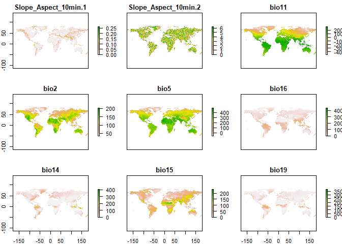
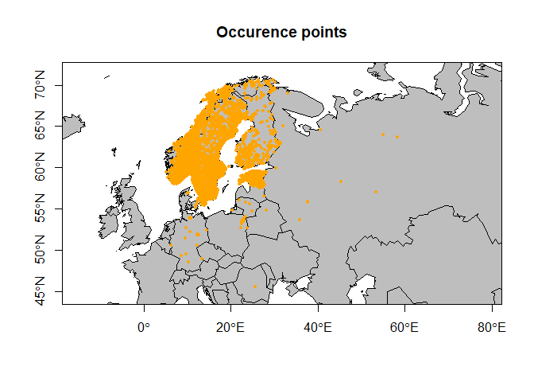
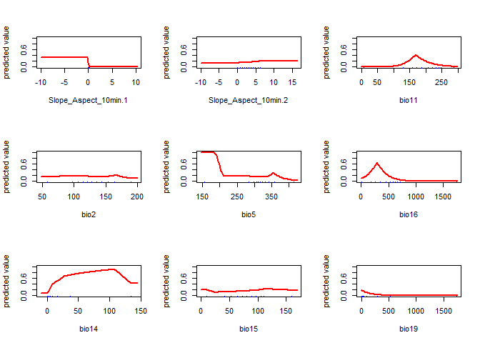
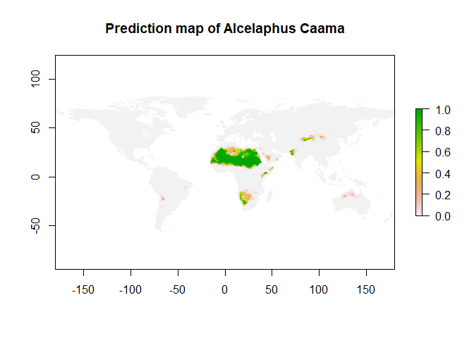

Introduction
============

dus even uitleggen wat voor model dit is en waar je het voor kan gebruiken

Case study : domesticated vs wild ungulates
===========================================

The domestication of flora and fauna is one of the most significant transitions in humankind's history and domination of planet earth (Kareiva et al., 2007, Larson et al., 2014). Domestication can be explained as the alteration of wild species by selecting traits that are useful to our society, examples of this are the selection of dogs that are able to live with people or the selection of larger wheat that have more seeds per plant (Kareiva et al., 2007). Over the course of thousands of years’ humans have domesticated relatively few large animals. The group of large animals that we have domesticated are called Ungulates (Perissodactyla + Artiodactyla) but we have only domesticated about 20 species from the +- 200 Ungulates. Interestingly, some of the 20 domesticated Ungulate species were domesticated multiple times independently through space and time, while the other +180 Ungulate species were never domesticated for a variety of reasons. Some of these reasons can be explained by behavioral preadaptations like social structures, sexual behaviour, parent-young interaction, feeding behaviour and response to humans and new environments (Zeder, 2012). Hence, it might be possible that domestication can be explained by abiotic preferences.

The following libraries need to be loaded:

``` r
library(raster)
```

    ## Loading required package: sp

``` r
library(maps)
library(rJava) 
library(maptools)
```

    ## Checking rgeos availability: TRUE

``` r
library(jsonlite)
library(caret)
```

    ## Loading required package: lattice

    ## Loading required package: ggplot2

``` r
library(ENMeval)
```

    ## Loading required package: dismo

``` r
library(repmis)
library(CoordinateCleaner)
library(dismo) 
library(virtualspecies)
```

Data
====

Abiotic data
------------

Our model is going to be based on climatic variables, topography and vegetation variables.

Climatic information about the present was subtracted from the widely used Bioclim dataset which includes 19 bioclimatic datasets. The datasets contain information such as precipitation in the driest quarter or maximum temperatures of the coldest month and are constructed based on monthly remote sensing data between 1950 and 2000, with a spatial resolution of 2.5 minutes (Hijmans et al., 2005, Title et al ., 2018). The dataset can directly be downloaded with the getData() function from the raster package. It is also possible to adjust the spatial resolution res=2.5 to 30 seconds, 5 minutes and 10 minutes.

The Bioclim dataset contains information about the present climatic variables. The problem with the use of GBIF occurrence data is that the GBIF dataset does not specify the date at which the animal was present at the location. Therefore the range in which the animal was at the location could be the whole holocene, this makes it impossible to reconstruct past palaeo climatic environments. For this research we assume with caution that using the climatic dataset based on our current climate, is enough to account for the climate variability during the course of the Holocene. However we are aware that much more climatic variability was present during the course of the Holocene which has been shown in ice cores from Greenland and Antarctic (Augustin et al., 2004).

``` r
currentEnv1=getData("worldclim", var="bio", res=10)
```

Topography datasets were extracted from the Harmonized World Soil Database (HWSD) and are based on NASA’s Shuttle Radar Topographic Mission (SRTM) dataset. The topography height datasets are directly correlated to temperature and can therefore not directly be used in a species distribution model. In order to be usefull we calculated slope and aspect variables from the HWSD dataset which can directly be downloaded from our dropbox (<https://www.dropbox.com/sh/12yi6vjyqpixmvj/AAAfx-4yRKYMfeW8RaZjbK4Za?dl=1>). Again we made the assumption that slope and aspect are largely static through the course of the Holocene but we are aware that this is not always the case, for example coastline areas (Title et al., 2018).

``` r
SlopeAspect<- stack("C:/Users/elkeh/Dropbox/trait-geo-diverse-ungulates/Input_Datasets/Abiotic_Data/Slope_Aspect_10min.tif")
```

The abiotic raster layers are combined using the stack() function from the raster package.

``` r
currentEnv<- stack(SlopeAspect, currentEnv1)
```

Layers with climatic and topographic information that are correlated with one another cannot be used in the species distribution model. Function 'remove\_correlation.R' in the scripts folder shows which layers are correlated with one another and which layers have to be removed to create a raster stack of abiotic data without correlation. remove all layers with a correlation coefficient higher than 0.7.

``` r
Env_removed_correlation<-removeCollinearity(currentEnv, multicollinearity.cutoff = 0.7, select.variables = TRUE)
currentEnv2<- subset(currentEnv, Env_removed_correlation)
plot(currentEnv2)
```



Occurence data
--------------

The script below downloads a list of the species of interest from the github (<https://github.com/naturalis/trait-geo-diverse-ungulates>) data folder, originally obtained via GBIF. The data contains the taxon name, taxon id and the longitude and latitude.

``` r
t<-read.table("https://github.com/naturalis/trait-geo-diverse-ungulates/raw/master/data/taxa.txt", header = FALSE, sep = "", dec = ".")
```

Before we can run the species distribution model we have to validate the occurence data in our dataset. We remove equal lon lat values, outliers, points in the sea, zero's and locations that are know biodiversity institutions or GBIF headquarters.

ook nog even zeggen dat alleen de points die binnen de polygons van natuurlijke habitat vallen meegenomen worden --&gt; maar die dataset heb ik ngo niet dus later aan de loop toevoegen

``` r
FilteredSpecies<-list()

#for (i in t)

for (i in 1:5){
  file<-paste("https://github.com/naturalis/trait-geo-diverse-ungulates/raw/master/data/", t[i,1], sep = "")
  species_occurence<-read.csv(file)
  cleaned_species_occurence<-invisible(clean_coordinates(species_occurence, lon="decimal_longitude", lat = "decimal_latitude",       species = "taxon_name", tests= c( "equal",   "outliers", "seas", "zeros", "gbif", "instiutions"), outliers_method =      "quantile" ))
  species_occurence<- subset.data.frame(cleaned_species_occurence[2:5], cleaned_species_occurence$.summary == TRUE)
  name <- paste(t[i,1])
  FilteredSpecies[[name]] <-species_occurence
}
```

    ## Warning in cc_outl(otl_test, lon = lon, lat = lat, species = species,
    ## method = outliers_method, : large dataset. Using raster approximation.

you can plot the occurence data as follows

``` r
OccurenceData<- as.data.frame(FilteredSpecies[i])
colnames(OccurenceData) <- c("taxon_id","taxon_name","decimal_latitude","decimal_longitude")
data(wrld_simpl)
plot(wrld_simpl, axes=TRUE, xlim=c(min(OccurenceData$decimal_longitude)-1,max(OccurenceData$decimal_longitude)+1), ylim=c(min(OccurenceData$decimal_latitude)-1,max(OccurenceData$decimal_latitude)+1), fill=TRUE, col="grey", main= "Occurence points")
points(OccurenceData$decimal_longitude, OccurenceData$decimal_latitude, col="orange", pch=20, cex=0.75)
box()
```



Species distribution model
==========================

Construction of the model
-------------------------

The script below constructs a species distribution model for each species seperately. The model is trained only for the extent of occurence data points + 5 lon lat. Afterwards the model is validated using a k-fold cross validation in which we set aside 25% of the date to test the predictions and 75% of the datta to train the model.

assess predictive performance, we do this with an approach called Area Under the Receiver Operator Curve AUC only values higher than 0.7 are considered valid

``` r
list_species_model_low_accuracy<- list()
list_species_model_high_accuracy<- list()
for (i in 1:5){
  # set the extent for the training model with a buffer of 5 lon and lat
  species_occurence<- as.data.frame(FilteredSpecies[i])
  colnames(species_occurence) <- c("taxon_id","taxon_name","decimal_latitude","decimal_longitude")
  
  model.extent<-extent(min(species_occurence$decimal_longitude)-5,max(species_occurence$decimal_longitude)+5,min(species_occurence$decimal_latitude)-5,max(species_occurence$decimal_latitude)+5)
  modelEnv=crop(currentEnv2,model.extent)
  
  ## make a dataframe of just the longitude and latitude locations remove all the other variables
  Species_occ<- cbind.data.frame(species_occurence$decimal_longitude,species_occurence$decimal_latitude)
  
  # create a k-fold cross validation. This means we set aside 25% of the data as test data and we use the other 75% as train data. 
  fold<- kfold(Species_occ, k=4)
  Species_test<- Species_occ[fold == 1, ]
  Species_train<- Species_occ[fold != 1, ]
  
  ## Maxent model with training data and cropped extent to train the model 
  species_model<- dismo::maxent(modelEnv, Species_train)
  
  # validate the model with the test data
  # to construct an AUC model we need random points
  
  random<- randomPoints(modelEnv, 1000)
  Validation_species<- evaluate(p=Species_test, a=random, x=modelEnv, model =species_model)
  
  # create two stacks one with the models with a low accuracy <0.7 and one with a high accuracy >0.7
  name <- paste(t[i,1])
  if (Validation_species@auc > 0.7) list_species_model_high_accuracy[[name]] <- species_model else list_species_model_low_accuracy[[name]] <- species_model
  
}
```

To plot the the model performance the following script can be used.

``` r
# Select the first model in the list
open_species_model<-list_species_model_high_accuracy[[1]]
# name of the dataset plotted
probeernaam<- names(list_species_model_high_accuracy[1])
name<- paste("Variable importance for ", probeernaam)
# plot the variable importance
plot(open_species_model, res = 130, main = name)
```


``` r
# plot the response curve to see what the range of important values is per abiotic dataset
response(open_species_model, res = 130)
```



Model predictions
-----------------

The outcome of the species distribution models can be used to create a prediction of the areas that are suitable for the species.

``` r
prediction_rasters <- stack()
for (i in 1:length(list_species_model_high_accuracy)){
  open_species_model<-list_species_model_high_accuracy[[i]]
  
  species.pred<- predict(open_species_model, currentEnv2)
  name<- names(list_species_model_high_accuracy[i])
  prediction_rasters<- stack(prediction_rasters, species.pred)
}
```

The outcomes of the species distribution model predictions can be plotted as followes.

``` r
# set p to the number of the prediction you want to plot 
p=2 
speciesname<- names(list_species_model_high_accuracy[p])
title<- paste("Prediction map of ", speciesname, sep="")
predictionplot<-raster(prediction_rasters, p)
plot(predictionplot, main=title)
```



Niche overlap
=============

Note that the `echo = FALSE` parameter was added to the code chunk to prevent printing of the R code that generated the plot.
